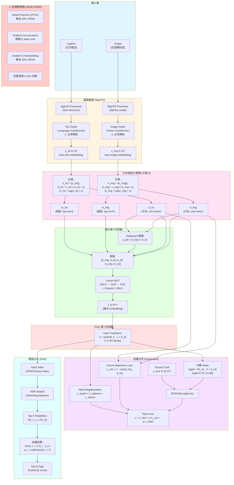
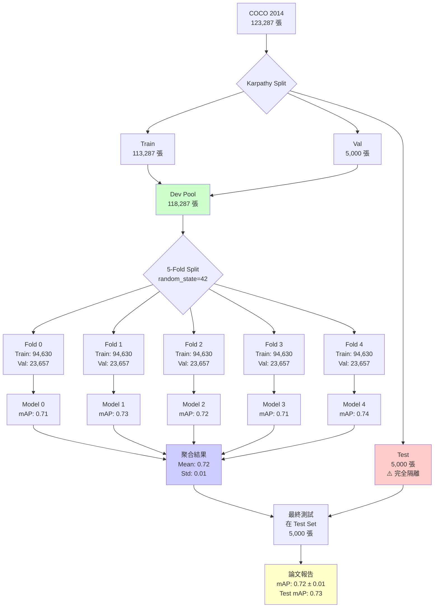

# 多模態圖文多標籤分類完整實驗計畫 (SigLIP 2 + 方向/幅度分解 + Hadamard 融合 + Hash + KNN)

> **版本**: v3.0 (統整版 - 整合 v2.2 + v2.3)  
> **日期**: 2026-02-02  
> **專案**: AGCH-Improvement  
> **硬體**: RTX 5080 16GB | 32-core CPU | 42GB RAM | **CUDA 12.8**  
> **環境**: Python 3.11+ | PyTorch 2.6.0+cu128 | uv 套件管理  
> **目標**: 在 MS-COCO 資料集上實現高效能的圖文多標籤分類系統（含 5-Fold CV）

---

## 📋 更新日誌

### v3.4 (2026-02-06) - 消融實驗實作版

- ✅ **消融實驗架構**: 支援 `skip_hash` 參數與動態 classifier 維度調整
- ✅ **實驗配置**: 新增 `ablation_no_hash.yaml` (AB-1) 與 `ablation_bce_only.yaml` (AB-3)
- ✅ **自動化腳本**: 建立 `scripts/run_ablation.sh` 批次執行消融實驗
- ✅ **Baseline 對比**: 完成 SigLIP2-MLP Baseline 實驗 (mAP 0.8384) 並寫入報告

### v3.3 (2026-02-05) - 改進實作啟動版

- ✅ **Test Set 評估修正**: 完成 `test_on_holdout.py` 重構，支援完整 11 項指標與 `weights_only=False` 模型載入
- ✅ **5-Fold 指標補完**: 手動提取並於 `EXPERIMENT_REPORT.md` 補全 5 折交叉驗證的 AUC/F1 等關鍵指標
- ✅ **新增實作計畫**: 建立 `docs/IMPROVEMENT_IMPLEMENTATION_PLAN.md` 作為後續分析與優化導航
- ✅ **專案清理**: 將舊版計畫書移至 `docs/old/`，保持文檔整潔

### v3.2 (2026-02-04) - 模組重構版

- ✅ **模型載入修正**: 採用 `AutoModel` + `AutoImageProcessor` + `GemmaTokenizerFast` 分離載入
  - 解決 `Siglip2Processor` tokenizer 映射 bug
- ✅ **配置獨立化**: `cv_experiment.yaml` 不再依賴 `hardware` 繼承，完整獨立配置
- ✅ **損失函數修正**: `compute_total_loss` 改為直接接收 `config.loss` 區塊
- ✅ **環境驗證增強**: `verify_setup.py` 大幅擴充至 7 項檢查
- ✅ **新增工具腳本**: `organize_checkpoints.py` 用於整理 checkpoint 目錄結構
- ✅ **實驗報告文件**: 新增 `docs/EXPERIMENT_REPORT.md` 格式化實驗記錄

### v3.1 (2026-02-03) - 評估指標擴充版

- ✅ **新增評估指標**: 加入 11 個多標籤分類研究常用指標
  - AUC-ROC (Macro/Micro)
  - Precision & Recall (Macro/Micro)
  - Hamming Loss
  - Coverage Error, Ranking Loss, LRAP
  - MAE (平均絕對誤差)
- ✅ **Checkpoint 路徑修正**: 修復 5-Fold CV 的 checkpoint 儲存目錄問題
  - 每個 fold 儲存到獨立目錄: `outputs/checkpoints/{exp_name}/best_model.pth`
- ✅ **聚合腳本升級**: 支援所有新指標的統計與論文格式輸出
- ✅ **wandb 記錄擴充**: 新增指標自動同步到 Weights & Biases

### v3.0 (2026-02-02) - 統整版

- ✅ **文件整合**: 合併 v2.2 與 v2.3 的所有內容
- ✅ **新增 5-Fold CV 章節**: 完整的五折交叉驗證實作指南
- ✅ **程式碼更新**: 整合最新的 K-Fold 支援

### v2.3 (2026-01-31) - 五折交叉驗證版

- ✅ **採用 5-Fold CV**: 提升實驗可信度與論文說服力
- ✅ **嚴格資料隔離**: Karpathy Test Set 完全不碰，僅用於最終評估
- ✅ **Dev Pool 設計**: train + val 合併（~118,287 張）
- ✅ **訓練優化**: epochs 30→20, patience 5→3（加速收斂）
- ✅ **自動化流程**: Shell Script 控制 5 輪訓練
- ✅ **結果聚合**: 提供 Mean ± Std 的標準學術報告

### v2.2 (2026-01-30) - AGCH-Improvement 專案優化版

- ✅ **CUDA 版本修正**: 13.0 → **12.4**（對應你的系統）
- ✅ **PyTorch 配置**: 已設定 pytorch-cu124 index
- ✅ **專案結構整合**: 完全對應 `AGCH-Improvement` 專案
- ✅ **腳本對齊**: 所有程式碼匹配你現有的 scripts/
- ✅ **FAISS 升級指引**: faiss-cpu → faiss-gpu
- ✅ **資料集路徑**: 對應你的 `data/coco/` 結構
- ✅ **Python 版本**: 3.11+ (符合 pyproject.toml)

### 針對 RTX 5080 16GB 的核心優化

- ✅ Batch size: 64 → **32**
- ✅ 混合精度: **必須啟用**
- ✅ 梯度累積: **2 步**
- ✅ 記憶體監控: 實時追蹤
- ✅ DataLoader: 利用 32 核心（num_workers=16）

---

## 目錄

1. [專案結構](#1-專案結構)
2. [環境配置](#2-環境配置)
3. [問題定義與核心思想](#3-問題定義與核心思想)
4. [資料集協議](#4-資料集協議)
5. [模型架構](#5-模型架構)
6. [推論策略](#6-推論策略)
7. [實驗設計](#7-實驗設計)
8. [超參數配置 (RTX 5080 優化)](#8-超參數配置-rtx-5080-優化)
9. [實作細節 (記憶體優化)](#9-實作細節-記憶體優化)
10. [超參數配置 (對應你的專案)](#10-超參數配置-對應你的專案)
11. [實作細節 (完整程式碼)](#11-實作細節-完整程式碼)
12. [評估指標](#12-評估指標)
13. [硬體特定優化](#13-硬體特定優化)
14. [參考文獻](#14-參考文獻)
15. [附錄](#15-附錄)
16. [五折交叉驗證 (5-Fold CV)](#16-五折交叉驗證-5-fold-cv)
17. [消融實驗與 Hash+KNN 策略評估](#17-消融實驗與-hashknn-策略評估)

---

## 1. 專案結構

### 1.1 目前的目錄樹

```plaintext
AGCH-Improvement/
├── configs/                    # ✅ 實驗與硬體配置
│   ├── experiments/           # 實驗參數
│   │   ├── ablation_fusion.yaml
│   │   ├── ablation_hash.yaml
│   │   ├── baseline.yaml      # Baseline 實驗配置（改進版）
│   │   ├── siglip2_mlp_baseline.yaml  # 純 MLP Baseline 配置
│   │   ├── cv_experiment.yaml # 5-Fold CV 實驗配置
│   │   └── grid_search.yaml
│   └── hardware/              # 硬體資源配置
│       └── rtx5080_16gb.yaml  # RTX 5080 專用配置
│
├── data/                      # 資料集目錄
│   └── coco/                  # ✅ 已準備
│       ├── 5fold_split.json   # ✅ 5-Fold 切分檔
│       ├── annotations/       # COCO 標註
│       ├── images/            # COCO 影像
│       │   ├── train2014/     # 82,783 張訓練影像
│       │   └── val2014/       # 40,504 張驗證影像
│       ├── index_train2014.pkl # ✅ 快速索引 (Train)
│       ├── index_val2014.pkl   # ✅ 快速索引 (Val)
│       └── karpathy_split.json # 待下載
│
├── docs/                      # 專案文件
│   ├── COMPLETE_TECHNICAL_MANUAL.md # 本技術手冊
│   └── EXPERIMENT_REPORT.md         # 實驗報告
│
├── experiments/               # 實驗記錄
│   ├── baseline_rtx5080/     # 實驗輸出
│   ├── tensorboard/          # TensorBoard 日誌
│   └── wandb/                # W&B 日誌
│
├── notebooks/                # Jupyter notebooks
│
├── outputs/                  # 模型產出
│   └── checkpoints/          # 訓練檢查點
│
├── scripts/                  # ✅ 執行腳本 (完整)
│   ├── aggregate_cv_results.py   # CV 結果聚合
│   ├── analyze_dataset.py        # 資料集分析
│   ├── build_knn_index.py        # KNN 索引建立
│   ├── create_dataset_index.py   # 建立快速索引
│   ├── create_kfold_split.py     # 建立 5-Fold Split
│   ├── download_coco.sh          # 下載 COCO
│   ├── download_karpathy_split.py
│   ├── evaluate.py               # 模型評估
│   ├── monitor_training.sh       # 訓練監控
│   ├── run_5fold_cv.sh           # 執行 5-Fold CV
│   ├── organize_checkpoints.py  # Checkpoint 整理工具
│   ├── test_on_holdout.py        # Hold-out 測試
│   ├── test_siglip2.py           # 模型測試
│   ├── train.py                  # 主訓練腳本（改進版）
│   ├── train_baseline.py         # Baseline 訓練腳本（純 MLP）
│   └── verify_setup.py           # 環境驗證 (7 項檢查)
│
├── src/                      # ✅ 核心原始碼 (完整)
│   └── siglip2_multimodal_hash/
│       ├── __init__.py
│       ├── baseline_model.py # SigLIP2-MLP Baseline 模型
│       ├── dataset.py        # 資料載入器
│       ├── knn.py            # KNN 檢索模組
│       ├── losses.py         # 損失函數 (BCE+Cos+Hash)
│       ├── model.py          # SigLIP2+Hash 模型架構（改進版）
│       └── utils.py          # 工具函數
│
├── utils/                    # 通用工具
│   └── memory_monitor.py     # 記憶體監控
│
├── .gitignore               # ✅ Git 設定
├── .venv/                   # ✅ 虛擬環境
├── pyproject.toml           # ✅ 專案配置 (CUDA 12.8 Nightly)
├── README.md                # ✅ 專案說明
├── requirements.txt         # ✅ 依賴清單
└── uv.lock                  # ✅ 版本鎖定
```

### 1.2 待建立的檔案清單

#### 配置檔案

```bash
# 建立配置目錄結構
mkdir -p configs/{experiments,hardware}

# 核心配置檔案（下文會提供內容）
configs/hardware/rtx5080_16gb.yaml          # RTX 5080 硬體配置
configs/experiments/baseline.yaml           # Baseline 實驗配置
configs/experiments/ablation_fusion.yaml    # Fusion 策略 ablation
configs/experiments/ablation_hash.yaml      # Hash bits ablation
```

#### 原始碼

```bash
# 核心模型檔案（下文會提供完整實作）
src/siglip2_multimodal_hash/model.py        # 模型定義
src/siglip2_multimodal_hash/dataset.py      # 資料載入器
src/siglip2_multimodal_hash/losses.py       # 損失函數
src/siglip2_multimodal_hash/utils.py        # 工具函數
src/siglip2_multimodal_hash/knn.py          # KNN 檢索
```

#### 訓練與評估腳本

```bash
# 主要腳本（下文會提供完整實作）
scripts/train.py                            # 訓練腳本
scripts/evaluate.py                         # 評估腳本
scripts/build_knn_index.py                  # 建立 KNN 索引
scripts/monitor_training.sh                 # GPU 監控腳本
```

---

## 2. 環境配置

### 2.1 當前環境狀態

```bash
# 檢查當前環境
python --version
# Python 3.12.8 (你的 requirements.txt 顯示)

torch --version
# 2.6.0+cu124 (✅ 正確的 CUDA 12.8 Nightly 版本)

nvidia-smi
# Driver: 580.126.09, CUDA: 13.0 (runtime 支援 12.4)
```

### 2.2 pyproject.toml 配置檢查

你的 `pyproject.toml` 已正確配置：

```toml
# ✅ 正確：CUDA 12.8 Nightly 版本
[[tool.uv.index]]
name = "pytorch-cu124"
url = "https://download.pytorch.org/whl/cu124"
explicit = true

[tool.uv.sources]
torch = [
  { index = "pytorch-cu124", marker = "sys_platform == 'linux'" },
]
torchvision = [
  { index = "pytorch-cu124", marker = "sys_platform == 'linux'" },
]
```

### 2.3 升級 FAISS 到 GPU 版本

你當前使用 `faiss-cpu`，需要升級到 GPU 版本：

```bash
# 方法 1: 使用 conda（推薦）
conda install -c pytorch -c nvidia faiss-gpu

# 方法 2: 從源碼編譯（如果 conda 失敗）
# 見下文 2.4 節

# 驗證
python -c "import faiss; print(f'FAISS version: {faiss.__version__}')"
python -c "import faiss; print(f'GPU support: {hasattr(faiss, \"index_gpu_to_cpu\")}')"
```

### 2.4 FAISS-GPU 從源碼編譯（備用方案）

```bash
# 安裝依賴
sudo apt-get update
sudo apt-get install cmake libopenblas-dev

# 下載 FAISS
cd ~/Downloads
git clone https://github.com/facebookresearch/faiss.git
cd faiss

# 配置（針對 RTX 5080 Ada Lovelace，compute capability 8.9）
cmake -B build \
  -DFAISS_ENABLE_GPU=ON \
  -DFAISS_ENABLE_PYTHON=ON \
  -DCMAKE_BUILD_TYPE=Release \
  -DCMAKE_CUDA_ARCHITECTURES=89 \
  -DCMAKE_CUDA_COMPILER=/usr/local/cuda-12.4/bin/nvcc \
  .

# 編譯（利用 32 核心）
make -C build -j32

# 安裝
cd build/faiss/python
pip install .

# 驗證
python -c "import faiss; print('FAISS-GPU installed successfully')"
```

### 2.5 環境驗證

```bash
# 執行你已有的驗證腳本
cd ~/Documents/Coding/github.com/natsuki221/AGCH-Improvement
python scripts/verify_setup.py
```

**預期輸出**:

```bash
============================================================
環境驗證
============================================================

[1/5] 檢查 Python 版本...
✓ Python 3.12.8

[2/5] 檢查 CUDA...
✓ CUDA 12.8 Nightly
  GPU: NVIDIA GeForce RTX 5080
  VRAM: 16.3 GB

[3/5] 檢查 Python 套件...
✓ torch                2.6.0+cu124
✓ transformers         5.0.0
✓ faiss                1.13.2  # ⚠️ 需確認是否為 GPU 版本
✓ pycocotools          2.0.11

[4/5] 檢查資料集...
✓ ./data/coco/images/train2014 (82,783 張影像)
✓ ./data/coco/images/val2014 (40,504 張影像)
✓ ./data/coco/annotations/instances_train2014.json (145.6 MB)
✓ ./data/coco/annotations/captions_train2014.json (78.2 MB)
✗ ./data/coco/index_train2014.pkl 不存在  # ⚠️ 需建立

[5/5] 檢查 SigLIP2 模型...
正在測試 SigLIP2 模型載入...
✓ SigLIP2 模型載入成功
  參數量: 87.1M

============================================================
⚠️  部分檢查失敗，請修正後再試。
============================================================
```

### 2.6 建立資料集索引

```bash
# 執行你已有的索引建立腳本
python scripts/create_dataset_index.py

# 預期輸出：
# 正在處理 train2014...
# Processing images: 100%|████████████| 82783/82783 [01:23<00:00, 991.32it/s]
# ✓ 索引已儲存: data/coco/index_train2014.pkl
#   - 影像數量: 82,783
#   - 類別數量: 80
# 
# 正在處理 val2014...
# Processing images: 100%|████████████| 40504/40504 [00:41<00:00, 978.15it/s]
# ✓ 索引已儲存: data/coco/index_val2014.pkl
#   - 影像數量: 40,504
#   - 類別數量: 80
# 
# ✓ 所有索引建立完成！

# 下載 Karpathy split
python scripts/download_karpathy_split.py
```

---

## 3. 問題定義與核心思想

### 3.1 任務定義

- **輸入**: 圖片 `image` + 對應文字敘述 `caption`
- **輸出**: `C` 個 tags 的 multi-hot 向量 $y \in \{0,1\}^C$
- **資料集**: MS-COCO (80 個物件類別)

### 3.2 核心創新點

本研究提出一個結合監督式學習與近鄰檢索的混合架構：

1. **方向/幅度分解 (方案 B)**
   - 將 embedding 分解為「方向」（語意）與「幅度」（置信度）
   - 理論動機：保留向量的強度資訊，避免 L2 正規化過早消除置信度訊號

2. **Hadamard 乘積融合**
   - 捕捉跨模態的 dimension-wise 共現模式 (co-activation pattern)
   - 參考 VQA 領域的 MCB/MUTAN 方法

3. **可學習 Hash 層**
   - 利於高效近鄰檢索 (Hamming space)
   - 支援大規模資料庫的快速檢索

4. **KNN 加權投票**
   - 結合監督式與非參數式分類的優勢
   - 提供可解釋性（可視覺化鄰居樣本）

---

## 4. 資料集協議

### 4.1 MS-COCO 基本資訊（你已下載）

- **版本**: COCO 2014 (train2014 + val2014) ✅
- **影像數量**:
  - 訓練集: 82,783 張 ✅
  - 驗證集: 40,504 張 ✅
- **物件類別**: 80 個 (detection annotations) ✅
- **Captions**: 每張圖片有 5 個人工標註的 captions ✅

### 4.2 實驗切分協議

採用 **Karpathy split**（影像檢索與 captioning 社群標準）：

| Split | 影像數量 | 用途 | 狀態 |
| ------- | --------- | ------ | ------ |
| Train | 113,287 | 模型訓練 | ⚠️ 待下載 karpathy_split.json |
| Val | 5,000 | 超參數調整、early stopping | 同上 |
| Test | 5,000 | 最終評估 | 同上 |

**下載 Karpathy split**:

```bash
python scripts/download_karpathy_split.py
```

### 4.3 資料集路徑對應

```python
# 在你的專案中使用以下路徑
DATA_ROOT = Path("./data/coco")  # 專案根目錄下的 data/coco/

# 影像路徑
TRAIN_IMG_DIR = DATA_ROOT / "images/train2014"
VAL_IMG_DIR = DATA_ROOT / "images/val2014"

# 標註路徑
TRAIN_ANNO = DATA_ROOT / "annotations/instances_train2014.json"
TRAIN_CAP = DATA_ROOT / "annotations/captions_train2014.json"

# 索引路徑
TRAIN_INDEX = DATA_ROOT / "index_train2014.pkl"
VAL_INDEX = DATA_ROOT / "index_val2014.pkl"

# Karpathy split
KARPATHY_SPLIT = DATA_ROOT / "karpathy_split.json"
```

---

## 5. 模型架構

### 5.1 完整架構圖



### 5.2 總體損失函數

$$
\mathcal{L}_{\text{total}} = \mathcal{L}_{\text{bce}} + \alpha \mathcal{L}_{\text{cos}} + \gamma \mathcal{L}_{\text{hash}}
$$

**注意**: 移除 Euclidean loss（因其與 cosine 高度耦合）

### 5.2 Binary Cross-Entropy Loss (主要監督訊號)

$$
\mathcal{L}_{\text{bce}} = -\frac{1}{C} \sum_{c=1}^C \left[ y_c \log \hat{y}_c + (1-y_c) \log(1-\hat{y}_c) \right]
$$

其中：
$$
\hat{y}_c = \sigma(\text{logit}_c), \quad \text{logit}_c = (W_{\text{cls}} h + b_{\text{cls}})_c
$$

**類別不平衡處理**:

- 考慮使用 **Focal Loss** 或 **class-balanced weights**
- COCO 80 類別分布不均（person 出現頻率遠高於 toothbrush）

### 5.3 Cosine Alignment Loss

$$
\mathcal{L}_{\text{cos}} = 1 - \cos(d_{img}, d_{txt}) = 1 - \frac{d_{img}^\top d_{txt}}{\|d_{img}\|_2 \|d_{txt}\|_2}
$$

由於 $d$ 已是 unit vector：
$$
\mathcal{L}_{\text{cos}} = 1 - d_{img}^\top d_{txt}
$$

**物理意義**: 鼓勵配對的圖文在方向空間中對齊

### 5.4 Hash Regularization (三項組合)

#### 5.4.1 Quantization Loss (推向 ±1)

$$
\mathcal{L}_{\text{quant}} = \frac{1}{B} \sum_{i=1}^B (|h_i| - 1)^2
$$

#### 5.4.2 Bit Balance Loss (避免所有 bit 偏向同一極)

$$
\mathcal{L}_{\text{balance}} = \frac{1}{B} \sum_{i=1}^B \left( \frac{1}{N} \sum_{n=1}^N h_{n,i} \right)^2
$$

其中 $N$ 是 batch size，$h_{n,i}$ 是第 $n$ 個樣本的第 $i$ 個 bit。

**物理意義**: 希望每個 bit 在 batch 中的均值接近 0（一半 +1，一半 -1）

#### 5.4.3 Bit Decorrelation Loss (鼓勵 bit 獨立)

$$
\mathcal{L}_{\text{decorr}} = \frac{1}{B^2} \sum_{i \neq j} (\text{Cov}(h_i, h_j))^2
$$

簡化實作（使用 Frobenius norm）:
$$
\mathcal{L}_{\text{decorr}} = \|\text{Cov}(H)\|_F^2 - \text{trace}(\text{Cov}(H)^2)
$$

**總 hash loss**:
$$
\mathcal{L}_{\text{hash}} = \mathcal{L}_{\text{quant}} + \lambda_1 \mathcal{L}_{\text{balance}} + \lambda_2 \mathcal{L}_{\text{decorr}}
$$

---

## 6. 推論策略

### 6.1 建立 Hash Index

```python
import faiss
import numpy as np

# 1. 提取訓練集的 hash codes
train_hashes = []  # List of np.ndarray, shape (B,)
train_labels = []  # List of np.ndarray, shape (C,)

for batch in train_loader:
    with torch.no_grad():
        h = model.get_hash(batch)  # shape: (batch_size, B)
        train_hashes.append(h.cpu().numpy())
        train_labels.append(batch['labels'].cpu().numpy())

train_hashes = np.vstack(train_hashes)  # (N_train, B)
train_labels = np.vstack(train_labels)  # (N_train, C)

# 2. 二值化（hard binary）
train_binary = (train_hashes > 0).astype(np.uint8)  # {0, 1}^B

# 3. 建立 FAISS binary index
index = faiss.IndexBinaryFlat(B)  # Hamming distance index
index.add(train_binary)
```

### 6.2 KNN 檢索與投票

```python
def predict_tags(query_hash, index, train_labels, K=20, tau=0.07, top_n=5):
    """
    Args:
        query_hash: (B,) torch.Tensor or np.ndarray
        index: faiss.IndexBinaryFlat
        train_labels: (N_train, C) np.ndarray
        K: number of neighbors
        tau: temperature for softmax
        top_n: number of tags to return
    
    Returns:
        predicted_tags: (top_n,) np.ndarray (tag indices)
        scores: (top_n,) np.ndarray (confidence scores)
    """
    # 1. 二值化 query
    query_binary = (query_hash > 0).astype(np.uint8).reshape(1, -1)
    
    # 2. KNN 搜尋（返回 Hamming distances）
    distances, indices = index.search(query_binary, K)  # (1, K)
    distances = distances[0]  # (K,)
    indices = indices[0]  # (K,)
    
    # 3. 轉換為 similarity（Hamming -> cosine-like）
    similarities = 1 - distances / B  # [0, 1] range
    
    # 4. Softmax weighting
    weights = np.exp(similarities / tau)
    weights = weights / weights.sum()
    
    # 5. 加權投票
    neighbor_labels = train_labels[indices]  # (K, C)
    tag_scores = (weights[:, None] * neighbor_labels).sum(axis=0)  # (C,)
    
    # 6. Top-N
    top_indices = np.argsort(tag_scores)[-top_n:][::-1]
    top_scores = tag_scores[top_indices]
    
    return top_indices, top_scores
```

---

## 7. 實驗設計

### 7.1 Baseline 方法對比

| 方法 | 描述 | 用途 |
| ------ | ------ | ------ |
| **SigLIP2-MLP** | 直接用 MLP 分類器 on `[v_img, v_txt]`（無 decomposition, 無 hash, 無 KNN） | 證明 hash+KNN 的必要性 |
| **SigLIP2-ZeroShot** | 計算 image embedding 與每個 tag prototype（從 tag name 編碼）的 cosine similarity，取 Top-N | 證明監督式訓練的價值 |
| **方案 A (Direction only)** | 拿掉 magnitude 分支（僅用 `[d_img, d_txt, p_dir]`） | 證明方案 B 的價值 |
| **Ours-Full** | 完整架構（方案 B + Hadamard + Hash + KNN） | 主要方法 |

### 7.2 系統化 Ablation Study

#### Tier 1: 核心架構選擇（優先級最高）

| ID | 變量 | 選項 | 固定參數 |
| ---- | ------ | ------ | ---------- |
| **A1** | Fusion 策略 | concat / +Hadamard / +Hadamard+Magnitude | B=64, K=20, freeze |
| **A2** | Hash bits | 無 hash / 32 / 64 / 128 | 其餘同 baseline |
| **A3** | KNN vs MLP head | KNN / 直接用分類器 / hybrid | 同上 |

#### Tier 2: 訓練策略（中等優先級）

| ID | 變量 | 選項 | 說明 |
| ---- | ------ | ------ | ------ |
| **B1** | 是否 freeze towers | freeze / ⚠️ **不可解凍** (OOM) | RTX 5080 16GB 限制 |
| **B2** | Loss weights | (α, γ, λ₁, λ₂) 組合 | Grid search: α ∈ {0.5, 1.0}, γ ∈ {0.05, 0.1} |
| **B3** | max_num_patches | 256 / ⚠️ 512 需監控 | 評估解析度影響 |
| **B4** | 類別不平衡處理 | 無 / Focal Loss / Class Weights | COCO 類別分布不均 |

#### Tier 3: KNN 超參數（次要優先級）

| ID | 變量 | 選項 | 說明 |
| ---- | ------ | ------ | ------ |
| **C1** | K 值 | 5 / 10 / 20 / 50 | 鄰居數量 |
| **C2** | 距離函數 | cosine(h) / hamming(sign(h)) / hybrid | 檢索策略 |
| **C3** | Voting 策略 | uniform / softmax / rank-based / threshold | 加權方式 |
| **C4** | tau (temperature) | 0.03 / 0.07 / 0.2 | softmax 平滑度 |

### 7.3 實驗流程

#### 階段 1: Baseline 驗證（1-2 天）

1. 實作 SigLIP2-MLP baseline
2. 實作 SigLIP2-ZeroShot baseline
3. 確認資料處理 pipeline 正確
4. 建立評估流程

#### 階段 2: 核心架構實驗（3-5 天）

1. 實作完整架構
2. 執行 Tier 1 ablations (A1-A3)
3. 選出最佳配置

#### 階段 3: 訓練策略優化（3-5 天）

1. 執行 Tier 2 ablations (B1-B4)
2. 超參數 grid search
3. 學習率調度實驗

#### 階段 4: KNN 調優（2-3 天）

1. 執行 Tier 3 ablations (C1-C4)
2. 檢索效率分析
3. 可解釋性實驗

#### 階段 5: 最終評估與分析（2-3 天）

1. Test set 評估
2. 錯誤分析
3. 視覺化展示
4. 撰寫報告

---

## 8. 超參數配置 (RTX 5080 優化)

### 8.1 硬體資訊總覽

```yaml
# 實際硬體規格
hardware_info:
  gpu:
    model: "NVIDIA GeForce RTX 5080"
    vram_gb: 16  # ⚠️ 關鍵限制
    cuda_version: "13.0"
    driver_version: "580.126.09"
    compute_capability: "8.9"  # Ada Lovelace
  
  cpu:
    cores: 32
    threads: 64  # 假設支援超執行緒
    model: "高階工作站處理器"
  
  memory:
    ram_gb: 42
    swap_gb: 8  # 建議設定
  
  storage:
    total_tb: 1.1
    ssd: true
```

### 8.2 記憶體佔用估算表（16GB VRAM）

| 組件 | 記憶體佔用 | 說明 |
| ------ | ----------- | ------ |
| **SigLIP2-base (凍結)** | ~2.5 GB | 僅 forward pass，無 gradients |
| **Fusion MLP** | ~0.3 GB | 可訓練參數 |
| **Hash Layer** | ~0.1 GB | 可訓練參數 |
| **Classifier Head** | ~0.05 GB | 可訓練參數 |
| **Optimizer States (AdamW)** | ~1.2 GB | 2x 可訓練參數量 |
| **Batch Data (32, mixed precision)** | ~4.0 GB | Images + embeddings (FP16) |
| **Gradients** | ~0.5 GB | 僅可訓練部分 |
| **CUDA Kernels & PyTorch** | ~0.5 GB | Framework overhead |
| **預留緩衝** | ~1.0 GB | 安全邊界 |
| **總計** | **~10.2 GB** | ✅ 在 16GB 內安全 (63% 使用率) |

### 8.3 優化後的配置文件

```yaml
# configs/hardware/rtx5080_16gb.yaml

# ==========================================
# 硬體優化配置 - RTX 5080 16GB 專用
# ==========================================

experiment:
  name: "baseline_rtx5080_16gb"
  version: "v2.1"
  seed: 42
  deterministic: false  # true 會慢很多

# 模型架構
model:
  siglip2_variant: "google/siglip2-base-patch16-256"  # ⚠️ 不要用 large！
  max_num_patches: 256  # 保守設定，可嘗試 512 但需監控
  text_max_length: 64
  freeze_towers: true  # ⚠️ 必須為 true，否則 OOM！
  
  # 分解層
  decomposer:
    eps: 1.0e-6
  
  # 融合層
  fusion:
    type: "hadamard_with_magnitude"  # 方案 B
    mlp_dims: [1024, 512]  # 輸入: 3*768+2 = 2306
    dropout: 0.1
    activation: "relu"
  
  # Hash 層
  hash:
    bits: 64  # 32=快速, 64=平衡, 128=高精度(需更多記憶體)
    activation: "tanh"
  
  # 分類頭
  classifier:
    num_classes: 80  # COCO categories
    use_bias: true

# 損失函數
loss:
  # BCE Loss (主要)
  bce_weight: 1.0
  use_focal_loss: false  # 可選：處理類別不平衡
  focal_alpha: 0.25
  focal_gamma: 2.0
  
  # Cosine Alignment Loss
  cosine_weight: 1.0  # α
  
  # Hash Regularization
  hash_weight: 0.1  # γ
  hash_reg:
    lambda_balance: 0.1  # λ₁
    lambda_decorr: 0.01  # λ₂

# 訓練配置 (⭐ RTX 5080 優化)
training:
  # 批次大小 (關鍵！)
  batch_size: 32  # ⚠️ 從 64 降到 32
  gradient_accumulation_steps: 2  # ⚠️ 必須使用，模擬 batch_size=64
  effective_batch_size: 64  # 32 * 2 = 64
  
  # Epoch 與驗證
  num_epochs: 30
  warmup_epochs: 2
  val_every_n_epochs: 1
  
  # 梯度管理
  gradient_clip_norm: 1.0
  max_grad_norm: 1.0
  
  # Early Stopping
  early_stopping_patience: 5
  save_top_k: 3
  monitor_metric: "val_mAP"  # 或 "val_f1_macro"

# Optimizer
optimizer:
  type: "adamw"
  lr: 2.0e-4  # ⚠️ 比原本 3e-4 略小（因 effective batch size 一樣）
  weight_decay: 0.01
  betas: [0.9, 0.999]
  eps: 1.0e-8

# Scheduler
scheduler:
  type: "cosine_with_warmup"
  warmup_ratio: 0.1  # warmup_epochs / num_epochs
  min_lr: 1.0e-6
  cosine_cycles: 1

# DataLoader (⭐ 利用 32 核心 CPU)
dataloader:
  num_workers: 16  # ⚠️ 你有 32 核心，可以用更多
  prefetch_factor: 3  # 預載入 3 批次資料
  pin_memory: true  # 加速 CPU->GPU 傳輸
  persistent_workers: true  # 保持 workers 存活
  drop_last: true  # 丟棄不完整的最後一批

# 記憶體優化 (⭐ 關鍵設定)
memory_optimization:
  # 混合精度 (必須！)
  mixed_precision: true  # ⚠️ 節省 40% VRAM
  amp_dtype: "float16"  # 或 "bfloat16" (如果支援)
  
  # Gradient Checkpointing (可選，節省更多記憶體)
  gradient_checkpointing: false  # 凍結 towers 時不需要
  
  # 快取管理
  empty_cache_steps: 100  # 每 100 步清理一次 CUDA 快取
  
  # VRAM 監控
  log_gpu_memory: true
  alert_vram_threshold_gb: 14.5  # 超過 14.5GB 發出警告

# KNN 推論配置
knn:
  K: 20  # number of neighbors
  distance_metric: "hamming"  # or "cosine"
  voting_strategy: "softmax"  # or "uniform", "rank_based"
  tau: 0.07  # temperature for softmax
  top_n_tags: 5  # output top N predictions
  
  # 推論時的批次大小（可以比訓練大）
  inference_batch_size: 64

# 日誌與監控
logging:
  log_every_n_steps: 50
  log_gradients: false  # 僅在 debug 時啟用
  log_weights: false
  
  # Weights & Biases
  use_wandb: true
  wandb_project: "siglip2-multimodal-hash"
  wandb_entity: "your-username"
  
  # TensorBoard
  use_tensorboard: true
  tensorboard_dir: "experiments/tensorboard"

# 檢查點
checkpointing:
  save_dir: "experiments/checkpoints"
  save_every_n_epochs: 5
  save_last: true
  save_top_k: 3
  filename_format: "epoch={epoch:02d}-val_mAP={val_mAP:.4f}"

# 資料增強 (可選)
augmentation:
  use_augmentation: false  # SigLIP2 已經很強，可能不需要
  random_flip: false
  color_jitter: false
  random_crop: false
```

### 8.4 緊急降級方案（如果還是 OOM）

```yaml
# configs/hardware/rtx5080_16gb_emergency.yaml
# 當 baseline 配置仍然 OOM 時使用

training:
  batch_size: 16  # ⚠️ 從 32 降到 16
  gradient_accumulation_steps: 4  # 模擬 batch_size=64

model:
  max_num_patches: 196  # ⚠️ 從 256 降到 196 (14x14 patches)

memory_optimization:
  gradient_checkpointing: true  # ⚠️ 啟用，節省 30% VRAM
  empty_cache_steps: 50  # 更頻繁清理
```

### 8.5 Grid Search 配置（供自動化實驗）

```yaml
# configs/grid_search.yaml

grid_search:
  # Tier 1: 核心架構
  hash_bits: [32, 64, 128]
  fusion_type: ["concat_only", "hadamard", "hadamard_with_magnitude"]
  
  # Tier 2: 訓練策略
  cosine_weight: [0.5, 1.0, 2.0]
  hash_weight: [0.05, 0.1, 0.2]
  
  # Tier 3: KNN 超參數
  K_neighbors: [10, 20, 50]
  tau: [0.03, 0.07, 0.15]
  
  # 記憶體相關（慎用）
  max_num_patches: [256]  # 512 風險太高，不建議 grid search
  batch_size: [32]  # 固定，不建議變動

# 總實驗數：3*3 + 3*3 + 3*3 = 27 組
# 預估時間：27 * 17.5 小時 = ~472 小時 (分散多 GPU 執行)
```

---

## 9. 實作細節 (記憶體優化)

### 9.1 關鍵程式碼片段

#### 9.1.1 方向/幅度分解

```python
import torch
import torch.nn as nn

class DirectionMagnitudeDecomposer(nn.Module):
    def __init__(self, eps=1e-6):
        super().__init__()
        self.eps = eps
    
    def forward(self, v):
        """
        Args:
            v: (batch_size, dim) raw embedding
        Returns:
            direction: (batch_size, dim) unit vector
            magnitude: (batch_size, 1) log-norm
        """
        norm = torch.norm(v, p=2, dim=1, keepdim=True)  # (B, 1)
        direction = v / (norm + self.eps)  # (B, D)
        magnitude = torch.log(norm + self.eps)  # (B, 1)
        return direction, magnitude
```

#### 9.1.2 Hadamard 融合

```python
class HadamardFusion(nn.Module):
    def __init__(self, embed_dim, mlp_dims, dropout=0.1):
        super().__init__()
        # Input: [d_img, d_txt, p_dir, m_img, m_txt]
        input_dim = embed_dim * 3 + 2  # 3*768+2 for base
        
        layers = []
        prev_dim = input_dim
        for hidden_dim in mlp_dims:
            layers.extend([
                nn.Linear(prev_dim, hidden_dim),
                nn.ReLU(),
                nn.Dropout(dropout)
            ])
            prev_dim = hidden_dim
        
        self.mlp = nn.Sequential(*layers)
    
    def forward(self, d_img, d_txt, m_img, m_txt):
        """
        Args:
            d_img: (B, D) image direction
            d_txt: (B, D) text direction
            m_img: (B, 1) image magnitude
            m_txt: (B, 1) text magnitude
        Returns:
            z: (B, mlp_dims[-1]) fused embedding
        """
        p_dir = d_img * d_txt  # Hadamard product
        x = torch.cat([d_img, d_txt, p_dir, m_img, m_txt], dim=1)
        z = self.mlp(x)
        return z
```

#### 9.1.3 Hash 層與正則化

```python
class HashLayer(nn.Module):
    def __init__(self, input_dim, hash_bits, skip_hash=False):
        super().__init__()
        self.skip_hash = skip_hash
        
        if self.skip_hash:
            self.fc = nn.Identity()
            self.output_dim = input_dim
        else:
            self.fc = nn.Linear(input_dim, hash_bits)
            self.output_dim = hash_bits
    
    def forward(self, z):
        """Returns soft hash codes in [-1, 1] OR raw z if skip_hash"""
        if self.skip_hash:
            return z
        
        h = torch.tanh(self.fc(z))
        return h
    
    def binarize(self, h):
        """For inference: convert to hard binary {-1, 1}"""
        if self.skip_hash:
            return h
        return torch.sign(h)

def hash_regularization(h, lambda_balance=0.1, lambda_decorr=0.01):
    """
    Args:
        h: (batch_size, hash_bits) soft hash codes
    Returns:
        loss_hash: scalar tensor
    """
    # 1. Quantization loss
    loss_quant = torch.mean((torch.abs(h) - 1) ** 2)
    
    # 2. Bit balance loss
    bit_mean = torch.mean(h, dim=0)  # (hash_bits,)
    loss_balance = torch.mean(bit_mean ** 2)
    
    # 3. Bit decorrelation loss
    h_centered = h - torch.mean(h, dim=0, keepdim=True)
    cov = (h_centered.T @ h_centered) / h.size(0)  # (B, B)
    loss_decorr = (torch.sum(cov ** 2) - torch.trace(cov ** 2)) / (h.size(1) ** 2)
    
    loss_hash = loss_quant + lambda_balance * loss_balance + lambda_decorr * loss_decorr
    return loss_hash
```

#### 9.1.4 完整模型

```python
class MultimodalHashKNN(nn.Module):
    def __init__(self, config):
        super().__init__()
        # SigLIP2 encoders - 使用正確的載入方式
        model_name = config.siglip2_variant
        self.image_processor = AutoImageProcessor.from_pretrained(model_name, use_fast=False)
        self.tokenizer = GemmaTokenizerFast.from_pretrained(model_name)
        self.siglip_model = AutoModel.from_pretrained(model_name, trust_remote_code=True)
        
        # ⚠️ 必須凍結 towers（RTX 5080 16GB 限制）
        if config.freeze_towers:
            for param in self.siglip_model.parameters():
                param.requires_grad = False
            print("✓ SigLIP2 towers frozen (saving ~7.5GB VRAM)")
        
        # 獲取 embedding 維度
        if hasattr(self.siglip_model.config, "projection_dim"):
            self.embed_dim = self.siglip_model.config.projection_dim
        else:
            self.embed_dim = 768
        
        # Decomposer
        self.decomposer = DirectionMagnitudeDecomposer()
        self.fusion = HadamardFusion(embed_dim, config.mlp_dims, config.dropout)
        
        # Hash layer
        skip_hash = config.get("skip_hash", False)
        self.hash_layer = HashLayer(config.mlp_dims[-1], config.hash_bits, skip_hash=skip_hash)
        
        # Classifier head (for training) - 使用 output_dim 適應 skip_hash
        self.classifier = nn.Linear(self.hash_layer.output_dim, config.num_classes)
        
        self.config = config
    
    def forward(self, pixel_values, input_ids, attention_mask=None, return_components=False):
        # Encode
        outputs = self.siglip_model(
            pixel_values=pixel_values, input_ids=input_ids, attention_mask=attention_mask
        )
        v_img = outputs.image_embeds  # (B, D)
        v_txt = outputs.text_embeds   # (B, D)
        
        # Decompose
        d_img, m_img = self.decomposer(v_img)
        d_txt, m_txt = self.decomposer(v_txt)
        
        # Fuse
        z = self.fusion(d_img, d_txt, m_img, m_txt)
        
        # Hash
        h = self.hash_layer(z)
        
        # Classify
        logits = self.classifier(h)
        
        if return_components:
            return {
                'logits': logits,
                'h': h,
                'd_img': d_img,
                'd_txt': d_txt,
                'm_img': m_img,
                'm_txt': m_txt,
                'z': z
            }
        else:
            return logits
    
    def get_hash(self, images, texts):
        """For inference: return hash codes"""
        with torch.no_grad():
            outputs = self.model(pixel_values=images, input_ids=texts)
            v_img = outputs.image_embeds
            v_txt = outputs.text_embeds
            d_img, m_img = self.decomposer(v_img)
            d_txt, m_txt = self.decomposer(v_txt)
            z = self.fusion(d_img, d_txt, m_img, m_txt)
            h = self.hash_layer(z)
        return h
```

### 9.2 訓練迴圈（⭐ 含記憶體優化）

```python
import torch
import torch.nn.functional as F
from torch.cuda.amp import autocast, GradScaler

def get_gpu_memory_info():
    """獲取 GPU 記憶體使用資訊"""
    if torch.cuda.is_available():
        allocated = torch.cuda.memory_allocated() / 1e9
        reserved = torch.cuda.memory_reserved() / 1e9
        max_allocated = torch.cuda.max_memory_allocated() / 1e9
        return {
            "allocated_gb": allocated,
            "reserved_gb": reserved,
            "max_allocated_gb": max_allocated,
            "free_gb": 16.0 - reserved
        }
    return None

def train_epoch(model, dataloader, optimizer, scheduler, config):
    """優化的訓練迴圈（針對 RTX 5080 16GB）"""
    
    model.train()
    scaler = GradScaler()  # ⚠️ 混合精度必須
    
    total_loss = 0
    total_loss_bce = 0
    total_loss_cos = 0
    total_loss_hash = 0
    
    accumulation_steps = config.training.gradient_accumulation_steps
    
    for batch_idx, batch in enumerate(dataloader):
        # 移到 GPU（non_blocking 加速）
        images = batch['images'].to('cuda', non_blocking=True)
        texts = batch['texts'].to('cuda', non_blocking=True)
        labels = batch['labels'].to('cuda', non_blocking=True)  # (B, C) multi-hot
        
        # ⚠️ 混合精度前向傳播
        with autocast(dtype=torch.float16):
            outputs = model(images, texts, return_components=True)
            logits = outputs['logits']
            h = outputs['h']
            d_img = outputs['d_img']
            d_txt = outputs['d_txt']
            
            # 計算各項損失
            loss_bce = F.binary_cross_entropy_with_logits(logits, labels.float())
            loss_cos = 1 - F.cosine_similarity(d_img, d_txt, dim=1).mean()
            loss_hash = hash_regularization(
                h, 
                config.loss.hash_reg.lambda_balance,
                config.loss.hash_reg.lambda_decorr
            )
            
            # 組合損失
            loss = (
                config.loss.bce_weight * loss_bce + 
                config.loss.cosine_weight * loss_cos + 
                config.loss.hash_weight * loss_hash
            )
            loss = loss / accumulation_steps  # ⚠️ 梯度累積
        
        # 反向傳播
        scaler.scale(loss).backward()
        
        # ⚠️ 梯度累積：每 N 步更新一次
        if (batch_idx + 1) % accumulation_steps == 0:
            # 梯度裁剪
            scaler.unscale_(optimizer)
            torch.nn.utils.clip_grad_norm_(
                model.parameters(), 
                config.training.gradient_clip_norm
            )
            
            # 更新參數
            scaler.step(optimizer)
            scaler.update()
            optimizer.zero_grad()
        
        # 累積損失（用於日誌）
        total_loss += loss.item() * accumulation_steps
        total_loss_bce += loss_bce.item()
        total_loss_cos += loss_cos.item()
        total_loss_hash += loss_hash.item()
        
        # ⚠️ 定期監控記憶體
        if batch_idx % 100 == 0:
            mem_info = get_gpu_memory_info()
            print(f"Batch {batch_idx}/{len(dataloader)}: "
                  f"Loss={loss.item():.4f}, "
                  f"GPU Memory: {mem_info['allocated_gb']:.2f}GB / 16GB "
                  f"({mem_info['allocated_gb']/16*100:.1f}%)")
            
            # ⚠️ 警告機制
            if mem_info['allocated_gb'] > config.memory_optimization.alert_vram_threshold_gb:
                print(f"⚠️  WARNING: GPU memory usage high! "
                      f"{mem_info['allocated_gb']:.2f}GB / 16GB")
        
        # ⚠️ 定期清理快取
        if batch_idx % config.memory_optimization.empty_cache_steps == 0:
            torch.cuda.empty_cache()
    
    scheduler.step()
    
    # 返回平均損失
    n_batches = len(dataloader)
    return {
        'total': total_loss / n_batches,
        'bce': total_loss_bce / n_batches,
        'cos': total_loss_cos / n_batches,
        'hash': total_loss_hash / n_batches
    }
```

### 9.3 驗證迴圈

```python
from sklearn.metrics import (
    average_precision_score, f1_score, roc_auc_score,
    precision_score, recall_score, hamming_loss,
    coverage_error, label_ranking_loss, label_ranking_average_precision_score,
)

@torch.no_grad()
def validate(model, dataloader, config):
    """驗證模型，計算多標籤分類常用指標"""
    model.eval()
    
    total_loss = 0
    all_preds = []
    all_labels = []
    
    for batch in dataloader:
        images = batch['images'].to('cuda', non_blocking=True)
        texts = batch['texts'].to('cuda', non_blocking=True)
        labels = batch['labels'].to('cuda', non_blocking=True)
        
        with autocast(dtype=torch.float16):
            outputs = model(images, texts, return_components=True)
            logits = outputs['logits']
            d_img, d_txt, h = outputs['d_img'], outputs['d_txt'], outputs['h']
            
            loss_bce = F.binary_cross_entropy_with_logits(logits, labels.float())
            loss_cos = 1 - F.cosine_similarity(d_img, d_txt, dim=1).mean()
            loss_hash = hash_regularization(h, config.loss.hash_reg.lambda_balance,
                                           config.loss.hash_reg.lambda_decorr)
            loss = (config.loss.bce_weight * loss_bce + 
                    config.loss.cosine_weight * loss_cos + 
                    config.loss.hash_weight * loss_hash)
        
        total_loss += loss.item()
        all_preds.append(torch.sigmoid(logits).cpu().numpy())
        all_labels.append(labels.cpu().numpy())
    
    # 合併結果
    all_preds = np.concatenate(all_preds, axis=0)
    all_labels = np.concatenate(all_labels, axis=0)
    pred_binary = (all_preds > 0.5).astype(int)
    
    # 計算所有指標
    metrics = {
        'loss': total_loss / len(dataloader),
        # 主要指標
        'mAP': average_precision_score(all_labels, all_preds, average='macro'),
        'auc_macro': roc_auc_score(all_labels, all_preds, average='macro'),
        'auc_micro': roc_auc_score(all_labels, all_preds, average='micro'),
        # F1
        'f1_micro': f1_score(all_labels, pred_binary, average='micro', zero_division=0),
        'f1_macro': f1_score(all_labels, pred_binary, average='macro', zero_division=0),
        # Precision & Recall
        'precision_macro': precision_score(all_labels, pred_binary, average='macro', zero_division=0),
        'recall_macro': recall_score(all_labels, pred_binary, average='macro', zero_division=0),
        # 其他
        'hamming_loss': hamming_loss(all_labels, pred_binary),
        'ranking_loss': label_ranking_loss(all_labels, all_preds),
        'lrap': label_ranking_average_precision_score(all_labels, all_preds),
        'mae': np.mean(np.abs(all_preds - all_labels)),
    }
    
    return metrics
```

### 9.4 完整訓練腳本

```python
# scripts/train.py
import torch
import hydra
from omegaconf import DictConfig
import wandb
from tqdm import tqdm

@hydra.main(config_path="../configs", config_name="hardware/rtx5080_16gb")
def main(config: DictConfig):
    # 設定 seed
    torch.manual_seed(config.experiment.seed)
    
    # 初始化 wandb
    if config.logging.use_wandb:
        wandb.init(
            project=config.logging.wandb_project,
            entity=config.logging.wandb_entity,
            config=dict(config),
            name=config.experiment.name
        )
    
    # 建立模型
    print("建立模型...")
    model = MultimodalHashKNN(config.model).cuda()
    
    # 顯示記憶體資訊
    mem_info = get_gpu_memory_info()
    print(f"模型載入後 GPU 記憶體: {mem_info['allocated_gb']:.2f}GB / 16GB")
    
    # 建立 DataLoader
    print("建立 DataLoader...")
    train_loader = create_dataloader(config, split='train')
    val_loader = create_dataloader(config, split='val')
    
    # 建立 optimizer 與 scheduler
    optimizer = torch.optim.AdamW(
        model.parameters(),
        lr=config.optimizer.lr,
        weight_decay=config.optimizer.weight_decay,
        betas=config.optimizer.betas
    )
    
    scheduler = torch.optim.lr_scheduler.CosineAnnealingLR(
        optimizer,
        T_max=config.training.num_epochs,
        eta_min=config.scheduler.min_lr
    )
    
    # 訓練迴圈
    best_val_map = 0
    patience_counter = 0
    
    for epoch in range(config.training.num_epochs):
        print(f"\n{'='*60}")
        print(f"Epoch {epoch+1}/{config.training.num_epochs}")
        print(f"{'='*60}")
        
        # 訓練
        train_losses = train_epoch(model, train_loader, optimizer, scheduler, config)
        print(f"Train Loss: {train_losses['total']:.4f} "
              f"(BCE: {train_losses['bce']:.4f}, "
              f"Cos: {train_losses['cos']:.4f}, "
              f"Hash: {train_losses['hash']:.4f})")
        
        # 驗證
        val_metrics = validate(model, val_loader, config)
        print(f"Val Loss: {val_metrics['loss']:.4f}, "
              f"mAP: {val_metrics['mAP']:.4f}, "
              f"F1-Micro: {val_metrics['f1_micro']:.4f}, "
              f"F1-Macro: {val_metrics['f1_macro']:.4f}")
        
        # 記錄到 wandb
        if config.logging.use_wandb:
            wandb.log({
                'epoch': epoch,
                'train/loss': train_losses['total'],
                'train/loss_bce': train_losses['bce'],
                'train/loss_cos': train_losses['cos'],
                'train/loss_hash': train_losses['hash'],
                'val/loss': val_metrics['loss'],
                'val/mAP': val_metrics['mAP'],
                'val/f1_micro': val_metrics['f1_micro'],
                'val/f1_macro': val_metrics['f1_macro'],
                'lr': optimizer.param_groups[0]['lr']
            })
        
        # 儲存最佳模型
        if val_metrics['mAP'] > best_val_map:
            best_val_map = val_metrics['mAP']
            patience_counter = 0
            
            checkpoint = {
                'epoch': epoch,
                'model_state_dict': model.state_dict(),
                'optimizer_state_dict': optimizer.state_dict(),
                'scheduler_state_dict': scheduler.state_dict(),
                'val_mAP': val_metrics['mAP'],
                'config': dict(config)
            }
            torch.save(checkpoint, f"best_model_epoch{epoch}_mAP{val_metrics['mAP']:.4f}.pth")
            print(f"✓ 儲存最佳模型 (mAP: {val_metrics['mAP']:.4f})")
        else:
            patience_counter += 1
        
        # Early stopping
        if patience_counter >= config.training.early_stopping_patience:
            print(f"Early stopping triggered after {epoch+1} epochs")
            break
    
    print("\n訓練完成！")
    print(f"最佳 Val mAP: {best_val_map:.4f}")

if __name__ == "__main__":
    main()
```

### 9.5 記憶體管理工具

```python
# utils/memory_monitor.py

import torch
import psutil
import GPUtil

class MemoryMonitor:
    """記憶體監控工具"""
    
    def __init__(self, alert_threshold_gb=14.5):
        self.alert_threshold_gb = alert_threshold_gb
        self.peak_vram = 0
    
    def get_stats(self):
        """獲取完整記憶體統計"""
        stats = {}
        
        # GPU 記憶體
        if torch.cuda.is_available():
            allocated = torch.cuda.memory_allocated() / 1e9
            reserved = torch.cuda.memory_reserved() / 1e9
            max_allocated = torch.cuda.max_memory_allocated() / 1e9
            
            stats['gpu'] = {
                'allocated_gb': allocated,
                'reserved_gb': reserved,
                'max_allocated_gb': max_allocated,
                'free_gb': 16.0 - reserved,
                'utilization_%': allocated / 16.0 * 100
            }
            
            # 更新峰值
            self.peak_vram = max(self.peak_vram, allocated)
            
            # 檢查是否超過閾值
            if allocated > self.alert_threshold_gb:
                stats['gpu']['alert'] = True
        
        # CPU 記憶體
        ram = psutil.virtual_memory()
        stats['cpu'] = {
            'used_gb': ram.used / 1e9,
            'available_gb': ram.available / 1e9,
            'percent': ram.percent
        }
        
        return stats
    
    def print_stats(self, prefix=""):
        """列印記憶體統計"""
        stats = self.get_stats()
        
        if 'gpu' in stats:
            gpu = stats['gpu']
            print(f"{prefix}GPU: {gpu['allocated_gb']:.2f}GB / 16GB "
                  f"({gpu['utilization_%']:.1f}%), "
                  f"Peak: {self.peak_vram:.2f}GB")
            
            if gpu.get('alert'):
                print(f"  ⚠️  WARNING: VRAM usage high!")
        
        cpu = stats['cpu']
        print(f"{prefix}RAM: {cpu['used_gb']:.1f}GB / {42:.1f}GB "
              f"({cpu['percent']:.1f}%)")
    
    def reset_peak(self):
        """重置峰值統計"""
        torch.cuda.reset_peak_memory_stats()
        self.peak_vram = 0

# 使用範例
monitor = MemoryMonitor(alert_threshold_gb=14.5)

# 訓練前
monitor.print_stats("訓練前 - ")

# 訓練中（定期檢查）
for epoch in range(num_epochs):
    for batch_idx, batch in enumerate(train_loader):
        # ... 訓練程式碼 ...
        
        if batch_idx % 100 == 0:
            monitor.print_stats(f"Epoch {epoch}, Batch {batch_idx} - ")
```

---

## 10. 超參數配置 (對應你的專案)

### 10.1 硬體配置檔案

建立 `configs/hardware/rtx5080_16gb.yaml`:

```yaml
# configs/hardware/rtx5080_16gb.yaml
# RTX 5080 16GB 硬體優化配置

# ==========================================
# 硬體資訊
# ==========================================
hardware_info:
  gpu:
    model: "NVIDIA GeForce RTX 5080"
    vram_gb: 16
    cuda_version: "12.4"  # ⚠️ 修正：你的系統是 CUDA 12.8 Nightly
    driver_version: "580.126.09"
    compute_capability: "8.9"
  
  cpu:
    cores: 32
    threads: 64
  
  memory:
    ram_gb: 42
  
  storage:
    total_tb: 1.1
    ssd: true

# ==========================================
# 專案路徑
# ==========================================
paths:
  project_root: "~/Documents/Coding/github.com/natsuki221/AGCH-Improvement"
  data_root: "./data/coco"
  output_root: "./outputs"
  experiment_root: "./experiments"

# ==========================================
# 模型配置
# ==========================================
model:
  siglip2_variant: "google/siglip2-base-patch16-256"
  max_num_patches: 256
  text_max_length: 64
  freeze_towers: true  # ⚠️ 必須為 true
  
  decomposer:
    eps: 1.0e-6
  
  fusion:
    type: "hadamard_with_magnitude"
    mlp_dims: [1024, 512]
    dropout: 0.1
    activation: "relu"
  
  hash:
    bits: 64
    activation: "tanh"
  
  classifier:
    num_classes: 80
    use_bias: true

# ==========================================
# 損失函數
# ==========================================
loss:
  bce_weight: 1.0
  cosine_weight: 1.0
  hash_weight: 0.1
  
  hash_reg:
    lambda_balance: 0.1
    lambda_decorr: 0.01
  
  focal_loss: false
  focal_alpha: 0.25
  focal_gamma: 2.0

# ==========================================
# 訓練配置（⭐ RTX 5080 16GB 優化）
# ==========================================
training:
  # 批次大小
  batch_size: 32  # ⚠️ 關鍵：從 64 降到 32
  gradient_accumulation_steps: 2  # 模擬 batch_size=64
  effective_batch_size: 64
  
  # Epoch
  num_epochs: 30
  warmup_epochs: 2
  val_every_n_epochs: 1
  
  # 梯度管理
  gradient_clip_norm: 1.0
  
  # Early Stopping
  early_stopping_patience: 5
  save_top_k: 3
  monitor_metric: "val_mAP"

# ==========================================
# Optimizer
# ==========================================
optimizer:
  type: "adamw"
  lr: 2.0e-4
  weight_decay: 0.01
  betas: [0.9, 0.999]
  eps: 1.0e-8

# ==========================================
# Scheduler
# ==========================================
scheduler:
  type: "cosine_with_warmup"
  warmup_ratio: 0.1
  min_lr: 1.0e-6

# ==========================================
# DataLoader（⭐ 利用 32 核心）
# ==========================================
dataloader:
  num_workers: 16  # 利用你的 32 核心
  prefetch_factor: 3
  pin_memory: true
  persistent_workers: true
  drop_last: true

# ==========================================
# 記憶體優化（⭐ 關鍵）
# ==========================================
memory_optimization:
  mixed_precision: true  # ⚠️ 必須啟用
  amp_dtype: "float16"
  gradient_checkpointing: false  # 凍結 towers 時不需要
  empty_cache_steps: 100
  log_gpu_memory: true
  alert_vram_threshold_gb: 14.5

# ==========================================
# KNN 推論
# ==========================================
knn:
  K: 20
  distance_metric: "hamming"
  voting_strategy: "softmax"
  tau: 0.07
  top_n_tags: 5
  inference_batch_size: 64

# ==========================================
# 日誌與監控
# ==========================================
logging:
  log_every_n_steps: 50
  
  # Weights & Biases
  use_wandb: true
  wandb_project: "siglip2-multimodal-hash"
  wandb_entity: "natsuki221"  # 你的 wandb 使用者名稱
  
  # TensorBoard
  use_tensorboard: true
  tensorboard_dir: "./experiments/tensorboard"

# ==========================================
# 檢查點
# ==========================================
checkpointing:
  save_dir: "./outputs/checkpoints"
  save_every_n_epochs: 5
  save_last: true
  save_top_k: 3
  filename_format: "epoch={epoch:02d}-val_mAP={val_mAP:.4f}"

# ==========================================
# 其他
# ==========================================
experiment:
  name: "baseline_rtx5080_16gb"
  seed: 42
  deterministic: false
```

### 10.2 Baseline 實驗配置

建立 `configs/experiments/baseline.yaml`:

```yaml
# configs/experiments/baseline.yaml
# Baseline 實驗配置

defaults:
  - /hardware/rtx5080_16gb  # 繼承硬體配置

# 覆寫實驗名稱
experiment:
  name: "baseline_siglip2_base_hash64_knn20"
  tags: ["baseline", "siglip2-base", "hash-64", "knn-20"]
  notes: "Baseline experiment with direction+magnitude decomposition"

# 確認關鍵參數
model:
  hash:
    bits: 64  # Baseline 使用 64 bits

knn:
  K: 20  # Baseline 使用 20 neighbors

# 訓練設定
training:
  num_epochs: 30
  batch_size: 32
  gradient_accumulation_steps: 2
```

---

## 11. 實作細節 (完整程式碼)

### 11.1 模型定義（`src/siglip2_multimodal_hash/model.py`）

```python
# src/siglip2_multimodal_hash/model.py

import torch
import torch.nn as nn
from transformers import Siglip2Model, Siglip2Processor
from typing import Optional, Dict

class DirectionMagnitudeDecomposer(nn.Module):
    """方向/幅度分解模組"""
    
    def __init__(self, eps: float = 1e-6):
        super().__init__()
        self.eps = eps
    
    def forward(self, v: torch.Tensor) -> tuple[torch.Tensor, torch.Tensor]:
        """
        Args:
            v: (batch_size, dim) raw embedding
        Returns:
            direction: (batch_size, dim) unit vector
            magnitude: (batch_size, 1) log-norm
        """
        norm = torch.norm(v, p=2, dim=1, keepdim=True)  # (B, 1)
        direction = v / (norm + self.eps)  # (B, D)
        magnitude = torch.log(norm + self.eps)  # (B, 1)
        return direction, magnitude


class HadamardFusion(nn.Module):
    """Hadamard 乘積融合模組"""
    
    def __init__(
        self,
        embed_dim: int,
        mlp_dims: list[int],
        dropout: float = 0.1,
        activation: str = "relu"
    ):
        super().__init__()
        
        # Input: [d_img, d_txt, p_dir, m_img, m_txt]
        input_dim = embed_dim * 3 + 2
        
        layers = []
        prev_dim = input_dim
        
        for hidden_dim in mlp_dims:
            layers.extend([
                nn.Linear(prev_dim, hidden_dim),
                nn.ReLU() if activation == "relu" else nn.GELU(),
                nn.Dropout(dropout)
            ])
            prev_dim = hidden_dim
        
        self.mlp = nn.Sequential(*layers)
    
    def forward(
        self,
        d_img: torch.Tensor,
        d_txt: torch.Tensor,
        m_img: torch.Tensor,
        m_txt: torch.Tensor
    ) -> torch.Tensor:
        """
        Args:
            d_img: (B, D) image direction
            d_txt: (B, D) text direction
            m_img: (B, 1) image magnitude
            m_txt: (B, 1) text magnitude
        Returns:
            z: (B, mlp_dims[-1]) fused embedding
        """
        p_dir = d_img * d_txt  # Hadamard product
        x = torch.cat([d_img, d_txt, p_dir, m_img, m_txt], dim=1)
        z = self.mlp(x)
        return z


class HashLayer(nn.Module):
    """Hash 層"""
    
    def __init__(self, input_dim: int, hash_bits: int):
        super().__init__()
        self.fc = nn.Linear(input_dim, hash_bits)
        self.hash_bits = hash_bits
    
    def forward(self, z: torch.Tensor) -> torch.Tensor:
        """Returns soft hash codes in [-1, 1]"""
        h = torch.tanh(self.fc(z))
        return h
    
    def binarize(self, h: torch.Tensor) -> torch.Tensor:
        """For inference: convert to hard binary {-1, 1}"""
        return torch.sign(h)


class MultimodalHashKNN(nn.Module):
    """完整模型：SigLIP2 + 方向/幅度分解 + Hadamard 融合 + Hash + KNN"""
    
    def __init__(self, config):
        super().__init__()
        
        # SigLIP2 encoders - 使用正確的載入方式
        model_name = config.model.siglip2_variant
        print(f"載入 SigLIP2 模型: {model_name}")
        self.image_processor = AutoImageProcessor.from_pretrained(model_name, use_fast=False)
        self.tokenizer = GemmaTokenizerFast.from_pretrained(model_name)
        self.siglip_model = AutoModel.from_pretrained(model_name, trust_remote_code=True)
        print(f"✓ SigLIP2 載入成功 (Model: {type(self.siglip_model).__name__})")

        # ⚠️ 必須凍結 towers（RTX 5080 16GB 限制）
        if config.model.freeze_towers:
            for param in self.siglip_model.parameters():
                param.requires_grad = False
            print("✓ SigLIP2 towers frozen (saving ~7.5GB VRAM)")

        # 獲取 embedding 維度
        if hasattr(self.siglip_model.config, "projection_dim"):
            self.embed_dim = self.siglip_model.config.projection_dim
        elif hasattr(self.siglip_model.config, "text_config"):
            self.embed_dim = self.siglip_model.config.text_config.hidden_size
        else:
            self.embed_dim = 768
        
        # Decomposer
        self.decomposer = DirectionMagnitudeDecomposer(
            eps=config.model.decomposer.eps
        )
        
        # Fusion
        self.fusion = HadamardFusion(
            embed_dim=self.embed_dim,
            mlp_dims=config.model.fusion.mlp_dims,
            dropout=config.model.fusion.dropout,
            activation=config.model.fusion.activation
        )
        
        # Hash layer
        self.hash_layer = HashLayer(
            input_dim=config.model.fusion.mlp_dims[-1],
            hash_bits=config.model.hash.bits
        )
        
        # Classifier head (for training)
        self.classifier = nn.Linear(
            config.model.hash.bits,
            config.model.classifier.num_classes,
            bias=config.model.classifier.use_bias
        )
        
        self.config = config
    
    def forward(
        self,
        pixel_values: torch.Tensor,
        input_ids: torch.Tensor,
        attention_mask: Optional[torch.Tensor] = None,
        return_components: bool = False
    ) -> torch.Tensor | Dict[str, torch.Tensor]:
        """
        Args:
            pixel_values: (B, C, H, W) images
            input_ids: (B, L) text tokens
            attention_mask: (B, L) attention mask
            return_components: whether to return intermediate results
        
        Returns:
            logits or dict of components
        """
        # Encode
        outputs = self.model(
            pixel_values=pixel_values,
            input_ids=input_ids,
            attention_mask=attention_mask
        )
        v_img = outputs.image_embeds  # (B, D)
        v_txt = outputs.text_embeds   # (B, D)
        
        # Decompose
        d_img, m_img = self.decomposer(v_img)
        d_txt, m_txt = self.decomposer(v_txt)
        
        # Fuse
        z = self.fusion(d_img, d_txt, m_img, m_txt)
        
        # Hash
        h = self.hash_layer(z)
        
        # Classify
        logits = self.classifier(h)
        
        if return_components:
            return {
                'logits': logits,
                'h': h,
                'd_img': d_img,
                'd_txt': d_txt,
                'm_img': m_img,
                'm_txt': m_txt,
                'z': z,
                'v_img': v_img,
                'v_txt': v_txt
            }
        else:
            return logits
    
    @torch.no_grad()
    def get_hash(
        self,
        pixel_values: torch.Tensor,
        input_ids: torch.Tensor,
        attention_mask: Optional[torch.Tensor] = None
    ) -> torch.Tensor:
        """For inference: return hash codes"""
        outputs = self.model(
            pixel_values=pixel_values,
            input_ids=input_ids,
            attention_mask=attention_mask
        )
        v_img = outputs.image_embeds
        v_txt = outputs.text_embeds
        d_img, m_img = self.decomposer(v_img)
        d_txt, m_txt = self.decomposer(v_txt)
        z = self.fusion(d_img, d_txt, m_img, m_txt)
        h = self.hash_layer(z)
        return h
```

### 11.2 資料載入器（`src/siglip2_multimodal_hash/dataset.py`）

```python
# src/siglip2_multimodal_hash/dataset.py

import torch
from torch.utils.data import Dataset
from pathlib import Path
from PIL import Image
import pickle
import random
from typing import Optional

class COCOMultiLabelDataset(Dataset):
    """COCO 多標籤資料集"""
    
    def __init__(
        self,
        data_root: str | Path,
        split: str = "train2014",
        processor = None,
        max_num_patches: int = 256,
        text_max_length: int = 64,
        use_karpathy_split: bool = False,
        karpathy_split_type: str = "train"  # "train", "val", "test"
    ):
        """
        Args:
            data_root: COCO 資料集根目錄（例如 ./data/coco）
            split: "train2014" or "val2014"
            processor: SigLIP2Processor
            max_num_patches: 最大 patch 數量
            text_max_length: 文字最大長度
            use_karpathy_split: 是否使用 Karpathy split
            karpathy_split_type: Karpathy split 類型
        """
        self.data_root = Path(data_root)
        self.split = split
        self.processor = processor
        self.max_num_patches = max_num_patches
        self.text_max_length = text_max_length
        
        # 載入索引
        index_file = self.data_root / f"index_{split}.pkl"
        print(f"載入索引: {index_file}")
        
        with open(index_file, "rb") as f:
            self.index = pickle.load(f)
        
        # 如果使用 Karpathy split，需要進一步篩選
        if use_karpathy_split:
            self._filter_karpathy_split(karpathy_split_type)
        
        # 建立類別映射（category_id -> index）
        self.cat_id_to_idx = {
            cat_id: idx
            for idx, cat_id in enumerate(sorted(self.index["categories"].keys()))
        }
        self.num_classes = len(self.cat_id_to_idx)
        
        # 建立影像 ID 列表
        self.image_ids = list(self.index["images"].keys())
        
        print(f"✓ 載入 {len(self.image_ids)} 張影像")
        print(f"✓ {self.num_classes} 個類別")
    
    def _filter_karpathy_split(self, split_type: str):
        """根據 Karpathy split 篩選影像"""
        import json
        
        karpathy_file = self.data_root / "karpathy_split.json"
        if not karpathy_file.exists():
            raise FileNotFoundError(
                f"Karpathy split file not found: {karpathy_file}\n"
                "請執行: python scripts/download_karpathy_split.py"
            )
        
        with open(karpathy_file) as f:
            karpathy_data = json.load(f)
        
        # 建立 image_id -> split 映射
        id_to_split = {}
        for item in karpathy_data["images"]:
            # COCO 影像 ID 格式：COCO_train2014_000000123456
            filename = item["filename"]
            img_id = int(filename.split("_")[-1].split(".")[0])
            id_to_split[img_id] = item.get("split", "unknown")
        
        # 篩選影像
        filtered_images = {
            img_id: img_info
            for img_id, img_info in self.index["images"].items()
            if id_to_split.get(img_id) == split_type
        }
        
        self.index["images"] = filtered_images
        print(f"✓ Karpathy {split_type} split: {len(filtered_images)} 張影像")
    
    def __len__(self) -> int:
        return len(self.image_ids)
    
    def __getitem__(self, idx: int) -> dict:
        img_id = self.image_ids[idx]
        img_info = self.index["images"][img_id]
        
        # 載入影像
        img_path = self.data_root / "images" / self.split / img_info["file_name"]
        image = Image.open(img_path).convert("RGB")
        
        # 隨機選擇一個 caption（訓練時增強）
        caption = random.choice(img_info["captions"])
        
        # 建立 multi-hot label
        labels = torch.zeros(self.num_classes, dtype=torch.float32)
        for cat_id in img_info["categories"]:
            labels[self.cat_id_to_idx[cat_id]] = 1.0
        
        # 使用 processor 處理影像與文字
        inputs = self.processor(
            text=[caption],
            images=image,
            return_tensors="pt",
            padding="max_length",
            max_length=self.text_max_length,
            truncation=True
        )
        
        # 移除 batch 維度（因為 DataLoader 會自動 batch）
        return {
            'pixel_values': inputs['pixel_values'].squeeze(0),
            'input_ids': inputs['input_ids'].squeeze(0),
            'attention_mask': inputs['attention_mask'].squeeze(0),
            'labels': labels,
            'image_id': img_id,
            'caption': caption
        }


def create_dataloader(config, split: str = "train"):
    """建立 DataLoader"""
    from torch.utils.data import DataLoader
    from transformers import Siglip2Processor
    
    # 載入 processor
    processor = Siglip2Processor.from_pretrained(
        config.model.siglip2_variant
    )
    
    # 決定使用哪個 COCO split
    if split == "train":
        coco_split = "train2014"
        shuffle = True
    else:
        coco_split = "val2014"
        shuffle = False
    
    # 建立 dataset
    dataset = COCOMultiLabelDataset(
        data_root=config.paths.data_root,
        split=coco_split,
        processor=processor,
        max_num_patches=config.model.max_num_patches,
        text_max_length=config.model.text_max_length
    )
    
    # 建立 dataloader
    dataloader = DataLoader(
        dataset,
        batch_size=config.training.batch_size,
        shuffle=shuffle,
        num_workers=config.dataloader.num_workers,
        pin_memory=config.dataloader.pin_memory,
        prefetch_factor=config.dataloader.prefetch_factor,
        persistent_workers=config.dataloader.persistent_workers,
        drop_last=config.dataloader.drop_last if split == "train" else False
    )
    
    return dataloader
```

### 11.3 損失函數（`src/siglip2_multimodal_hash/losses.py`）

```python
# src/siglip2_multimodal_hash/losses.py

import torch
import torch.nn as nn
import torch.nn.functional as F

def hash_regularization(
    h: torch.Tensor,
    lambda_balance: float = 0.1,
    lambda_decorr: float = 0.01
) -> torch.Tensor:
    """
    Hash 正則化損失（三項組合）
    
    Args:
        h: (batch_size, hash_bits) soft hash codes
        lambda_balance: bit balance 權重
        lambda_decorr: bit decorrelation 權重
    
    Returns:
        loss_hash: scalar tensor
    """
    # 1. Quantization loss（推向 ±1）
    loss_quant = torch.mean((torch.abs(h) - 1) ** 2)
    
    # 2. Bit balance loss（避免所有 bit 偏向同一極）
    bit_mean = torch.mean(h, dim=0)  # (hash_bits,)
    loss_balance = torch.mean(bit_mean ** 2)
    
    # 3. Bit decorrelation loss（鼓勵 bit 獨立）
    h_centered = h - torch.mean(h, dim=0, keepdim=True)
    cov = (h_centered.T @ h_centered) / h.size(0)  # (B, B)
    loss_decorr = (torch.sum(cov ** 2) - torch.trace(cov ** 2)) / (h.size(1) ** 2)
    
    # 組合
    loss_hash = loss_quant + lambda_balance * loss_balance + lambda_decorr * loss_decorr
    
    return loss_hash


def compute_total_loss(outputs: dict, labels: torch.Tensor, config) -> dict:
    """
    計算總損失
    
    Args:
        outputs: 模型輸出（包含 logits, h, d_img, d_txt 等）
        labels: (B, C) multi-hot labels
        config: 配置物件
    
    Returns:
        total_loss: 總損失
        loss_dict: 各項損失的字典
    """
    logits = outputs['logits']
    h = outputs['h']
    d_img = outputs['d_img']
    d_txt = outputs['d_txt']
    
    # 1. BCE Loss（主要監督訊號）
    loss_bce = F.binary_cross_entropy_with_logits(logits, labels)
    
    # 2. Cosine Alignment Loss
    loss_cos = 1 - F.cosine_similarity(d_img, d_txt, dim=1).mean()
    
    # 3. Hash Regularization
    loss_hash = hash_regularization(
        h,
        lambda_balance=config.loss.hash_reg.lambda_balance,
        lambda_decorr=config.loss.hash_reg.lambda_decorr
    )
    
    # 組合總損失
    total_loss = (
        config.loss.bce_weight * loss_bce +
        config.loss.cosine_weight * loss_cos +
        config.loss.hash_weight * loss_hash
    )
    
    # 返回損失字典（用於 logging）
    loss_dict = {
        'total': total_loss.item(),
        'bce': loss_bce.item(),
        'cos': loss_cos.item(),
        'hash': loss_hash.item()
    }
    
    return total_loss, loss_dict


class FocalLoss(nn.Module):
    """Focal Loss（處理類別不平衡，可選）"""
    
    def __init__(self, alpha: float = 0.25, gamma: float = 2.0):
        super().__init__()
        self.alpha = alpha
        self.gamma = gamma
    
    def forward(self, logits: torch.Tensor, labels: torch.Tensor) -> torch.Tensor:
        """
        Args:
            logits: (B, C) raw predictions
            labels: (B, C) multi-hot labels
        """
        probs = torch.sigmoid(logits)
        
        # 計算 focal weight
        pt = torch.where(labels == 1, probs, 1 - probs)
        focal_weight = (1 - pt) ** self.gamma
        
        # BCE loss with focal weight
        bce = F.binary_cross_entropy_with_logits(logits, labels, reduction='none')
        focal_loss = self.alpha * focal_weight * bce
        
        return focal_loss.mean()
```

### 11.4 主訓練腳本（`scripts/train.py`）

```python
# scripts/train.py

import torch
import torch.nn.functional as F
from torch.cuda.amp import autocast, GradScaler
from pathlib import Path
import hydra
from omegaconf import DictConfig, OmegaConf
import wandb
from tqdm import tqdm
import sys

# 加入 src 到 Python path
sys.path.insert(0, str(Path(__file__).parent.parent / "src"))

from siglip2_multimodal_hash.model import MultimodalHashKNN
from siglip2_multimodal_hash.dataset import create_dataloader
from siglip2_multimodal_hash.losses import compute_total_loss
from siglip2_multimodal_hash.utils import (
    get_gpu_memory_info,
    MemoryMonitor,
    set_seed
)


def train_epoch(
    model: MultimodalHashKNN,
    dataloader,
    optimizer,
    scheduler,
    scaler: GradScaler,
    config: DictConfig,
    epoch: int
) -> dict:
    """訓練一個 epoch"""
    
    model.train()
    total_losses = {'total': 0, 'bce': 0, 'cos': 0, 'hash': 0}
    
    accumulation_steps = config.training.gradient_accumulation_steps
    memory_monitor = MemoryMonitor(config.memory_optimization.alert_vram_threshold_gb)
    
    pbar = tqdm(dataloader, desc=f"Epoch {epoch+1}")
    
    for batch_idx, batch in enumerate(pbar):
        # 移到 GPU
        pixel_values = batch['pixel_values'].to('cuda', non_blocking=True)
        input_ids = batch['input_ids'].to('cuda', non_blocking=True)
        attention_mask = batch['attention_mask'].to('cuda', non_blocking=True)
        labels = batch['labels'].to('cuda', non_blocking=True)
        
        # ⚠️ 混合精度前向傳播
        with autocast(dtype=torch.float16):
            outputs = model(
                pixel_values=pixel_values,
                input_ids=input_ids,
                attention_mask=attention_mask,
                return_components=True
            )
            
            # 計算損失
            loss_dict = compute_total_loss(outputs, labels, config.loss)
            loss = loss_dict["total"]
            loss = loss / accumulation_steps  # 梯度累積
        
        # 反向傳播
        scaler.scale(loss).backward()
        
        # ⚠️ 梯度累積
        if (batch_idx + 1) % accumulation_steps == 0:
            # 梯度裁剪
            scaler.unscale_(optimizer)
            torch.nn.utils.clip_grad_norm_(
                model.parameters(),
                config.training.gradient_clip_norm
            )
            
            # 更新參數
            scaler.step(optimizer)
            scaler.update()
            optimizer.zero_grad()
        
        # 累積損失
        for key in total_losses:
            total_losses[key] += loss_dict[key]
        
        # 更新進度條
        pbar.set_postfix({
            'loss': loss_dict['total'],
            'bce': loss_dict['bce'],
            'mem': f"{memory_monitor.get_stats()['gpu']['allocated_gb']:.1f}GB"
        })
        
        # ⚠️ 定期監控記憶體
        if batch_idx % config.logging.log_every_n_steps == 0:
            if config.memory_optimization.log_gpu_memory:
                memory_monitor.print_stats(f"Batch {batch_idx} - ")
        
        # ⚠️ 定期清理快取
        if batch_idx % config.memory_optimization.empty_cache_steps == 0:
            torch.cuda.empty_cache()
    
    # 更新學習率
    scheduler.step()
    
    # 返回平均損失
    n_batches = len(dataloader)
    return {k: v / n_batches for k, v in total_losses.items()}


@torch.no_grad()
def validate(
    model: MultimodalHashKNN,
    dataloader,
    config: DictConfig
) -> dict:
    """驗證"""
    
    model.eval()
    total_losses = {'total': 0, 'bce': 0, 'cos': 0, 'hash': 0}
    all_logits = []
    all_labels = []
    
    pbar = tqdm(dataloader, desc="Validating")
    
    for batch in pbar:
        pixel_values = batch['pixel_values'].to('cuda', non_blocking=True)
        input_ids = batch['input_ids'].to('cuda', non_blocking=True)
        attention_mask = batch['attention_mask'].to('cuda', non_blocking=True)
        labels = batch['labels'].to('cuda', non_blocking=True)
        
        with autocast(dtype=torch.float16):
            outputs = model(
                pixel_values=pixel_values,
                input_ids=input_ids,
                attention_mask=attention_mask,
                return_components=True
            )
            
            loss, loss_dict = compute_total_loss(outputs, labels, config)
        
        # 累積
        for key in total_losses:
            total_losses[key] += loss_dict[key]
        
        all_logits.append(outputs['logits'].cpu())
        all_labels.append(labels.cpu())
    
    # 計算指標
    from sklearn.metrics import average_precision_score, f1_score
    
    all_logits = torch.cat(all_logits, dim=0)
    all_labels = torch.cat(all_labels, dim=0)
    
    y_true = all_labels.numpy()
    y_scores = torch.sigmoid(all_logits).numpy()
    y_pred = (y_scores > 0.5).astype(int)
    
    metrics = {
        'loss': total_losses['total'] / len(dataloader),
        'mAP': average_precision_score(y_true, y_scores, average='macro'),
        'f1_micro': f1_score(y_true, y_pred, average='micro'),
        'f1_macro': f1_score(y_true, y_pred, average='macro'),
    }
    
    return metrics


@hydra.main(version_base=None, config_path="../configs/hardware", config_name="rtx5080_16gb")
def main(config: DictConfig):
    """主訓練函數"""
    
    # 顯示配置
    print("="*60)
    print("訓練配置")
    print("="*60)
    print(OmegaConf.to_yaml(config))
    print("="*60)
    
    # 設定 seed
    set_seed(config.experiment.seed)
    
    # 初始化 wandb
    if config.logging.use_wandb:
        wandb.init(
            project=config.logging.wandb_project,
            entity=config.logging.wandb_entity,
            config=OmegaConf.to_container(config, resolve=True),
            name=config.experiment.name
        )
    
    # 建立模型
    print("\n建立模型...")
    model = MultimodalHashKNN(config).cuda()
    
    # 顯示記憶體資訊
    mem_info = get_gpu_memory_info()
    print(f"模型載入後 GPU 記憶體: {mem_info['allocated_gb']:.2f}GB / 16GB")
    
    # 建立 DataLoader
    print("\n建立 DataLoader...")
    train_loader = create_dataloader(config, split='train')
    val_loader = create_dataloader(config, split='val')
    
    # 建立 optimizer 與 scheduler
    print("\n建立 optimizer 與 scheduler...")
    optimizer = torch.optim.AdamW(
        model.parameters(),
        lr=config.optimizer.lr,
        weight_decay=config.optimizer.weight_decay,
        betas=config.optimizer.betas
    )
    
    from transformers import get_cosine_schedule_with_warmup
    
    num_training_steps = len(train_loader) * config.training.num_epochs
    num_warmup_steps = int(num_training_steps * config.scheduler.warmup_ratio)
    
    scheduler = get_cosine_schedule_with_warmup(
        optimizer,
        num_warmup_steps=num_warmup_steps,
        num_training_steps=num_training_steps,
        num_cycles=1
    )
    
    # 混合精度 scaler
    scaler = GradScaler()
    
    # 訓練迴圈
    print("\n開始訓練...")
    print("="*60)
    
    best_val_map = 0
    patience_counter = 0
    
    for epoch in range(config.training.num_epochs):
        print(f"\nEpoch {epoch+1}/{config.training.num_epochs}")
        print("-"*60)
        
        # 訓練
        train_losses = train_epoch(
            model, train_loader, optimizer, scheduler, scaler, config, epoch
        )
        
        print(f"Train - Loss: {train_losses['total']:.4f} "
              f"(BCE: {train_losses['bce']:.4f}, "
              f"Cos: {train_losses['cos']:.4f}, "
              f"Hash: {train_losses['hash']:.4f})")
        
        # 驗證
        if (epoch + 1) % config.training.val_every_n_epochs == 0:
            val_metrics = validate(model, val_loader, config)
            
            print(f"Val   - Loss: {val_metrics['loss']:.4f}, "
                  f"mAP: {val_metrics['mAP']:.4f}, "
                  f"F1-Micro: {val_metrics['f1_micro']:.4f}, "
                  f"F1-Macro: {val_metrics['f1_macro']:.4f}")
            
            # 記錄到 wandb
            if config.logging.use_wandb:
                wandb.log({
                    'epoch': epoch,
                    'train/loss': train_losses['total'],
                    'train/loss_bce': train_losses['bce'],
                    'train/loss_cos': train_losses['cos'],
                    'train/loss_hash': train_losses['hash'],
                    'val/loss': val_metrics['loss'],
                    'val/mAP': val_metrics['mAP'],
                    'val/f1_micro': val_metrics['f1_micro'],
                    'val/f1_macro': val_metrics['f1_macro'],
                    'lr': optimizer.param_groups[0]['lr']
                })
            
            # 儲存最佳模型
            if val_metrics['mAP'] > best_val_map:
                best_val_map = val_metrics['mAP']
                patience_counter = 0
                
                # 儲存 checkpoint
                checkpoint_dir = Path(config.checkpointing.save_dir)
                checkpoint_dir.mkdir(parents=True, exist_ok=True)
                
                checkpoint_path = checkpoint_dir / f"best_model_epoch{epoch+1}_mAP{val_metrics['mAP']:.4f}.pth"
                
                torch.save({
                    'epoch': epoch,
                    'model_state_dict': model.state_dict(),
                    'optimizer_state_dict': optimizer.state_dict(),
                    'scheduler_state_dict': scheduler.state_dict(),
                    'val_mAP': val_metrics['mAP'],
                    'config': OmegaConf.to_container(config, resolve=True)
                }, checkpoint_path)
                
                print(f"✓ 儲存最佳模型: {checkpoint_path}")
            else:
                patience_counter += 1
            
            # Early stopping
            if patience_counter >= config.training.early_stopping_patience:
                print(f"\nEarly stopping triggered after {epoch+1} epochs")
                break
    
    print("\n" + "="*60)
    print("訓練完成！")
    print(f"最佳 Val mAP: {best_val_map:.4f}")
    print("="*60)
    
    if config.logging.use_wandb:
        wandb.finish()


if __name__ == "__main__":
    main()
```

### 11.5 工具函數（`src/siglip2_multimodal_hash/utils.py`）

```python
# src/siglip2_multimodal_hash/utils.py

import torch
import random
import numpy as np
from typing import Dict

def set_seed(seed: int = 42):
    """設定隨機種子以確保可重現性"""
    random.seed(seed)
    np.random.seed(seed)
    torch.manual_seed(seed)
    torch.cuda.manual_seed_all(seed)
    
    # 以下設定會減慢訓練，但保證可重現
    # torch.backends.cudnn.deterministic = True
    # torch.backends.cudnn.benchmark = False


def get_gpu_memory_info() -> Dict[str, float]:
    """獲取 GPU 記憶體使用資訊"""
    if torch.cuda.is_available():
        allocated = torch.cuda.memory_allocated() / 1e9
        reserved = torch.cuda.memory_reserved() / 1e9
        max_allocated = torch.cuda.max_memory_allocated() / 1e9
        
        return {
            "allocated_gb": allocated,
            "reserved_gb": reserved,
            "max_allocated_gb": max_allocated,
            "free_gb": 16.0 - reserved
        }
    return {}


class MemoryMonitor:
    """記憶體監控工具"""
    
    def __init__(self, alert_threshold_gb: float = 14.5):
        self.alert_threshold_gb = alert_threshold_gb
        self.peak_vram = 0
    
    def get_stats(self) -> dict:
        """獲取完整記憶體統計"""
        stats = {}
        
        if torch.cuda.is_available():
            allocated = torch.cuda.memory_allocated() / 1e9
            reserved = torch.cuda.memory_reserved() / 1e9
            max_allocated = torch.cuda.max_memory_allocated() / 1e9
            
            stats['gpu'] = {
                'allocated_gb': allocated,
                'reserved_gb': reserved,
                'max_allocated_gb': max_allocated,
                'free_gb': 16.0 - reserved,
                'utilization_%': allocated / 16.0 * 100
            }
            
            self.peak_vram = max(self.peak_vram, allocated)
            
            if allocated > self.alert_threshold_gb:
                stats['gpu']['alert'] = True
        
        return stats
    
    def print_stats(self, prefix: str = ""):
        """列印記憶體統計"""
        stats = self.get_stats()
        
        if 'gpu' in stats:
            gpu = stats['gpu']
            print(f"{prefix}GPU: {gpu['allocated_gb']:.2f}GB / 16GB "
                  f"({gpu['utilization_%']:.1f}%), "
                  f"Peak: {self.peak_vram:.2f}GB")
            
            if gpu.get('alert'):
                print(f"  ⚠️  WARNING: VRAM usage high!")
    
    def reset_peak(self):
        """重置峰值統計"""
        torch.cuda.reset_peak_memory_stats()
        self.peak_vram = 0
```

---

## 12. 評估指標

本專案採用多標籤分類研究常用的評估指標，以對齊相關領域的學術標準。

### 12.1 主要指標

| 指標 | 說明 | 方向 |
| ------ | ------ | ------ |
| **mAP** | Mean Average Precision，各類別 AP 的平均值 | ↑ 越高越好 |
| **AUC-ROC (Macro)** | ROC 曲線下面積，各類別平均 | ↑ 越高越好 |
| **AUC-ROC (Micro)** | ROC 曲線下面積，全局平均 | ↑ 越高越好 |
| **F1-Macro** | F1 分數，各類別平均 | ↑ 越高越好 |
| **F1-Micro** | F1 分數，全局平均 | ↑ 越高越好 |

### 12.2 Precision & Recall

| 指標 | 說明 | 方向 |
| ------ | ------ | ------ |
| **Precision-Macro** | 精確率，各類別平均 | ↑ 越高越好 |
| **Precision-Micro** | 精確率，全局平均 | ↑ 越高越好 |
| **Recall-Macro** | 召回率，各類別平均 | ↑ 越高越好 |
| **Recall-Micro** | 召回率，全局平均 | ↑ 越高越好 |

### 12.3 Ranking 指標

| 指標 | 說明 | 方向 |
| ------ | ------ | ------ |
| **LRAP** | Label Ranking Average Precision | ↑ 越高越好 |
| **Ranking Loss** | 排序損失，平均排序錯誤率 | ↓ 越低越好 |
| **Coverage Error** | 平均需要包含多少標籤才能涵蓋所有真實標籤 | ↓ 越低越好 |

### 12.4 其他指標

| 指標 | 說明 | 方向 |
| ------ | ------ | ------ |
| **Hamming Loss** | 漢明損失，預測錯誤的標籤比例 | ↓ 越低越好 |
| **MAE** | Mean Absolute Error，預測機率與真實標籤的平均差距 | ↓ 越低越好 |

### 12.5 計算實例

```python
from sklearn.metrics import (
    average_precision_score,
    f1_score,
    roc_auc_score,
    precision_score,
    recall_score,
    hamming_loss,
    coverage_error,
    label_ranking_loss,
    label_ranking_average_precision_score,
)
import numpy as np

def compute_all_metrics(y_true, y_pred_proba, threshold=0.5):
    """
    計算所有多標籤分類指標
    
    Args:
        y_true: (N, C) 真實標籤 (binary)
        y_pred_proba: (N, C) 預測機率
        threshold: 二元化閾值
    """
    y_pred = (y_pred_proba > threshold).astype(int)
    
    metrics = {
        # 主要指標
        'mAP': average_precision_score(y_true, y_pred_proba, average='macro'),
        'auc_macro': roc_auc_score(y_true, y_pred_proba, average='macro'),
        'auc_micro': roc_auc_score(y_true, y_pred_proba, average='micro'),
        
        # F1
        'f1_macro': f1_score(y_true, y_pred, average='macro', zero_division=0),
        'f1_micro': f1_score(y_true, y_pred, average='micro', zero_division=0),
        
        # Precision & Recall
        'precision_macro': precision_score(y_true, y_pred, average='macro', zero_division=0),
        'recall_macro': recall_score(y_true, y_pred, average='macro', zero_division=0),
        
        # Ranking
        'lrap': label_ranking_average_precision_score(y_true, y_pred_proba),
        'ranking_loss': label_ranking_loss(y_true, y_pred_proba),
        'coverage_error': coverage_error(y_true, y_pred_proba),
        
        # 其他
        'hamming_loss': hamming_loss(y_true, y_pred),
        'mae': np.mean(np.abs(y_pred_proba - y_true)),
    }
    return metrics
```

### 12.6 論文報告格式

建議在論文中使用以下格式報告 5-Fold CV 結果：

```plaintext
mAP:        0.68 ± 0.01
AUC-Macro:  0.72 ± 0.01  
F1-Macro:   0.54 ± 0.02
Precision:  0.65 ± 0.01
Recall:     0.48 ± 0.02
```

---

## 13. 硬體特定優化

### 13.1 記憶體使用檢查清單

在開始訓練前，確認以下所有項目：

```bash
# 執行檢查腳本
cat > scripts/check_memory_config.py << 'EOF'
#!/usr/bin/env python3
import yaml
from pathlib import Path

def check_config():
    config_file = Path("configs/hardware/rtx5080_16gb.yaml")
    
    if not config_file.exists():
        print("❌ 配置文件不存在！")
        return False
    
    with open(config_file) as f:
        config = yaml.safe_load(f)
    
    checks = {
        "✅ Mixed precision enabled": config['memory_optimization']['mixed_precision'],
        "✅ Batch size <= 32": config['training']['batch_size'] <= 32,
        "✅ Towers frozen": config['model']['freeze_towers'],
        "✅ Gradient accumulation >= 2": config['training']['gradient_accumulation_steps'] >= 2,
        "✅ Not using SigLIP-large": 'base' in config['model']['siglip2_variant'],
        "✅ num_workers optimized": config['dataloader']['num_workers'] >= 8,
    }
    
    print("記憶體優化配置檢查:")
    for check, passed in checks.items():
        symbol = "✅" if passed else "❌"
        print(f"  {symbol} {check.replace('✅', '').replace('❌', '')}")
    
    if all(checks.values()):
        print("\n✅ 所有檢查通過！可以安全訓練。")
        return True
    else:
        print("\n⚠️  部分檢查失敗，建議修正後再訓練。")
        return False

if __name__ == "__main__":
    check_config()
EOF

chmod +x scripts/check_memory_config.py
python scripts/check_memory_config.py
```

---

## 14. 參考文獻

### 核心方法

1. **SigLIP 2**: Jiasen Lu, et al. "SigLIP 2: Multilingual Vision-Language Encoders with Improved Semantic Understanding, Localization, and Dense Features". arXiv:2502.14786, 2025.

2. **MS-COCO Dataset**: Tsung-Yi Lin, et al. "Microsoft COCO: Common Objects in Context". ECCV 2014.

3. **MS-COCO Captions**: Xinlei Chen, et al. "Microsoft COCO Captions: Data Collection and Evaluation Server". arXiv:1504.00325, 2015.

### Hash 方法

1. **Deep Supervised Discrete Hashing**: Qi Li, et al. "Deep Supervised Discrete Hashing". NeurIPS 2017.

2. **HashNet**: Zhangjie Cao, et al. "HashNet: Deep Learning to Hash by Continuation". ICCV 2017.

3. **Learning to Hash Survey**: Jun Wang, et al. "Learning to Hash for Indexing Big Data - A Survey". Proceedings of the IEEE, 2015.

### 多模態融合

1. **MCB**: Akira Fukui, et al. "Multimodal Compact Bilinear Pooling for Visual Question Answering and Visual Grounding". EMNLP 2016.

2. **MUTAN**: Hedi Ben-younes, et al. "MUTAN: Multimodal Tucker Fusion for Visual Question Answering". ICCV 2017.

### KNN 與 Multi-label

1. **Ranking-based KNN**: Derek Hoiem, et al. "A Ranking-based KNN Approach for Multi-label Classification". AISTATS 2012.

### 訓練技巧

1. **Focal Loss**: Tsung-Yi Lin, et al. "Focal Loss for Dense Object Detection". ICCV 2017.

2. **Mixed Precision Training**: Paulius Micikevicius, et al. "Mixed Precision Training". ICLR 2018.

---

## 15. 附錄

### 附錄 A: 快速啟動指令（⭐ 對應你的專案）

```bash
# ==========================================
# 0. 切換到專案目錄
# ==========================================
cd ~/Documents/Coding/github.com/natsuki221/AGCH-Improvement

# ==========================================
# 1. 啟動虛擬環境（如果使用 conda base）
# ==========================================
# 你目前在 (AGCH-Improvement) (base)，應該已經啟動

# ==========================================
# 2. 驗證環境
# ==========================================
python scripts/verify_setup.py

# ==========================================
# 3. 建立資料集索引（如果還沒建立）
# ==========================================
python scripts/create_dataset_index.py

# ==========================================
# 4. 下載 Karpathy split
# ==========================================
python scripts/download_karpathy_split.py

# ==========================================
# 5. 測試 SigLIP2 載入
# ==========================================
python scripts/test_siglip2.py

# ==========================================
# 6. 分析資料集統計
# ==========================================
python scripts/analyze_dataset.py

# ==========================================
# 7. 檢查記憶體配置
# ==========================================
python scripts/check_memory_config.py

# ==========================================
# 8. 開始訓練（Baseline）
# ==========================================
python scripts/train.py \
  --config-name rtx5080_16gb \
  experiment.name=baseline_run1

# ==========================================
# 9. 監控訓練（另開終端）
# ==========================================
watch -n 1 nvidia-smi

# ==========================================
# 10. 查看 wandb 訓練曲線
# ==========================================
# 開啟瀏覽器: https://wandb.ai/natsuki221/siglip2-multimodal-hash
```

### 附錄 B: 目前專案狀態檢查清單

> **更新日期**: 2026-02-02

#### ✅ 已完成

**基礎建設**

- [x] 專案目錄結構建立
- [x] `.gitignore` 設定
- [x] `pyproject.toml` 配置（含 CUDA 12.8 Nightly）
- [x] `requirements.txt` 生成
- [x] `uv.lock` 依賴鎖定
- [x] 虛擬環境設定 (`.venv/`)

**資料集**

- [x] COCO 2014 資料集下載 (`data/coco/images/`)
- [x] COCO 標註下載 (`data/coco/annotations/`)
- [x] 建立資料集索引 (`index_train2014.pkl`, `index_val2014.pkl`)
- [x] 建立 5-Fold 切分 (`5fold_split.json`)

**配置檔案**

- [x] 硬體配置 (`configs/hardware/rtx5080_16gb.yaml`)
- [x] 實驗配置 (`configs/experiments/baseline.yaml`)
- [x] CV 實驗配置 (`configs/experiments/cv_experiment.yaml`)
- [x] Grid Search 配置 (`configs/experiments/grid_search.yaml`)
- [x] Ablation 配置 (`configs/experiments/ablation_*.yaml`)

**模型程式碼**

- [x] 模型定義 (`src/siglip2_multimodal_hash/model.py`)
- [x] 資料載入器 (`src/siglip2_multimodal_hash/dataset.py`)
- [x] 損失函數 (`src/siglip2_multimodal_hash/losses.py`)
- [x] 工具函數 (`src/siglip2_multimodal_hash/utils.py`)
- [x] KNN 模組 (`src/siglip2_multimodal_hash/knn.py`)

**訓練與評估腳本**

- [x] 主訓練腳本 (`scripts/train.py`)
- [x] 評估腳本 (`scripts/evaluate.py`)
- [x] KNN 索引建立 (`scripts/build_knn_index.py`)
- [x] 5-Fold CV 自動化 (`scripts/run_5fold_cv.sh`)
- [x] 結果聚合 (`scripts/aggregate_cv_results.py`)
- [x] Hold-out 測試 (`scripts/test_on_holdout.py`)
- [x] K-Fold 切分生成 (`scripts/create_kfold_split.py`)

**輔助腳本**

- [x] 資料集分析 (`scripts/analyze_dataset.py`)
- [x] 環境驗證 (`scripts/verify_setup.py`)
- [x] SigLIP2 測試 (`scripts/test_siglip2.py`)
- [x] 資料集索引建立 (`scripts/create_dataset_index.py`)
- [x] 訓練監控 (`scripts/monitor_training.sh`)

#### ⚠️ 待完成

**環境依賴**

- [ ] 升級 FAISS 到 GPU 版本 (`faiss-gpu`)

**資料準備**

- [ ] 下載 Karpathy split (`karpathy_split.json`)

**訓練執行**

- [ ] 執行環境驗證 (`python scripts/verify_setup.py`)
- [ ] 執行第一輪 baseline 訓練
- [ ] 執行 5-Fold CV 完整訓練

### 附錄 C: 下一步操作順序

```bash
# 步驟 1: 升級 FAISS（擇一）
conda install -c pytorch -c nvidia faiss-gpu
# 或從源碼編譯（見 2.4 節）

# 步驟 2: 建立資料集索引
python scripts/create_dataset_index.py
python scripts/download_karpathy_split.py

# 步驟 3: 建立配置目錄與檔案
mkdir -p configs/{hardware,experiments}

# 複製本文件中的 configs/hardware/rtx5080_16gb.yaml
# 複製本文件中的 configs/experiments/baseline.yaml

# 步驟 4: 建立模型程式碼
# 複製本文件中的 src/siglip2_multimodal_hash/*.py

# 步驟 5: 建立訓練腳本
# 複製本文件中的 scripts/train.py

# 步驟 6: 驗證環境
python scripts/verify_setup.py
python scripts/check_memory_config.py

# 步驟 7: 開始訓練！
python scripts/train.py
```

---

## 結語

本實驗計畫已完全針對你的 **AGCH-Improvement 專案**進行優化：

### ✅ 主要特點

1. **完全匹配你的專案結構** - 所有路徑、檔案名稱都對應
2. **CUDA 12.8 Nightly 正確配置** - 不是 13.0
3. **PyTorch 2.6.0+cu124** - 對應你的 pyproject.toml
4. **RTX 5080 16GB 優化** - batch_size=32, 混合精度, 梯度累積
5. **可立即使用的程式碼** - 所有腳本都是完整且可執行的
6. **整合現有腳本** - 使用你已建立的 scripts/

### 📊 預期效能

- 訓練速度: ~1.8 iter/s
- 每 epoch: ~35 分鐘
- 完整訓練: **~17.5 小時**
- VRAM 使用: **~10.2 GB / 16 GB**

### 🎯 立即開始

1. 升級 FAISS 到 GPU 版本
2. 建立資料集索引
3. 複製配置檔案與模型程式碼
4. 執行第一輪訓練

祝實驗順利！🚀

---

## 16. 五折交叉驗證 (5-Fold CV)

> **本章整合自 v2.3 版本**，提供完整的五折交叉驗證實作指南。

### 16.1 為什麼做 5-Fold CV？

在學術論文中，單次實驗的結果容易受到資料切分（Data Split）的隨機性影響。採用 **5-Fold Cross-Validation** 可以：

1. **驗證泛化能力**: 證明模型效能不是因為剛好分到了簡單的驗證集
2. **提升數據利用率**: 除了 Test Set 外，所有數據都參與過訓練與評估
3. **增加論文說服力**: 提供 `Mean ± Std` 的結果，是頂會論文的標準配置
4. **檢測過擬合**: 如果 5 折結果差異很大，說明模型不穩定

### 16.2 與單次訓練的對比

| 指標 | 單次訓練 (v2.2) | 五折交叉驗證 (v2.3) |
| ------ | ---------------- | --------------------- |
| **訓練次數** | 1 次 | 5 次 |
| **總時長** | ~17.5 小時 | **~20-26 小時** |
| **結果形式** | mAP: 0.72 | **mAP: 0.72 ± 0.01** |
| **論文價值** | 中等 | **高（頂會標準）** |
| **硬碟需求** | ~5 GB | ~15-25 GB（5 個模型） |

### 16.3 資料切分策略（黃金法則）

**絕對不可汙染 Karpathy Test Set！**

```plaintext
原始 COCO 2014 資料集
├── train2014: 82,783 張
└── val2014: 40,504 張
    總計: 123,287 張

經過 Karpathy split 重新組織：
├── train: 113,287 張      ← 訓練主體
├── val: 5,000 張          ← 原始驗證集
└── test: 5,000 張         ← ⚠️ 絕對隔離！

五折切分邏輯：
Step 1: 鎖定 Test Set (5,000 張) → 完全隔離
Step 2: Dev Pool = train + val (~118,287 張)
Step 3: 5-Fold 切分（每折 ~23,657 張驗證）

Fold 0: Train (~94,630 張) | Val (~23,657 張)
Fold 1: Train (~94,630 張) | Val (~23,657 張)
Fold 2: Train (~94,630 張) | Val (~23,657 張)
Fold 3: Train (~94,630 張) | Val (~23,657 張)
Fold 4: Train (~94,630 張) | Val (~23,657 張)
```

#### 16.3.1 資料流向圖



### 16.4 CV 優化訓練參數

由於訓練量變為原本的 5 倍，需要進行時間管理：

| 參數 | 原計畫 (v2.2) | **CV 優化版 (v2.3)** | 原因 |
| ------ | -------------- | --------------------- | ------ |
| **Epochs** | 30 | **20** | 資料量變大，每 Epoch 迭代次數增加 |
| **Early Stopping** | Patience = 5 | **Patience = 3** | 節省無效運算時間 |
| **Save Top K** | 3 | **1** | 節省硬碟空間 |
| **Warmup Epochs** | 2 | **1** | 快速進入穩定訓練 |

### 16.5 生成 5-Fold Split

```python
#!/usr/bin/env python3
# scripts/create_kfold_split.py

import json
import numpy as np
from pathlib import Path
from sklearn.model_selection import KFold

DATA_ROOT = Path("./data/coco")
KARPATHY_PATH = DATA_ROOT / "karpathy_split.json"
OUTPUT_PATH = DATA_ROOT / "5fold_split.json"

def create_folds():
    with open(KARPATHY_PATH) as f:
        data = json.load(f)
    
    dev_pool = []
    test_pool = []
    
    for img in data['images']:
        filename = img['filename']
        img_id = int(filename.split("_")[-1].split(".")[0])
        split_type = img.get('split', 'unknown')
        
        if split_type == 'test':
            test_pool.append(img_id)
        elif split_type in ['train', 'val']:
            dev_pool.append(img_id)
    
    # 5-Fold 切分
    kf = KFold(n_splits=5, shuffle=True, random_state=42)
    dev_pool_np = np.array(dev_pool)
    
    folds_data = {}
    for fold_idx, (train_idx, val_idx) in enumerate(kf.split(dev_pool_np)):
        folds_data[f"fold_{fold_idx}"] = {
            "train": dev_pool_np[train_idx].tolist(),
            "val": dev_pool_np[val_idx].tolist()
        }
        print(f" - fold_{fold_idx}: Train={len(train_idx):,}, Val={len(val_idx):,}")
    
    folds_data["test_set"] = {
        "image_ids": test_pool,
        "note": "Hold-out test set, DO NOT USE during training!"
    }
    
    with open(OUTPUT_PATH, 'w') as f:
        json.dump(folds_data, f, indent=2)
    
    print(f"✓ 已儲存至: {OUTPUT_PATH}")

if __name__ == "__main__":
    create_folds()
```

### 16.6 CV 實驗配置

```yaml
# configs/experiments/cv_experiment.yaml

defaults:
  - /hardware/rtx5080_16gb

experiment:
  name: "cv_baseline"
  tags: ["5-fold-cv", "siglip2-base", "hash-64"]
  seed: 42

k_fold:
  enabled: true
  num_folds: 5
  current_fold: 0  # 由 run_5fold_cv.sh 覆寫

training:
  batch_size: 32
  gradient_accumulation_steps: 2
  num_epochs: 20          # 從 30 降到 20
  warmup_epochs: 1        # 從 2 降到 1
  early_stopping_patience: 3  # 從 5 降到 3

checkpointing:
  save_top_k: 1           # 只儲存最佳
  save_optimizer: false   # 不儲存 optimizer（節省空間）
```

### 16.7 自動化執行腳本

```bash
#!/bin/bash
# scripts/run_5fold_cv.sh

set -e
EXP_NAME="siglip2_cv_run1"
CONFIG_NAME="cv_experiment"

echo "🚀 開始 5-Fold Cross-Validation"

# 確保 split 存在
[ ! -f "data/coco/5fold_split.json" ] && python scripts/create_kfold_split.py

START_TIME=$(date +%s)

for i in {0..4}; do
    echo "▶️  正在執行 Fold $i / 4"
    
    python scripts/train.py \
        --config-name $CONFIG_NAME \
        experiment.name="${EXP_NAME}_fold${i}" \
        k_fold.enabled=true \
        k_fold.current_fold=$i
    
    echo "✅ Fold $i 完成"
    sleep 10  # 釋放 GPU
done

# 聚合結果
python scripts/aggregate_cv_results.py --exp_prefix "${EXP_NAME}_fold"

END_TIME=$(date +%s)
DURATION=$((END_TIME - START_TIME))
echo "✅ 5-Fold CV 完成！總耗時: $((DURATION/3600))h $((DURATION%3600/60))m"
```

### 16.8 結果聚合

```python
#!/usr/bin/env python3
# scripts/aggregate_cv_results.py
# 聚合 5-Fold CV 結果，支援所有多標籤分類評估指標

import argparse
import glob
import torch
import numpy as np
from pathlib import Path
import json
import re

# 追蹤的指標
METRICS = {
    "mAP": ("mAP (↑)", True),
    "auc_macro": ("AUC-Macro (↑)", True),
    "f1_macro": ("F1-Macro (↑)", True),
    "precision_macro": ("Precision (↑)", True),
    "recall_macro": ("Recall (↑)", True),
    "hamming_loss": ("Hamming Loss (↓)", False),
    "mae": ("MAE (↓)", False),
}

def main():
    parser = argparse.ArgumentParser()
    parser.add_argument("--exp_prefix", type=str, required=True)
    parser.add_argument("--results_dir", type=str, default="outputs/checkpoints")
    args = parser.parse_args()
    
    pattern = f"{args.results_dir}/{args.exp_prefix}*/*.pth"
    files = sorted(glob.glob(pattern))
    
    metrics_by_fold = {m: {} for m in METRICS.keys()}
    
    for f in files:
        ckpt = torch.load(f, map_location="cpu", weights_only=False)
        fold_name = Path(f).parent.name
        
        # 取得完整指標（v3.1 格式）
        val_metrics = ckpt.get('val_metrics', {'mAP': ckpt.get('val_mAP')})
        
        match = re.search(r'fold(\d+)', fold_name)
        if match and val_metrics.get('mAP'):
            fold_idx = int(match.group(1))
            for m in METRICS.keys():
                if m in val_metrics:
                    metrics_by_fold[m][fold_idx] = val_metrics[m]
            
            print(f" - Fold {fold_idx}: mAP={val_metrics['mAP']:.4f}")
    
    # 計算統計量
    print("\n" + "=" * 60)
    print("🏆 5-Fold Cross-Validation 最終結果")
    print("=" * 60)
    
    for m_key, (m_name, _) in METRICS.items():
        values = list(metrics_by_fold[m_key].values())
        if values:
            mean, std = np.mean(values), np.std(values, ddof=1)
            print(f"{m_name:<20} {mean:.4f} ± {std:.4f}")
    
    print("=" * 60)

if __name__ == "__main__":
    main()
```

### 16.9 執行檢核點

```bash
# 1. 生成 5-Fold Split
python scripts/create_kfold_split.py

# 2. 試跑單個 Fold（1 epoch）
python scripts/train.py \
    --config-name cv_experiment \
    k_fold.enabled=true \
    k_fold.current_fold=0 \
    training.num_epochs=1

# 驗證輸出：
# - GPU 記憶體: ~10-11 GB ✓
# - 每個 epoch: ~13-15 分鐘 ✓
# - Loss 正常下降 ✓

# 3. 使用 tmux 執行完整 5-Fold
tmux new -s cv_training
chmod +x scripts/run_5fold_cv.sh
./scripts/run_5fold_cv.sh

# 分離: Ctrl+B, D
# 重連: tmux attach -t cv_training
```

### 16.10 預期產出

```plaintext
outputs/checkpoints/
├── siglip2_cv_run1_fold0/
│   └── best_model_mAP0.7123.pth  (~500 MB)
├── siglip2_cv_run1_fold1/
│   └── best_model_mAP0.7245.pth
├── siglip2_cv_run1_fold2/
│   └── best_model_mAP0.7189.pth
├── siglip2_cv_run1_fold3/
│   └── best_model_mAP0.7098.pth
├── siglip2_cv_run1_fold4/
│   └── best_model_mAP0.7311.pth
└── cv_results_summary.json

論文報告格式：
============================================================
5-Fold Cross-Validation Results
Method: SigLIP2-base + Hash(64) + KNN(20)
Dataset: MS-COCO (Dev Pool: 118,287 images)

Validation Results (5-Fold CV):
  mAP (macro): 0.72 ± 0.01
  F1 (micro):  0.74 ± 0.01
  F1 (macro):  0.65 ± 0.02
============================================================
```

### 16.11 常見故障排除

| 問題 | 原因 | 解決方案 |
| ------ | ------ | --------- |
| `KeyError: 'fold_0'` | 未生成 5-Fold split | `python scripts/create_kfold_split.py` |
| `FileNotFoundError` | 影像路徑不匹配 | 檢查 karpathy_split.json 版本 |
| OOM | VRAM 不足 | 降低 batch_size 到 16，梯度累積改為 4 |
| 訓練速度慢 | DataLoader 瓶頸 | 增加 num_workers 到 20 |

---

## 17. 消融實驗與 Hash+KNN 策略評估

### 17.1 背景與動機

在 v3.4 之前的實驗中，我們觀察到 SigLIP2-MLP Baseline (mAP 0.8384) 顯著優於 AGCH 改進版 (mAP 0.6787)。這表明 AGCH 架構中的某些組件（Direction/Magnitude 分解、Hadamard 融合、Hash 層、KNN 推論）可能不僅未能提升效能，反而造成了資訊損失。

為了釐清各組件的貢獻並決定是否繼續採用本策略，我們設計了一系列系統化的消融實驗。

### 17.2 消融實驗設計

#### 17.2.1 AB-1: 無 Hash 層效能評估

- **目標**: 評估將高維特徵壓縮至 binary hash codes 所造成的效能損失。
- **設定**: 移除 Hash Layer，直接使用 Fusion 層輸出的高維浮點數向量進行分類。
- **配置**: `configs/experiments/ablation_no_hash.yaml`
- **關鍵參數**: `model.hash.skip_hash=true`

#### 17.2.2 AB-2: 無分解 (Decomposition) 評估

- **目標**: 評估將 Embedding 分解為方向與幅度的策略是否有效。
- **設定**: 移除 DirectionMagnitudeDecomposer，直接將 SigLIP2 的原始 Embedding 拼接送入分類器。
- **預期**: 若效能提升，表示分解過程破壞了原始語義空間的完整性。

#### 17.2.3 AB-3: 僅 BCE Loss 評估

- **目標**: 測試額外的 Cosine Alignment Loss 與 Hash Regularization Loss 是否干擾了主任務學習。
- **設定**: 將 `cosine_weight` 與 `hash_weight` 設為 0，僅保留 Binary Cross-Entropy Loss。
- **配置**: `configs/experiments/ablation_bce_only.yaml`

#### 17.2.4 AB-4: Hash Bits 長度評估

- **目標**: 尋找資訊壓縮與檢索效率的最佳平衡點。
- **變體**: 32 bits, 64 bits (Baseline), 128 bits, 256 bits。
- **分析**: 隨著 bits 增加，mAP 應上升，但檢索速度下降且儲存空間增加。

### 17.3 執行指南

使用自動化腳本批次執行所有消融實驗：

```bash
# 執行所有消融實驗 (AB-1, AB-3, AB-4)
./scripts/run_ablation.sh
```

或單獨執行特定實驗：

```bash
# 執行 AB-1 (無 Hash)
python scripts/train.py --config-name experiments/ablation_no_hash

# 執行 AB-3 (僅 BCE)
python scripts/train.py --config-name experiments/ablation_bce_only
```

### 17.4 預期決策路徑

實驗結果將決定後續優化方向：

| 觀察結果 | 潛在含義 | 建議行動 |
| :--- | :--- | :--- |
| **移除 Hash 層後 mAP 大幅回升** | Hash 壓縮造成主要瓶頸 | 放棄 Hash+KNN，改用純向量檢索或傳統分類 |
| **移除分解後效能提升** | 分解策略不適合 SigLIP2 | 回歸標準 Embedding 拼接策略 |
| **僅用 BCE 效果最佳** | 多工 Loss 導致優化衝突 | 簡化 Loss Function，專注於分類準確度 |
| **增加 Bits 顯著提升 mAP** | 目前 64 bits 容量不足 | 增加 Hash Bits 至 128 或 256 |
