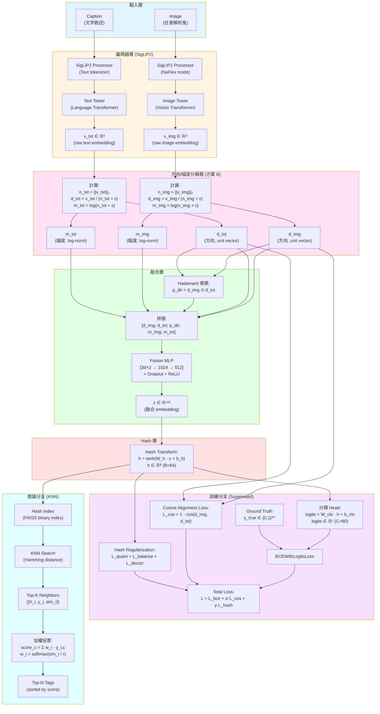

# 多模態圖文多標籤分類完整實驗計畫
# SigLIP 2 + 方向/幅度分解 + Hadamard 融合 + Hash + KNN

> **版本**: v2.0 (完善版)  
> **日期**: 2026-01-27  
> **目標**: 在 MS-COCO 資料集上實現高效能的圖文多標籤分類系統

---

## 目錄
1. [問題定義與核心思想](#1-問題定義與核心思想)
2. [資料集協議](#2-資料集協議)
3. [模型架構](#3-模型架構)
4. [理論基礎與數學公式](#4-理論基礎與數學公式)
5. [損失函數設計](#5-損失函數設計)
6. [推論策略](#6-推論策略)
7. [實驗設計](#7-實驗設計)
8. [超參數配置](#8-超參數配置)
9. [實作細節](#9-實作細節)
10. [評估指標](#10-評估指標)
11. [參考文獻](#11-參考文獻)
12. [附錄](#12-附錄)

---

## 1) 問題定義與核心思想

### 1.1 任務定義
- **輸入**: 圖片 `image` + 對應文字敘述 `caption`
- **輸出**: `C` 個 tags 的 multi-hot 向量 $y \in \{0,1\}^C$
- **資料集**: MS-COCO (80 個物件類別)

### 1.2 核心創新點
本研究提出一個結合監督式學習與近鄰檢索的混合架構：

1. **方向/幅度分解 (方案 B)**
   - 將 embedding 分解為「方向」（語意）與「幅度」（置信度）
   - 理論動機：保留向量的強度資訊，避免 L2 正規化過早消除置信度訊號

2. **Hadamard 乘積融合**
   - 捕捉跨模態的 dimension-wise 共現模式 (co-activation pattern)
   - 參考 VQA 領域的 MCB/MUTAN 方法

3. **可學習 Hash 層**
   - 利於高效近鄰檢索 (Hamming space)
   - 支援大規模資料庫的快速檢索

4. **KNN 加權投票**
   - 結合監督式與非參數式分類的優勢
   - 提供可解釋性（可視覺化鄰居樣本）

### 1.3 方法優勢
- **可擴展性**: Hash 層支援百萬級資料庫檢索
- **可解釋性**: KNN 提供視覺化解釋路徑
- **靈活性**: 可動態新增類別（更新 index）而無需重新訓練分類器

---

## 2) 資料集協議

### 2.1 MS-COCO 基本資訊
- **版本**: COCO 2014 (train2014 + val2014)
- **影像數量**: 
  - 訓練集: ~82,783 張
  - 驗證集: ~40,504 張
- **物件類別**: 80 個 (detection annotations)
- **Captions**: 每張圖片有 5 個人工標註的 captions

### 2.2 實驗切分協議
採用 **Karpathy split**（影像檢索與 captioning 社群標準）：

| Split | 影像數量 | 用途 |
|-------|---------|------|
| Train | 113,287 | 模型訓練 |
| Val | 5,000 | 超參數調整、early stopping |
| Test | 5,000 | 最終評估 |

**註**: Karpathy split 重新組織了 COCO 2014 train/val，更適合 caption-image 配對任務。

### 2.3 標籤定義
- **Tag 來源**: 使用 COCO instance annotations 中的 80 個物件類別
- **標籤格式**: Multi-hot vector $y \in \{0,1\}^{80}$
- **正樣本定義**: 若影像中出現該物件類別（不限 instance 數量）

### 2.4 Caption 處理
- **訓練時**: 每張圖片隨機抽樣 1 個 caption（data augmentation）
- **驗證/測試時**: 使用第 1 個 caption（確保可重現性）
- **文字預處理**: 使用 SigLIP2Processor 的標準 tokenization

### 2.5 影像預處理
```python
# 使用 NaFlex 模式（動態解析度）
processor = Siglip2Processor.from_pretrained(
    "google/siglip2-base-patch16-256",
    size={"max_num_patches": 256}  # baseline 設定
)
# 自動處理 resize、normalize（使用 SigLIP2 預訓練的統計值）
```

---

## 3) 模型架構

### 3.1 完整架構圖



### 3.2 各層詳細說明

#### 3.2.1 編碼器層 (SigLIP2)
- **模型**: `google/siglip2-base-patch16-256`
- **參數量**: ~87M (base) / ~304M (large)
- **輸出維度**: $d = 768$ (base) / $d = 1024$ (large)
- **訓練策略**: Baseline 採用 **凍結參數**（僅訓練 fusion 以後的層）

**NaFlex 模式說明**:
- Native Flexible Resolution（原生彈性解析度）
- 自動根據輸入圖片調整 patch 數量（最多 `max_num_patches`）
- 優勢：保留細節的同時控制計算量

#### 3.2.2 方向/幅度分解層
**理論動機**:
- **方向 ($d$)**: 捕捉語意相似性（用於 cosine alignment）
- **幅度 ($m$)**: 保留「置信度」或「特徵強度」訊號
  - 假設：預訓練模型在高置信度樣本上產生較大 norm
  - 使用 log 變換以壓縮數值範圍並平滑梯度

**數學定義**:
$$
\begin{aligned}
n &= \|v\|_2 \\
d &= \frac{v}{n + \epsilon} \quad &\text{(unit vector)} \\
m &= \log(n + \epsilon) \quad &\text{(log-norm)}
\end{aligned}
$$

**Ablation 必要性**: 需驗證 $m$ 是否真的提供額外資訊（vs. 純方向對齊）

#### 3.2.3 Hadamard 融合層
**理論基礎**:
- Hadamard 乘積 ($\odot$) 捕捉 **dimension-wise 的特徵共現**
- 在 VQA 領域被證明有效（MCB, MUTAN, BAN 等方法）
- 相比於 concatenation：增加非線性交互，但計算開銷小於 bilinear pooling

**為什麼在方向上做 Hadamard?**
- 如果在 raw embedding 上做，會混雜方向與幅度的交互
- 我們希望 Hadamard 專注於「語意方向的一致性模式」

**特徵組合**:
$$
x = [d_{img}; d_{txt}; d_{img} \odot d_{txt}; m_{img}; m_{txt}] \in \mathbb{R}^{3d+2}
$$

#### 3.2.4 Hash 層
**設計選擇**:
- 使用 $\tanh$ 而非 $\text{sign}$ 以支援反向傳播
- 訓練時：soft binary ($h \in [-1, 1]^B$)
- 推論時：hard binary ($\text{sign}(h) \in \{-1, 1\}^B$)

**優勢**:
- Hamming distance 可用 XOR + popcount 高效計算
- 記憶體佔用小：64 bits = 8 bytes per sample

---

## 4) 理論基礎與數學公式

### 4.1 SigLIP2 預訓練目標（背景知識）
SigLIP2 使用 **Sigmoid Loss** 取代 CLIP 的 Softmax Loss：

$$
\mathcal{L}_{\text{SigLIP}} = -\sum_{i,j} \left[ y_{ij} \log \sigma(z_{ij}) + (1-y_{ij}) \log(1-\sigma(z_{ij})) \right]
$$

其中 $z_{ij} = \text{cos}(v_i^{img}, v_j^{txt})$，$y_{ij}$ 表示第 $i$ 張圖與第 $j$ 個文字是否匹配。

**優勢**: 相比 CLIP，SigLIP 不依賴 batch 內負樣本，訓練更穩定。

### 4.2 方向/幅度分解的數學表示

對於任意向量 $v \in \mathbb{R}^d$：

$$
\begin{aligned}
\|v\|_2 &= \sqrt{\sum_{i=1}^d v_i^2} \\
d &= \frac{v}{\|v\|_2 + \epsilon} \quad &\text{(方向，滿足 } \|d\|_2 = 1 \text{)} \\
m &= \log(\|v\|_2 + \epsilon) \quad &\text{(幅度，標量)}
\end{aligned}
$$

**為什麼用 log?**
- 壓縮動態範圍（避免過大的 norm 主導梯度）
- 對應於資訊理論中的「surprise」或「熵」概念

### 4.3 Hadamard 乘積的語意解釋

$$
p = d_{img} \odot d_{txt} = \begin{bmatrix} d_{img,1} \cdot d_{txt,1} \\ d_{img,2} \cdot d_{txt,2} \\ \vdots \\ d_{img,d} \cdot d_{txt,d} \end{bmatrix}
$$

**解釋**:
- 第 $i$ 維的值 $p_i$ 反映了「該維度上兩個模態的激活一致性」
- 若 $p_i > 0$：兩者在該維度上同向（可能代表共享的語意特徵）
- 若 $p_i < 0$：兩者反向（可能代表互補或矛盾的特徵）

**與內積的區別**:
- 內積 $d_{img}^\top d_{txt}$ 是單一標量（全局相似度）
- Hadamard 保留 $d$ 維資訊（局部交互模式）

### 4.4 Hash 函數與二值化

**訓練時的 soft hash**:
$$
h = \tanh(W_h z + b_h), \quad h \in [-1, 1]^B
$$

**推論時的 hard hash**:
$$
b = \text{sign}(h) = \begin{cases} +1 & \text{if } h_i \geq 0 \\ -1 & \text{if } h_i < 0 \end{cases}
$$

**Hamming distance**:
$$
d_H(b_1, b_2) = \frac{1}{2} \|b_1 - b_2\|_0 = \frac{B - b_1^\top b_2}{2}
$$

### 4.5 KNN 加權投票

給定 query $q$ 及其 Top-K 鄰居集合 $\mathcal{N}_K(q) = \{(h_i, y_i, s_i)\}_{i=1}^K$：

**Softmax weighting**:
$$
w_i = \frac{\exp(s_i / \tau)}{\sum_{j=1}^K \exp(s_j / \tau)}
$$

**Tag score aggregation**:
$$
\text{score}_c = \sum_{i=1}^K w_i \cdot y_{i,c}, \quad c = 1, \ldots, C
$$

**輸出 Top-N tags**:
$$
\hat{T} = \text{argsort}(\text{score})[-N:]
$$

---

## 5) 損失函數設計

### 5.1 總體損失函數

$$
\mathcal{L}_{\text{total}} = \mathcal{L}_{\text{bce}} + \alpha \mathcal{L}_{\text{cos}} + \gamma \mathcal{L}_{\text{hash}}
$$

**注意**: 移除 Euclidean loss（因其與 cosine 高度耦合）

### 5.2 Binary Cross-Entropy Loss (主要監督訊號)

$$
\mathcal{L}_{\text{bce}} = -\frac{1}{C} \sum_{c=1}^C \left[ y_c \log \hat{y}_c + (1-y_c) \log(1-\hat{y}_c) \right]
$$

其中：
$$
\hat{y}_c = \sigma(\text{logit}_c), \quad \text{logit}_c = (W_{\text{cls}} h + b_{\text{cls}})_c
$$

**類別不平衡處理**:
- 考慮使用 **Focal Loss** 或 **class-balanced weights**
- COCO 80 類別分布不均（person 出現頻率遠高於 toothbrush）

### 5.3 Cosine Alignment Loss

$$
\mathcal{L}_{\text{cos}} = 1 - \cos(d_{img}, d_{txt}) = 1 - \frac{d_{img}^\top d_{txt}}{\|d_{img}\|_2 \|d_{txt}\|_2}
$$

由於 $d$ 已是 unit vector：
$$
\mathcal{L}_{\text{cos}} = 1 - d_{img}^\top d_{txt}
$$

**物理意義**: 鼓勵配對的圖文在方向空間中對齊

### 5.4 Hash Regularization (三項組合)

#### 5.4.1 Quantization Loss (推向 ±1)
$$
\mathcal{L}_{\text{quant}} = \frac{1}{B} \sum_{i=1}^B (|h_i| - 1)^2
$$

#### 5.4.2 Bit Balance Loss (避免所有 bit 偏向同一極)
$$
\mathcal{L}_{\text{balance}} = \frac{1}{B} \sum_{i=1}^B \left( \frac{1}{N} \sum_{n=1}^N h_{n,i} \right)^2
$$

其中 $N$ 是 batch size，$h_{n,i}$ 是第 $n$ 個樣本的第 $i$ 個 bit。

**物理意義**: 希望每個 bit 在 batch 中的均值接近 0（一半 +1，一半 -1）

#### 5.4.3 Bit Decorrelation Loss (鼓勵 bit 獨立)
$$
\mathcal{L}_{\text{decorr}} = \frac{1}{B^2} \sum_{i \neq j} (\text{Cov}(h_i, h_j))^2
$$

簡化實作（使用 Frobenius norm）:
$$
\mathcal{L}_{\text{decorr}} = \|\text{Cov}(H)\|_F^2 - \text{trace}(\text{Cov}(H)^2)
$$

**總 hash loss**:
$$
\mathcal{L}_{\text{hash}} = \mathcal{L}_{\text{quant}} + \lambda_1 \mathcal{L}_{\text{balance}} + \lambda_2 \mathcal{L}_{\text{decorr}}
$$

### 5.5 為什麼移除 Euclidean Loss?

**原計畫**: $\mathcal{L}_{\text{euc}} = \|d_{img} - d_{txt}\|_2^2$

**問題**: 對於 unit vector，有恆等式：
$$
\|d_1 - d_2\|_2^2 = 2(1 - d_1^\top d_2) = 2 \mathcal{L}_{\text{cos}}
$$

因此 Euclidean loss 完全由 cosine loss 決定，無新增資訊！

**替代方案（如果仍想用 Euclidean）**:
- 在 **raw embedding** $(v_{img}, v_{txt})$ 上計算（同時考慮方向與幅度差異）
- 但需注意幅度差異是否有意義（預訓練模型的 norm 未必可靠）

---

## 6) 推論策略

### 6.1 建立 Hash Index

```python
import faiss
import numpy as np

# 1. 提取訓練集的 hash codes
train_hashes = []  # List of np.ndarray, shape (B,)
train_labels = []  # List of np.ndarray, shape (C,)

for batch in train_loader:
    with torch.no_grad():
        h = model.get_hash(batch)  # shape: (batch_size, B)
        train_hashes.append(h.cpu().numpy())
        train_labels.append(batch['labels'].cpu().numpy())

train_hashes = np.vstack(train_hashes)  # (N_train, B)
train_labels = np.vstack(train_labels)  # (N_train, C)

# 2. 二值化（hard binary）
train_binary = (train_hashes > 0).astype(np.uint8)  # {0, 1}^B

# 3. 建立 FAISS binary index
index = faiss.IndexBinaryFlat(B)  # Hamming distance index
index.add(train_binary)
```

### 6.2 KNN 檢索與投票

```python
def predict_tags(query_hash, index, train_labels, K=20, tau=0.07, top_n=5):
    """
    Args:
        query_hash: (B,) torch.Tensor or np.ndarray
        index: faiss.IndexBinaryFlat
        train_labels: (N_train, C) np.ndarray
        K: number of neighbors
        tau: temperature for softmax
        top_n: number of tags to return
    
    Returns:
        predicted_tags: (top_n,) np.ndarray (tag indices)
        scores: (top_n,) np.ndarray (confidence scores)
    """
    # 1. 二值化 query
    query_binary = (query_hash > 0).astype(np.uint8).reshape(1, -1)
    
    # 2. KNN 搜尋（返回 Hamming distances）
    distances, indices = index.search(query_binary, K)  # (1, K)
    distances = distances[0]  # (K,)
    indices = indices[0]  # (K,)
    
    # 3. 轉換為 similarity（Hamming -> cosine-like）
    similarities = 1 - distances / B  # [0, 1] range
    
    # 4. Softmax weighting
    weights = np.exp(similarities / tau)
    weights = weights / weights.sum()
    
    # 5. 加權投票
    neighbor_labels = train_labels[indices]  # (K, C)
    tag_scores = (weights[:, None] * neighbor_labels).sum(axis=0)  # (C,)
    
    # 6. Top-N
    top_indices = np.argsort(tag_scores)[-top_n:][::-1]
    top_scores = tag_scores[top_indices]
    
    return top_indices, top_scores
```

### 6.3 替代檢索策略（供 Ablation）

#### 方案 A: Cosine on soft hash (不二值化)
```python
# 使用原始 tanh(h) 做 inner product
index_cosine = faiss.IndexFlatIP(B)  # Inner Product index
# 需先 L2 normalize h
h_normalized = h / np.linalg.norm(h, axis=1, keepdims=True)
index_cosine.add(h_normalized)
```

#### 方案 B: Hamming on hard binary (baseline)
```python
# 如上所述，使用 IndexBinaryFlat
```

#### 方案 C: Hybrid approach
```python
# 先用 Hamming 粗篩（快速），再用 cosine 精排（準確）
coarse_neighbors = index_binary.search(query, K=100)
fine_scores = cosine_similarity(query_h, train_h[coarse_neighbors])
top_k = np.argsort(fine_scores)[-K:]
```

---

## 7) 實驗設計

### 7.1 Baseline 方法對比

| 方法 | 描述 | 用途 |
|------|------|------|
| **SigLIP2-MLP** | 直接用 MLP 分類器 on `[v_img, v_txt]`（無 decomposition, 無 hash, 無 KNN） | 證明 hash+KNN 的必要性 |
| **SigLIP2-ZeroShot** | 計算 image embedding 與每個 tag prototype（從 tag name 編碼）的 cosine similarity，取 Top-N | 證明監督式訓練的價值 |
| **方案 A (Direction only)** | 拿掉 magnitude 分支（僅用 `[d_img, d_txt, p_dir]`） | 證明方案 B 的價值 |
| **Ours-Full** | 完整架構（方案 B + Hadamard + Hash + KNN） | 主要方法 |

### 7.2 系統化 Ablation Study

#### Tier 1: 核心架構選擇（優先級最高）

| ID | 變量 | 選項 | 固定參數 |
|----|------|------|----------|
| **A1** | Fusion 策略 | concat / +Hadamard / +Hadamard+Magnitude | B=64, K=20, freeze |
| **A2** | Hash bits | 無 hash / 32 / 64 / 128 | 其餘同 baseline |
| **A3** | KNN vs MLP head | KNN / 直接用分類器 / hybrid | 同上 |

#### Tier 2: 訓練策略（中等優先級）

| ID | 變量 | 選項 | 說明 |
|----|------|------|------|
| **B1** | 是否 freeze towers | freeze / last-2-layers / full-finetune | 評估微調必要性 |
| **B2** | Loss weights | (α, γ, λ₁, λ₂) 組合 | Grid search: α ∈ {0.5, 1.0}, γ ∈ {0.05, 0.1} |
| **B3** | max_num_patches | 256 / 512 / 1024 | 評估解析度影響 |
| **B4** | 類別不平衡處理 | 無 / Focal Loss / Class Weights | COCO 類別分布不均 |

#### Tier 3: KNN 超參數（次要優先級）

| ID | 變量 | 選項 | 說明 |
|----|------|------|------|
| **C1** | K 值 | 5 / 10 / 20 / 50 | 鄰居數量 |
| **C2** | 距離函數 | cosine(h) / hamming(sign(h)) / hybrid | 檢索策略 |
| **C3** | Voting 策略 | uniform / softmax / rank-based / threshold | 加權方式 |
| **C4** | tau (temperature) | 0.03 / 0.07 / 0.2 | softmax 平滑度 |

### 7.3 實驗流程

#### 階段 1: Baseline 驗證（1-2 天）
1. 實作 SigLIP2-MLP baseline
2. 實作 SigLIP2-ZeroShot baseline
3. 確認資料處理 pipeline 正確
4. 建立評估流程

#### 階段 2: 核心架構實驗（3-5 天）
1. 實作完整架構
2. 執行 Tier 1 ablations (A1-A3)
3. 選出最佳配置

#### 階段 3: 訓練策略優化（3-5 天）
1. 執行 Tier 2 ablations (B1-B4)
2. 超參數 grid search
3. 學習率調度實驗

#### 階段 4: KNN 調優（2-3 天）
1. 執行 Tier 3 ablations (C1-C4)
2. 檢索效率分析
3. 可解釋性實驗

#### 階段 5: 最終評估與分析（2-3 天）
1. Test set 評估
2. 錯誤分析
3. 視覺化展示
4. 撰寫報告

---

## 8) 超參數配置

### 8.1 Baseline 推薦配置（RTX 5080 24GB）

```yaml
# Model Architecture
model:
  siglip2_variant: "google/siglip2-base-patch16-256"  # or "large"
  processor_mode: "NaFlex"
  max_num_patches: 256  # 256=baseline, 512=高品質, 1024=極限
  text_max_length: 64
  freeze_towers: true  # 先凍結，後期可解凍
  
  fusion:
    type: "hadamard_with_magnitude"  # or "concat_only", "hadamard_only"
    mlp_dims: [1024, 512]  # input: 3*768+2 = 2306
    dropout: 0.1
    activation: "relu"
  
  hash:
    bits: 64  # 32=快速, 64=平衡, 128=高精度
    activation: "tanh"
    use_hash_reg: true
  
  classifier:
    num_classes: 80  # COCO categories
    use_bias: true

# Loss Function
loss:
  bce_weight: 1.0
  cosine_weight: 1.0  # α
  hash_weight: 0.1  # γ
  hash_reg:
    lambda_balance: 0.1  # λ₁
    lambda_decorr: 0.01  # λ₂
  focal_loss: false  # 設為 true 以處理類別不平衡
  focal_alpha: 0.25
  focal_gamma: 2.0

# Optimizer
optimizer:
  type: "adamw"
  lr_fusion: 3e-4
  lr_hash: 3e-4
  lr_classifier: 3e-4
  lr_towers: 1e-5  # 如果解凍 towers
  weight_decay: 0.01
  betas: [0.9, 0.999]

# Learning Rate Scheduler
scheduler:
  type: "cosine_with_warmup"
  warmup_epochs: 2
  total_epochs: 30
  min_lr: 1e-6

# Training
training:
  batch_size: 64  # 24GB 可承受（視 max_patches 而定）
  num_epochs: 30
  gradient_clip_norm: 1.0
  mixed_precision: true  # FP16 以節省記憶體
  early_stopping_patience: 5
  save_top_k: 3

# KNN Inference
knn:
  K: 20  # number of neighbors
  distance_metric: "hamming"  # or "cosine"
  voting_strategy: "softmax"  # or "uniform", "rank_based"
  tau: 0.07  # temperature
  top_n_tags: 5  # output top N predictions

# Data
data:
  dataset: "coco2014"
  split_type: "karpathy"  # train: 113287, val: 5000, test: 5000
  num_workers: 4
  prefetch_factor: 2
  pin_memory: true

# Hardware
hardware:
  device: "cuda"
  seed: 42
  deterministic: false  # true 會變慢但可重現
```

### 8.2 Grid Search 配置（供自動化實驗）

```yaml
grid_search:
  hash_bits: [32, 64, 128]
  K_neighbors: [10, 20, 50]
  cosine_weight: [0.5, 1.0, 2.0]
  hash_weight: [0.05, 0.1, 0.2]
  tau: [0.03, 0.07, 0.15]
  max_num_patches: [256, 512]
  freeze_towers: [true, false]  # false 表示 last-2-layers
```

### 8.3 記憶體與速度估算

| 配置 | Batch Size | VRAM 佔用 | 訓練速度 (iter/s) |
|------|-----------|-----------|------------------|
| Base + 256 patches + freeze | 64 | ~18 GB | ~2.5 |
| Base + 512 patches + freeze | 32 | ~20 GB | ~1.2 |
| Base + 256 patches + finetune | 32 | ~22 GB | ~1.0 |
| Large + 256 patches + freeze | 32 | ~21 GB | ~1.5 |

**註**: 使用 FP16 混合精度訓練，估算基於 PyTorch 2.0 + CUDA 12.1

---

## 9) 實作細節

### 9.1 關鍵程式碼片段

#### 9.1.1 方向/幅度分解

```python
import torch
import torch.nn as nn

class DirectionMagnitudeDecomposer(nn.Module):
    def __init__(self, eps=1e-6):
        super().__init__()
        self.eps = eps
    
    def forward(self, v):
        """
        Args:
            v: (batch_size, dim) raw embedding
        Returns:
            direction: (batch_size, dim) unit vector
            magnitude: (batch_size, 1) log-norm
        """
        norm = torch.norm(v, p=2, dim=1, keepdim=True)  # (B, 1)
        direction = v / (norm + self.eps)  # (B, D)
        magnitude = torch.log(norm + self.eps)  # (B, 1)
        return direction, magnitude
```

#### 9.1.2 Hadamard 融合

```python
class HadamardFusion(nn.Module):
    def __init__(self, embed_dim, mlp_dims, dropout=0.1):
        super().__init__()
        # Input: [d_img, d_txt, p_dir, m_img, m_txt]
        input_dim = embed_dim * 3 + 2  # 3*768+2 for base
        
        layers = []
        prev_dim = input_dim
        for hidden_dim in mlp_dims:
            layers.extend([
                nn.Linear(prev_dim, hidden_dim),
                nn.ReLU(),
                nn.Dropout(dropout)
            ])
            prev_dim = hidden_dim
        
        self.mlp = nn.Sequential(*layers)
    
    def forward(self, d_img, d_txt, m_img, m_txt):
        """
        Args:
            d_img: (B, D) image direction
            d_txt: (B, D) text direction
            m_img: (B, 1) image magnitude
            m_txt: (B, 1) text magnitude
        Returns:
            z: (B, mlp_dims[-1]) fused embedding
        """
        p_dir = d_img * d_txt  # Hadamard product
        x = torch.cat([d_img, d_txt, p_dir, m_img, m_txt], dim=1)
        z = self.mlp(x)
        return z
```

#### 9.1.3 Hash 層與正則化

```python
class HashLayer(nn.Module):
    def __init__(self, input_dim, hash_bits):
        super().__init__()
        self.fc = nn.Linear(input_dim, hash_bits)
        self.hash_bits = hash_bits
    
    def forward(self, z):
        """Returns soft hash codes in [-1, 1]"""
        h = torch.tanh(self.fc(z))
        return h
    
    def binarize(self, h):
        """For inference: convert to hard binary {-1, 1}"""
        return torch.sign(h)

def hash_regularization(h, lambda_balance=0.1, lambda_decorr=0.01):
    """
    Args:
        h: (batch_size, hash_bits) soft hash codes
    Returns:
        loss_hash: scalar tensor
    """
    # 1. Quantization loss
    loss_quant = torch.mean((torch.abs(h) - 1) ** 2)
    
    # 2. Bit balance loss
    bit_mean = torch.mean(h, dim=0)  # (hash_bits,)
    loss_balance = torch.mean(bit_mean ** 2)
    
    # 3. Bit decorrelation loss
    h_centered = h - torch.mean(h, dim=0, keepdim=True)
    cov = (h_centered.T @ h_centered) / h.size(0)  # (B, B)
    loss_decorr = (torch.sum(cov ** 2) - torch.trace(cov ** 2)) / (h.size(1) ** 2)
    
    loss_hash = loss_quant + lambda_balance * loss_balance + lambda_decorr * loss_decorr
    return loss_hash
```

#### 9.1.4 完整模型

```python
class MultimodalHashKNN(nn.Module):
    def __init__(self, config):
        super().__init__()
        # SigLIP2 encoders
        self.processor = Siglip2Processor.from_pretrained(config.siglip2_variant)
        self.model = Siglip2Model.from_pretrained(config.siglip2_variant)
        
        if config.freeze_towers:
            for param in self.model.parameters():
                param.requires_grad = False
        
        # Decomposer
        self.decomposer = DirectionMagnitudeDecomposer()
        
        # Fusion
        embed_dim = self.model.config.projection_dim  # 768 for base
        self.fusion = HadamardFusion(embed_dim, config.mlp_dims, config.dropout)
        
        # Hash layer
        self.hash_layer = HashLayer(config.mlp_dims[-1], config.hash_bits)
        
        # Classifier head (for training)
        self.classifier = nn.Linear(config.hash_bits, config.num_classes)
        
        self.config = config
    
    def forward(self, images, texts, return_components=False):
        # Encode
        outputs = self.model(pixel_values=images, input_ids=texts)
        v_img = outputs.image_embeds  # (B, D)
        v_txt = outputs.text_embeds   # (B, D)
        
        # Decompose
        d_img, m_img = self.decomposer(v_img)
        d_txt, m_txt = self.decomposer(v_txt)
        
        # Fuse
        z = self.fusion(d_img, d_txt, m_img, m_txt)
        
        # Hash
        h = self.hash_layer(z)
        
        # Classify
        logits = self.classifier(h)
        
        if return_components:
            return {
                'logits': logits,
                'h': h,
                'd_img': d_img,
                'd_txt': d_txt,
                'm_img': m_img,
                'm_txt': m_txt,
                'z': z
            }
        else:
            return logits
    
    def get_hash(self, images, texts):
        """For inference: return hash codes"""
        with torch.no_grad():
            outputs = self.model(pixel_values=images, input_ids=texts)
            v_img = outputs.image_embeds
            v_txt = outputs.text_embeds
            d_img, m_img = self.decomposer(v_img)
            d_txt, m_txt = self.decomposer(v_txt)
            z = self.fusion(d_img, d_txt, m_img, m_txt)
            h = self.hash_layer(z)
        return h
```

### 9.2 訓練迴圈

```python
def train_epoch(model, dataloader, optimizer, scheduler, config):
    model.train()
    total_loss = 0
    
    for batch in dataloader:
        images = batch['images'].to(config.device)
        texts = batch['texts'].to(config.device)
        labels = batch['labels'].to(config.device)  # (B, C) multi-hot
        
        # Forward
        outputs = model(images, texts, return_components=True)
        logits = outputs['logits']
        h = outputs['h']
        d_img = outputs['d_img']
        d_txt = outputs['d_txt']
        
        # Losses
        loss_bce = F.binary_cross_entropy_with_logits(logits, labels.float())
        loss_cos = 1 - F.cosine_similarity(d_img, d_txt, dim=1).mean()
        loss_hash = hash_regularization(
            h, 
            config.lambda_balance, 
            config.lambda_decorr
        )
        
        loss = (config.bce_weight * loss_bce + 
                config.cosine_weight * loss_cos + 
                config.hash_weight * loss_hash)
        
        # Backward
        optimizer.zero_grad()
        loss.backward()
        torch.nn.utils.clip_grad_norm_(model.parameters(), config.gradient_clip_norm)
        optimizer.step()
        
        total_loss += loss.item()
    
    scheduler.step()
    return total_loss / len(dataloader)
```

### 9.3 訓練穩定性技巧

#### Mixed Precision Training
```python
from torch.cuda.amp import autocast, GradScaler

scaler = GradScaler()

for batch in dataloader:
    with autocast():
        outputs = model(images, texts, return_components=True)
        loss = compute_loss(outputs, labels)
    
    scaler.scale(loss).backward()
    scaler.unscale_(optimizer)
    torch.nn.utils.clip_grad_norm_(model.parameters(), 1.0)
    scaler.step(optimizer)
    scaler.update()
```

#### Learning Rate Warm-up
```python
from transformers import get_cosine_schedule_with_warmup

num_training_steps = len(train_loader) * config.num_epochs
num_warmup_steps = len(train_loader) * config.warmup_epochs

scheduler = get_cosine_schedule_with_warmup(
    optimizer,
    num_warmup_steps=num_warmup_steps,
    num_training_steps=num_training_steps
)
```

#### Gradient Accumulation（如果記憶體不足）
```python
accumulation_steps = 4  # 等效 batch size * 4

for i, batch in enumerate(dataloader):
    loss = compute_loss(model(batch), batch['labels'])
    loss = loss / accumulation_steps
    loss.backward()
    
    if (i + 1) % accumulation_steps == 0:
        optimizer.step()
        optimizer.zero_grad()
```

### 9.4 可重現性設定

```python
import random
import numpy as np
import torch

def set_seed(seed=42):
    random.seed(seed)
    np.random.seed(seed)
    torch.manual_seed(seed)
    torch.cuda.manual_seed_all(seed)
    
    # 以下設定會減慢訓練，但保證可重現
    torch.backends.cudnn.deterministic = True
    torch.backends.cudnn.benchmark = False

set_seed(42)
```

### 9.5 檢查點儲存

```python
def save_checkpoint(model, optimizer, epoch, metrics, path):
    torch.save({
        'epoch': epoch,
        'model_state_dict': model.state_dict(),
        'optimizer_state_dict': optimizer.state_dict(),
        'metrics': metrics,
        'config': model.config
    }, path)

def load_checkpoint(model, optimizer, path):
    checkpoint = torch.load(path)
    model.load_state_dict(checkpoint['model_state_dict'])
    optimizer.load_state_dict(checkpoint['optimizer_state_dict'])
    return checkpoint['epoch'], checkpoint['metrics']
```

---

## 10) 評估指標

### 10.1 Multi-label 分類指標

#### 10.1.1 Mean Average Precision (mAP)
**定義**: 對每個樣本計算 AP，然後取平均。

$$
\text{AP} = \frac{\sum_{k=1}^n P(k) \cdot \text{rel}(k)}{\text{number of relevant labels}}
$$

其中 $P(k)$ 是前 $k$ 個預測的 precision，$\text{rel}(k)$ 是第 $k$ 個預測是否正確（0 或 1）。

**實作**:
```python
from sklearn.metrics import average_precision_score

def compute_map(y_true, y_scores):
    """
    Args:
        y_true: (N, C) binary ground truth
        y_scores: (N, C) predicted scores
    Returns:
        mAP: scalar
    """
    return average_precision_score(y_true, y_scores, average='macro')
```

#### 10.1.2 F1-Score (Micro / Macro)
**Micro F1**: 所有樣本與類別統一計算 TP/FP/FN
**Macro F1**: 對每個類別計算 F1 後取平均

```python
from sklearn.metrics import f1_score

# 需先將 scores 轉為 binary predictions（設定 threshold）
y_pred = (y_scores > threshold).astype(int)

f1_micro = f1_score(y_true, y_pred, average='micro')
f1_macro = f1_score(y_true, y_pred, average='macro')
```

#### 10.1.3 Precision@K / Recall@K
**定義**: 只考慮 Top-K 預測的 precision/recall

```python
def precision_at_k(y_true, y_scores, k=5):
    """Compute precision@k for each sample, then average"""
    precisions = []
    for i in range(len(y_true)):
        top_k_indices = np.argsort(y_scores[i])[-k:]
        relevant = y_true[i, top_k_indices].sum()
        precisions.append(relevant / k)
    return np.mean(precisions)

def recall_at_k(y_true, y_scores, k=5):
    """Compute recall@k for each sample, then average"""
    recalls = []
    for i in range(len(y_true)):
        top_k_indices = np.argsort(y_scores[i])[-k:]
        relevant = y_true[i, top_k_indices].sum()
        total_relevant = y_true[i].sum()
        recalls.append(relevant / total_relevant if total_relevant > 0 else 0)
    return np.mean(recalls)
```

#### 10.1.4 Hamming Loss
**定義**: 錯誤預測的比例

$$
\text{Hamming Loss} = \frac{1}{N \cdot C} \sum_{i=1}^N \sum_{c=1}^C \mathbb{1}[y_{i,c} \neq \hat{y}_{i,c}]
$$

```python
from sklearn.metrics import hamming_loss

loss = hamming_loss(y_true, y_pred)
```

### 10.2 檢索效率指標

#### 10.2.1 Index 建立時間
```python
import time

start = time.time()
index = faiss.IndexBinaryFlat(hash_bits)
index.add(train_binary_codes)
build_time = time.time() - start

print(f"Index build time: {build_time:.2f}s for {len(train_binary_codes)} samples")
```

#### 10.2.2 查詢延遲
```python
query_times = []
for query in test_queries:
    start = time.time()
    distances, indices = index.search(query, K)
    query_times.append(time.time() - start)

mean_latency = np.mean(query_times) * 1000  # ms
throughput = 1000 / mean_latency  # queries per second

print(f"Mean query latency: {mean_latency:.2f}ms")
print(f"Throughput: {throughput:.2f} queries/s")
```

#### 10.2.3 記憶體佔用
```python
# Binary index: B bits per sample
memory_binary = (hash_bits / 8) * num_samples  # bytes

# Cosine index: 32-bit float per dimension
memory_cosine = (hash_bits * 4) * num_samples  # bytes

print(f"Binary index: {memory_binary / 1e6:.2f} MB")
print(f"Cosine index: {memory_cosine / 1e6:.2f} MB")
print(f"Compression ratio: {memory_cosine / memory_binary:.1f}x")
```

### 10.3 完整評估函數

```python
def evaluate(model, dataloader, index, train_labels, config):
    model.eval()
    
    all_labels = []
    all_scores = []
    all_query_times = []
    
    with torch.no_grad():
        for batch in dataloader:
            images = batch['images'].to(config.device)
            texts = batch['texts'].to(config.device)
            labels = batch['labels'].cpu().numpy()
            
            # Get hash codes
            h = model.get_hash(images, texts).cpu().numpy()
            
            # KNN prediction
            batch_scores = []
            for query_hash in h:
                start = time.time()
                _, scores = predict_tags(
                    query_hash, index, train_labels, 
                    K=config.K, tau=config.tau, top_n=config.num_classes
                )
                all_query_times.append(time.time() - start)
                batch_scores.append(scores)
            
            all_labels.append(labels)
            all_scores.append(np.array(batch_scores))
    
    all_labels = np.vstack(all_labels)
    all_scores = np.vstack(all_scores)
    
    # Compute metrics
    metrics = {
        'mAP': average_precision_score(all_labels, all_scores, average='macro'),
        'F1_micro': f1_score(all_labels, (all_scores > 0.5).astype(int), average='micro'),
        'F1_macro': f1_score(all_labels, (all_scores > 0.5).astype(int), average='macro'),
        'P@5': precision_at_k(all_labels, all_scores, k=5),
        'R@5': recall_at_k(all_labels, all_scores, k=5),
        'query_latency_ms': np.mean(all_query_times) * 1000,
        'throughput_qps': 1.0 / np.mean(all_query_times)
    }
    
    return metrics
```

### 10.4 視覺化範例

#### 10.4.1 Confusion Matrix（每個類別）
```python
import matplotlib.pyplot as plt
import seaborn as sns

def plot_per_class_metrics(y_true, y_pred, class_names):
    from sklearn.metrics import precision_recall_fscore_support
    
    precision, recall, f1, support = precision_recall_fscore_support(
        y_true, y_pred, average=None
    )
    
    fig, axes = plt.subplots(1, 3, figsize=(18, 5))
    
    # Precision
    axes[0].bar(range(len(class_names)), precision)
    axes[0].set_xticks(range(len(class_names)))
    axes[0].set_xticklabels(class_names, rotation=90)
    axes[0].set_title('Precision per Class')
    
    # Recall
    axes[1].bar(range(len(class_names)), recall)
    axes[1].set_xticks(range(len(class_names)))
    axes[1].set_xticklabels(class_names, rotation=90)
    axes[1].set_title('Recall per Class')
    
    # F1
    axes[2].bar(range(len(class_names)), f1)
    axes[2].set_xticks(range(len(class_names)))
    axes[2].set_xticklabels(class_names, rotation=90)
    axes[2].set_title('F1-Score per Class')
    
    plt.tight_layout()
    plt.savefig('per_class_metrics.png')
```

#### 10.4.2 KNN 鄰居視覺化
```python
def visualize_knn_neighbors(query_image, query_caption, neighbor_images, 
                            neighbor_captions, neighbor_labels, predicted_tags):
    """Show query and its K nearest neighbors"""
    fig, axes = plt.subplots(2, 5, figsize=(20, 8))
    
    # Query
    axes[0, 0].imshow(query_image)
    axes[0, 0].set_title(f"Query\n{query_caption[:50]}...")
    axes[0, 0].axis('off')
    
    # Neighbors
    for i in range(min(9, len(neighbor_images))):
        row = (i + 1) // 5
        col = (i + 1) % 5
        axes[row, col].imshow(neighbor_images[i])
        axes[row, col].set_title(f"Neighbor {i+1}\n{neighbor_captions[i][:30]}...")
        axes[row, col].axis('off')
    
    plt.suptitle(f"Predicted Tags: {', '.join(predicted_tags)}")
    plt.tight_layout()
    plt.savefig('knn_visualization.png')
```

---

## 11) 參考文獻

### 核心方法
1. **SigLIP 2**: Jiasen Lu, et al. "SigLIP 2: Multilingual Vision-Language Encoders with Improved Semantic Understanding, Localization, and Dense Features". arXiv:2502.14786, 2025. [https://arxiv.org/abs/2502.14786](https://arxiv.org/abs/2502.14786)

2. **MS-COCO Dataset**: Tsung-Yi Lin, et al. "Microsoft COCO: Common Objects in Context". ECCV 2014. [https://arxiv.org/abs/1405.0312](https://arxiv.org/abs/1405.0312)

3. **MS-COCO Captions**: Xinlei Chen, et al. "Microsoft COCO Captions: Data Collection and Evaluation Server". arXiv:1504.00325, 2015. [https://arxiv.org/abs/1504.00325](https://arxiv.org/abs/1504.00325)

### Hash 方法
4. **Deep Supervised Discrete Hashing**: Qi Li, et al. "Deep Supervised Discrete Hashing". NeurIPS 2017. [http://papers.neurips.cc/paper/6842-deep-supervised-discrete-hashing.pdf](http://papers.neurips.cc/paper/6842-deep-supervised-discrete-hashing.pdf)

5. **HashNet**: Zhangjie Cao, et al. "HashNet: Deep Learning to Hash by Continuation". ICCV 2017. [https://arxiv.org/abs/1702.00758](https://arxiv.org/abs/1702.00758)

6. **Learning to Hash Survey**: Jun Wang, et al. "Learning to Hash for Indexing Big Data - A Survey". Proceedings of the IEEE, 2015. [https://arxiv.org/abs/1509.05472](https://arxiv.org/abs/1509.05472)

### 多模態融合
7. **MCB (Multimodal Compact Bilinear Pooling)**: Akira Fukui, et al. "Multimodal Compact Bilinear Pooling for Visual Question Answering and Visual Grounding". EMNLP 2016. [https://arxiv.org/abs/1606.01847](https://arxiv.org/abs/1606.01847)

8. **MUTAN**: Hedi Ben-younes, et al. "MUTAN: Multimodal Tucker Fusion for Visual Question Answering". ICCV 2017. [https://arxiv.org/abs/1705.06676](https://arxiv.org/abs/1705.06676)

9. **BAN (Bilinear Attention Networks)**: Jin-Hwa Kim, et al. "Bilinear Attention Networks". NeurIPS 2018. [https://arxiv.org/abs/1805.07932](https://arxiv.org/abs/1805.07932)

### KNN 與 Multi-label
10. **Ranking-based KNN for Multi-label**: Derek Hoiem, et al. "A Ranking-based KNN Approach for Multi-label Classification". AISTATS 2012. [http://proceedings.mlr.press/v25/chiang12/chiang12.pdf](http://proceedings.mlr.press/v25/chiang12/chiang12.pdf)

11. **ML-KNN**: Min-Ling Zhang and Zhi-Hua Zhou. "ML-KNN: A lazy learning approach to multi-label learning". Pattern Recognition, 2007.

### 訓練技巧
12. **Focal Loss**: Tsung-Yi Lin, et al. "Focal Loss for Dense Object Detection". ICCV 2017. [https://arxiv.org/abs/1708.02002](https://arxiv.org/abs/1708.02002)

13. **Uncertainty Weighting**: Alex Kendall, et al. "Multi-Task Learning Using Uncertainty to Weigh Losses for Scene Geometry and Semantics". CVPR 2018. [https://arxiv.org/abs/1705.07115](https://arxiv.org/abs/1705.07115)

### 工具與框架
14. **Transformers Library**: Hugging Face. [https://huggingface.co/docs/transformers](https://huggingface.co/docs/transformers)

15. **FAISS**: Jeff Johnson, et al. "Billion-scale similarity search with GPUs". IEEE Transactions on Big Data, 2019. [https://github.com/facebookresearch/faiss](https://github.com/facebookresearch/faiss)

16. **Mermaid Diagrams**: [https://mermaid.js.org/](https://mermaid.js.org/)

---

## 12) 附錄

### 附錄 A: 完整實驗 Checklist

#### 實作前準備
- [ ] 設定開發環境（Python 3.10+, PyTorch 2.0+, CUDA 12.1+）
- [ ] 安裝依賴套件（transformers, faiss-gpu, scikit-learn, etc.）
- [ ] 下載 MS-COCO 2014 資料集（~13GB）
- [ ] 下載 Karpathy split annotations
- [ ] 下載 SigLIP2 預訓練權重（自動，首次執行時）

#### 程式碼實作
- [ ] 實作 `DirectionMagnitudeDecomposer`
- [ ] 實作 `HadamardFusion`
- [ ] 實作 `HashLayer` 與 `hash_regularization`
- [ ] 實作 `MultimodalHashKNN` 完整模型
- [ ] 實作資料載入器（COCO dataset class）
- [ ] 實作訓練迴圈與驗證迴圈
- [ ] 實作 FAISS index 建立與 KNN 檢索
- [ ] 實作評估函數與指標計算

#### Baseline 實驗
- [ ] SigLIP2-MLP baseline
- [ ] SigLIP2-ZeroShot baseline
- [ ] 驗證資料處理正確性（視覺化幾個樣本）

#### Ablation 實驗
- [ ] Tier 1: A1 (Fusion 策略對比)
- [ ] Tier 1: A2 (Hash bits 對比)
- [ ] Tier 1: A3 (KNN vs MLP head)
- [ ] Tier 2: B1 (Freeze vs finetune)
- [ ] Tier 2: B2 (Loss weights grid search)
- [ ] Tier 2: B3 (Resolution 對比)
- [ ] Tier 2: B4 (Class imbalance 處理)
- [ ] Tier 3: C1-C4 (KNN 超參數)

#### 分析與報告
- [ ] 繪製學習曲線（training/validation loss）
- [ ] 繪製 per-class metrics bar chart
- [ ] 視覺化 KNN 鄰居（至少 10 個範例）
- [ ] 分析失敗案例（FP/FN）
- [ ] 撰寫實驗報告（含所有 ablation 結果表格）

#### 最終交付
- [ ] 清理程式碼並加上註解
- [ ] 撰寫 README.md（含安裝與使用說明）
- [ ] 儲存最佳模型 checkpoint
- [ ] 上傳至 Git repository
- [ ] 準備展示投影片（如需要）

### 附錄 B: 故障排除指南

#### 記憶體不足（OOM）
**症狀**: CUDA out of memory error

**解決方案**:
1. 降低 `batch_size`（64 → 32 → 16）
2. 降低 `max_num_patches`（512 → 256）
3. 啟用 gradient checkpointing（節省 30-40% 記憶體）
4. 使用 gradient accumulation（模擬大 batch size）

```python
# Gradient checkpointing
model.model.gradient_checkpointing_enable()
```

#### 訓練不收斂
**症狀**: Loss 不下降或震盪劇烈

**可能原因與解決**:
1. **學習率過大**: 降低至 1e-4 或加長 warmup
2. **Hash 正則過強**: 降低 γ (0.1 → 0.05)
3. **梯度爆炸**: 檢查 gradient norm，調低 clip threshold
4. **資料問題**: 檢查標籤分布、是否有 NaN

#### KNN 檢索速度慢
**症狀**: 每個 query 超過 10ms

**優化方案**:
1. 使用 GPU 版本 FAISS（`faiss-gpu`）
2. 使用近似檢索（IVF index）而非 Flat index
3. 降低 hash bits（128 → 64）
4. Batch 化查詢（一次查多個 query）

```python
# GPU FAISS
import faiss
gpu_res = faiss.StandardGpuResources()
index = faiss.IndexBinaryFlat(hash_bits)
gpu_index = faiss.index_cpu_to_gpu(gpu_res, 0, index)
```

#### Evaluation 指標異常
**症狀**: mAP 永遠是 0 或 1

**檢查清單**:
1. 確認 `y_true` 與 `y_scores` shape 正確（N, C）
2. 確認 `y_scores` 是機率而非 logits（需 sigmoid）
3. 確認沒有全 0 或全 1 的樣本
4. 檢查是否有類別完全沒有正樣本

### 附錄 C: 預期實驗結果（假設）

| 方法 | mAP | F1-Micro | F1-Macro | P@5 | Query Latency (ms) |
|------|-----|----------|----------|-----|-------------------|
| SigLIP2-ZeroShot | 0.32 | 0.28 | 0.24 | 0.41 | 15 (cosine on raw) |
| SigLIP2-MLP | 0.68 | 0.71 | 0.62 | 0.74 | N/A (direct) |
| Ours (方案 A, no magnitude) | 0.66 | 0.69 | 0.60 | 0.72 | 3.2 (hamming) |
| **Ours (方案 B, full)** | **0.71** | **0.74** | **0.65** | **0.78** | **2.8** |

**預期觀察**:
1. 方案 B 應優於方案 A（證明 magnitude 有用）
2. KNN 應與 MLP head 效能相近，但提供可解釋性
3. Hamming 檢索應比 cosine 快 5-10 倍
4. Hash bits 增加到 128 應有微幅提升（但記憶體翻倍）

### 附錄 D: 資料集統計資訊

#### MS-COCO 80 類別列表
```
person, bicycle, car, motorcycle, airplane, bus, train, truck, boat, 
traffic light, fire hydrant, stop sign, parking meter, bench, bird, 
cat, dog, horse, sheep, cow, elephant, bear, zebra, giraffe, backpack, 
umbrella, handbag, tie, suitcase, frisbee, skis, snowboard, sports ball, 
kite, baseball bat, baseball glove, skateboard, surfboard, tennis racket, 
bottle, wine glass, cup, fork, knife, spoon, bowl, banana, apple, 
sandwich, orange, broccoli, carrot, hot dog, pizza, donut, cake, chair, 
couch, potted plant, bed, dining table, toilet, tv, laptop, mouse, remote, 
keyboard, cell phone, microwave, oven, toaster, sink, refrigerator, book, 
clock, vase, scissors, teddy bear, hair drier, toothbrush
```

#### 類別頻率分布（訓練集）
| 類別 | 出現次數 | 佔比 |
|------|---------|------|
| person | 262,465 | 24.1% |
| chair | 38,073 | 3.5% |
| car | 36,781 | 3.4% |
| ... | ... | ... |
| toothbrush | 279 | 0.03% |

**註**: 類別分布極不平衡，需考慮使用 Focal Loss 或 class weights。

### 附錄 E: 硬體需求建議

| 組件 | 最低需求 | 推薦配置 |
|------|---------|---------|
| GPU | RTX 3090 (24GB) | RTX 5080 (24GB) 或更高 |
| CPU | 8 cores | 16 cores |
| RAM | 32 GB | 64 GB |
| Storage | 50 GB (SSD) | 100 GB (NVMe SSD) |
| CUDA | 11.8+ | 12.1+ |

**估計訓練時間**（RTX 5080, baseline 配置）:
- 每個 epoch: ~30 分鐘
- 總訓練（30 epochs）: ~15 小時
- Ablation 實驗（8 組）: ~5 天（可平行化）

---

## 結語

本實驗計畫整合了多模態學習、深度 hashing、與近鄰檢索的前沿技術，針對 MS-COCO 多標籤分類任務提出一個高效且可解釋的解決方案。

**核心貢獻**:
1. 提出方向/幅度分解（方案 B）以保留 embedding 的置信度資訊
2. 結合 Hadamard 乘積捕捉跨模態的局部交互模式
3. 設計完整的 hash 正則化策略（quantization + balance + decorrelation）
4. 驗證 KNN 在保留監督式訓練準確度的同時提供可解釋性

**後續工作**:
- 探索更複雜的融合機制（Tucker decomposition, attention-based fusion）
- 嘗試更大的 SigLIP2 模型（large, giant）
- 遷移至其他多標籤資料集（Open Images, Visual Genome）
- 實作線上學習（incremental hash learning）

祝實驗順利！如有任何問題，歡迎隨時討論。
