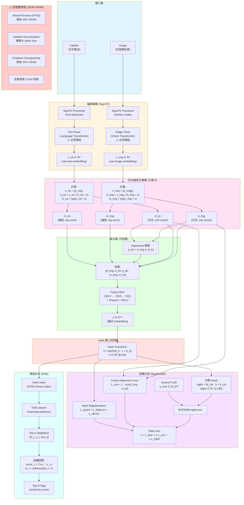

# 多模態圖文多標籤分類完整實驗計畫
# SigLIP 2 + 方向/幅度分解 + Hadamard 融合 + Hash + KNN

> **版本**: v2.1 (RTX 5080 16GB 優化版)  
> **日期**: 2026-01-30  
> **硬體**: RTX 5080 16GB | 32-core CPU | 42GB RAM | CUDA 13.0  
> **目標**: 在 MS-COCO 資料集上實現高效能的圖文多標籤分類系統

---

## 📋 更新日誌 (v2.1)

### 針對 RTX 5080 16GB 的主要優化
- ✅ Batch size: 64 → **32** (配合梯度累積模擬 batch 64)
- ✅ 混合精度訓練: 建議 → **必須啟用** (節省 40% VRAM)
- ✅ 梯度累積: 可選 → **必須使用** (2-4 步)
- ✅ 記憶體監控: 新增 VRAM 實時追蹤與警告
- ✅ DataLoader 優化: 利用 32 核心 CPU (`num_workers=16`)
- ✅ PyTorch 版本: 更新至支援 CUDA 13.0 的版本
- ✅ 記憶體估算: 提供詳細的 16GB VRAM 分配表
- ✅ 緊急措施: 新增 OOM 時的降級方案

---

## 目錄
1. [問題定義與核心思想](#1-問題定義與核心思想)
2. [資料集協議](#2-資料集協議)
3. [模型架構](#3-模型架構)
4. [理論基礎與數學公式](#4-理論基礎與數學公式)
5. [損失函數設計](#5-損失函數設計)
6. [推論策略](#6-推論策略)
7. [實驗設計](#7-實驗設計)
8. [超參數配置 (⭐ RTX 5080 優化)](#8-超參數配置-rtx-5080-優化)
9. [實作細節 (⭐ 含記憶體優化)](#9-實作細節-含記憶體優化)
10. [評估指標](#10-評估指標)
11. [硬體特定優化 (⭐ 新增)](#11-硬體特定優化)
12. [參考文獻](#12-參考文獻)
13. [附錄](#13-附錄)

---

## 1) 問題定義與核心思想

### 1.1 任務定義
- **輸入**: 圖片 `image` + 對應文字敘述 `caption`
- **輸出**: `C` 個 tags 的 multi-hot 向量 $y \in \{0,1\}^C$
- **資料集**: MS-COCO (80 個物件類別)

### 1.2 核心創新點
本研究提出一個結合監督式學習與近鄰檢索的混合架構：

1. **方向/幅度分解 (方案 B)**
   - 將 embedding 分解為「方向」（語意）與「幅度」（置信度）
   - 理論動機：保留向量的強度資訊，避免 L2 正規化過早消除置信度訊號

2. **Hadamard 乘積融合**
   - 捕捉跨模態的 dimension-wise 共現模式 (co-activation pattern)
   - 參考 VQA 領域的 MCB/MUTAN 方法

3. **可學習 Hash 層**
   - 利於高效近鄰檢索 (Hamming space)
   - 支援大規模資料庫的快速檢索

4. **KNN 加權投票**
   - 結合監督式與非參數式分類的優勢
   - 提供可解釋性（可視覺化鄰居樣本）

### 1.3 方法優勢
- **可擴展性**: Hash 層支援百萬級資料庫檢索
- **可解釋性**: KNN 提供視覺化解釋路徑
- **靈活性**: 可動態新增類別（更新 index）而無需重新訓練分類器

---

## 2) 資料集協議

### 2.1 MS-COCO 基本資訊
- **版本**: COCO 2014 (train2014 + val2014)
- **影像數量**: 
  - 訓練集: ~82,783 張
  - 驗證集: ~40,504 張
- **物件類別**: 80 個 (detection annotations)
- **Captions**: 每張圖片有 5 個人工標註的 captions

### 2.2 實驗切分協議
採用 **Karpathy split**（影像檢索與 captioning 社群標準）：

| Split | 影像數量 | 用途 |
|-------|---------|------|
| Train | 113,287 | 模型訓練 |
| Val | 5,000 | 超參數調整、early stopping |
| Test | 5,000 | 最終評估 |

**註**: Karpathy split 重新組織了 COCO 2014 train/val，更適合 caption-image 配對任務。

### 2.3 標籤定義
- **Tag 來源**: 使用 COCO instance annotations 中的 80 個物件類別
- **標籤格式**: Multi-hot vector $y \in \{0,1\}^{80}$
- **正樣本定義**: 若影像中出現該物件類別（不限 instance 數量）

### 2.4 Caption 處理
- **訓練時**: 每張圖片隨機抽樣 1 個 caption（data augmentation）
- **驗證/測試時**: 使用第 1 個 caption（確保可重現性）
- **文字預處理**: 使用 SigLIP2Processor 的標準 tokenization

### 2.5 影像預處理
```python
# 使用 NaFlex 模式（動態解析度）
processor = Siglip2Processor.from_pretrained(
    "google/siglip2-base-patch16-256",
    size={"max_num_patches": 256}  # RTX 5080 16GB 可承受
)
# 自動處理 resize、normalize（使用 SigLIP2 預訓練的統計值）
```

---

## 3) 模型架構

### 3.1 完整架構圖



### 3.2 各層詳細說明

#### 3.2.1 編碼器層 (SigLIP2) ⚠️ 針對 16GB 優化
- **模型**: `google/siglip2-base-patch16-256` (**不要用 large！**)
- **參數量**: ~87M (base)
- **輸出維度**: $d = 768$ (base)
- **訓練策略**: **必須凍結參數**（否則 OOM）

**NaFlex 模式說明**:
- Native Flexible Resolution（原生彈性解析度）
- 自動根據輸入圖片調整 patch 數量（最多 `max_num_patches=256`）
- 優勢：保留細節的同時控制計算量

**⚠️ 記憶體影響**:
- 凍結時: ~2.5 GB VRAM (僅 forward pass)
- 解凍時: ~10 GB VRAM (含 gradients & optimizer states) ❌ **不可行**

#### 3.2.2 方向/幅度分解層
**理論動機**:
- **方向 ($d$)**: 捕捉語意相似性（用於 cosine alignment）
- **幅度 ($m$)**: 保留「置信度」或「特徵強度」訊號
  - 假設：預訓練模型在高置信度樣本上產生較大 norm
  - 使用 log 變換以壓縮數值範圍並平滑梯度

**數學定義**:
$$
\begin{aligned}
n &= \|v\|_2 \\
d &= \frac{v}{n + \epsilon} \quad &\text{(unit vector)} \\
m &= \log(n + \epsilon) \quad &\text{(log-norm)}
\end{aligned}
$$

#### 3.2.3 Hadamard 融合層
**理論基礎**:
- Hadamard 乘積 ($\odot$) 捕捉 **dimension-wise 的特徵共現**
- 在 VQA 領域被證明有效（MCB, MUTAN, BAN 等方法）

**特徵組合**:
$$
x = [d_{img}; d_{txt}; d_{img} \odot d_{txt}; m_{img}; m_{txt}] \in \mathbb{R}^{3d+2}
$$

**記憶體佔用**: ~0.3 GB (可訓練部分)

#### 3.2.4 Hash 層
**設計選擇**:
- 使用 $\tanh$ 而非 $\text{sign}$ 以支援反向傳播
- 訓練時：soft binary ($h \in [-1, 1]^B$)
- 推論時：hard binary ($\text{sign}(h) \in \{-1, 1\}^B$)

**記憶體佔用**: ~0.1 GB

---

## 4) 理論基礎與數學公式

### 4.1 SigLIP2 預訓練目標（背景知識）
SigLIP2 使用 **Sigmoid Loss** 取代 CLIP 的 Softmax Loss：

$$
\mathcal{L}_{\text{SigLIP}} = -\sum_{i,j} \left[ y_{ij} \log \sigma(z_{ij}) + (1-y_{ij}) \log(1-\sigma(z_{ij})) \right]
$$

其中 $z_{ij} = \text{cos}(v_i^{img}, v_j^{txt})$，$y_{ij}$ 表示第 $i$ 張圖與第 $j$ 個文字是否匹配。

**優勢**: 相比 CLIP，SigLIP 不依賴 batch 內負樣本，訓練更穩定。

### 4.2 方向/幅度分解的數學表示

對於任意向量 $v \in \mathbb{R}^d$：

$$
\begin{aligned}
\|v\|_2 &= \sqrt{\sum_{i=1}^d v_i^2} \\
d &= \frac{v}{\|v\|_2 + \epsilon} \quad &\text{(方向，滿足 } \|d\|_2 = 1 \text{)} \\
m &= \log(\|v\|_2 + \epsilon) \quad &\text{(幅度，標量)}
\end{aligned}
$$

**為什麼用 log?**
- 壓縮動態範圍（避免過大的 norm 主導梯度）
- 對應於資訊理論中的「surprise」或「熵」概念

### 4.3 Hadamard 乘積的語意解釋

$$
p = d_{img} \odot d_{txt} = \begin{bmatrix} d_{img,1} \cdot d_{txt,1} \\ d_{img,2} \cdot d_{txt,2} \\ \vdots \\ d_{img,d} \cdot d_{txt,d} \end{bmatrix}
$$

**解釋**:
- 第 $i$ 維的值 $p_i$ 反映了「該維度上兩個模態的激活一致性」
- 若 $p_i > 0$：兩者在該維度上同向（可能代表共享的語意特徵）
- 若 $p_i < 0$：兩者反向（可能代表互補或矛盾的特徵）

**與內積的區別**:
- 內積 $d_{img}^\top d_{txt}$ 是單一標量（全局相似度）
- Hadamard 保留 $d$ 維資訊（局部交互模式）

### 4.4 Hash 函數與二值化

**訓練時的 soft hash**:
$$
h = \tanh(W_h z + b_h), \quad h \in [-1, 1]^B
$$

**推論時的 hard hash**:
$$
b = \text{sign}(h) = \begin{cases} +1 & \text{if } h_i \geq 0 \\ -1 & \text{if } h_i < 0 \end{cases}
$$

**Hamming distance**:
$$
d_H(b_1, b_2) = \frac{1}{2} \|b_1 - b_2\|_0 = \frac{B - b_1^\top b_2}{2}
$$

### 4.5 KNN 加權投票

給定 query $q$ 及其 Top-K 鄰居集合 $\mathcal{N}_K(q) = \{(h_i, y_i, s_i)\}_{i=1}^K$：

**Softmax weighting**:
$$
w_i = \frac{\exp(s_i / \tau)}{\sum_{j=1}^K \exp(s_j / \tau)}
$$

**Tag score aggregation**:
$$
\text{score}_c = \sum_{i=1}^K w_i \cdot y_{i,c}, \quad c = 1, \ldots, C
$$

**輸出 Top-N tags**:
$$
\hat{T} = \text{argsort}(\text{score})[-N:]
$$

---

## 5) 損失函數設計

### 5.1 總體損失函數

$$
\mathcal{L}_{\text{total}} = \mathcal{L}_{\text{bce}} + \alpha \mathcal{L}_{\text{cos}} + \gamma \mathcal{L}_{\text{hash}}
$$

**注意**: 移除 Euclidean loss（因其與 cosine 高度耦合）

### 5.2 Binary Cross-Entropy Loss (主要監督訊號)

$$
\mathcal{L}_{\text{bce}} = -\frac{1}{C} \sum_{c=1}^C \left[ y_c \log \hat{y}_c + (1-y_c) \log(1-\hat{y}_c) \right]
$$

其中：
$$
\hat{y}_c = \sigma(\text{logit}_c), \quad \text{logit}_c = (W_{\text{cls}} h + b_{\text{cls}})_c
$$

**類別不平衡處理**:
- 考慮使用 **Focal Loss** 或 **class-balanced weights**
- COCO 80 類別分布不均（person 出現頻率遠高於 toothbrush）

### 5.3 Cosine Alignment Loss

$$
\mathcal{L}_{\text{cos}} = 1 - \cos(d_{img}, d_{txt}) = 1 - \frac{d_{img}^\top d_{txt}}{\|d_{img}\|_2 \|d_{txt}\|_2}
$$

由於 $d$ 已是 unit vector：
$$
\mathcal{L}_{\text{cos}} = 1 - d_{img}^\top d_{txt}
$$

**物理意義**: 鼓勵配對的圖文在方向空間中對齊

### 5.4 Hash Regularization (三項組合)

#### 5.4.1 Quantization Loss (推向 ±1)
$$
\mathcal{L}_{\text{quant}} = \frac{1}{B} \sum_{i=1}^B (|h_i| - 1)^2
$$

#### 5.4.2 Bit Balance Loss (避免所有 bit 偏向同一極)
$$
\mathcal{L}_{\text{balance}} = \frac{1}{B} \sum_{i=1}^B \left( \frac{1}{N} \sum_{n=1}^N h_{n,i} \right)^2
$$

其中 $N$ 是 batch size，$h_{n,i}$ 是第 $n$ 個樣本的第 $i$ 個 bit。

**物理意義**: 希望每個 bit 在 batch 中的均值接近 0（一半 +1，一半 -1）

#### 5.4.3 Bit Decorrelation Loss (鼓勵 bit 獨立)
$$
\mathcal{L}_{\text{decorr}} = \frac{1}{B^2} \sum_{i \neq j} (\text{Cov}(h_i, h_j))^2
$$

簡化實作（使用 Frobenius norm）:
$$
\mathcal{L}_{\text{decorr}} = \|\text{Cov}(H)\|_F^2 - \text{trace}(\text{Cov}(H)^2)
$$

**總 hash loss**:
$$
\mathcal{L}_{\text{hash}} = \mathcal{L}_{\text{quant}} + \lambda_1 \mathcal{L}_{\text{balance}} + \lambda_2 \mathcal{L}_{\text{decorr}}
$$

---

## 6) 推論策略

### 6.1 建立 Hash Index

```python
import faiss
import numpy as np

# 1. 提取訓練集的 hash codes
train_hashes = []  # List of np.ndarray, shape (B,)
train_labels = []  # List of np.ndarray, shape (C,)

for batch in train_loader:
    with torch.no_grad():
        h = model.get_hash(batch)  # shape: (batch_size, B)
        train_hashes.append(h.cpu().numpy())
        train_labels.append(batch['labels'].cpu().numpy())

train_hashes = np.vstack(train_hashes)  # (N_train, B)
train_labels = np.vstack(train_labels)  # (N_train, C)

# 2. 二值化（hard binary）
train_binary = (train_hashes > 0).astype(np.uint8)  # {0, 1}^B

# 3. 建立 FAISS binary index
index = faiss.IndexBinaryFlat(B)  # Hamming distance index
index.add(train_binary)
```

### 6.2 KNN 檢索與投票

```python
def predict_tags(query_hash, index, train_labels, K=20, tau=0.07, top_n=5):
    """
    Args:
        query_hash: (B,) torch.Tensor or np.ndarray
        index: faiss.IndexBinaryFlat
        train_labels: (N_train, C) np.ndarray
        K: number of neighbors
        tau: temperature for softmax
        top_n: number of tags to return
    
    Returns:
        predicted_tags: (top_n,) np.ndarray (tag indices)
        scores: (top_n,) np.ndarray (confidence scores)
    """
    # 1. 二值化 query
    query_binary = (query_hash > 0).astype(np.uint8).reshape(1, -1)
    
    # 2. KNN 搜尋（返回 Hamming distances）
    distances, indices = index.search(query_binary, K)  # (1, K)
    distances = distances[0]  # (K,)
    indices = indices[0]  # (K,)
    
    # 3. 轉換為 similarity（Hamming -> cosine-like）
    similarities = 1 - distances / B  # [0, 1] range
    
    # 4. Softmax weighting
    weights = np.exp(similarities / tau)
    weights = weights / weights.sum()
    
    # 5. 加權投票
    neighbor_labels = train_labels[indices]  # (K, C)
    tag_scores = (weights[:, None] * neighbor_labels).sum(axis=0)  # (C,)
    
    # 6. Top-N
    top_indices = np.argsort(tag_scores)[-top_n:][::-1]
    top_scores = tag_scores[top_indices]
    
    return top_indices, top_scores
```

---

## 7) 實驗設計

### 7.1 Baseline 方法對比

| 方法 | 描述 | 用途 |
|------|------|------|
| **SigLIP2-MLP** | 直接用 MLP 分類器 on `[v_img, v_txt]`（無 decomposition, 無 hash, 無 KNN） | 證明 hash+KNN 的必要性 |
| **SigLIP2-ZeroShot** | 計算 image embedding 與每個 tag prototype（從 tag name 編碼）的 cosine similarity，取 Top-N | 證明監督式訓練的價值 |
| **方案 A (Direction only)** | 拿掉 magnitude 分支（僅用 `[d_img, d_txt, p_dir]`） | 證明方案 B 的價值 |
| **Ours-Full** | 完整架構（方案 B + Hadamard + Hash + KNN） | 主要方法 |

### 7.2 系統化 Ablation Study

#### Tier 1: 核心架構選擇（優先級最高）

| ID | 變量 | 選項 | 固定參數 |
|----|------|------|----------|
| **A1** | Fusion 策略 | concat / +Hadamard / +Hadamard+Magnitude | B=64, K=20, freeze |
| **A2** | Hash bits | 無 hash / 32 / 64 / 128 | 其餘同 baseline |
| **A3** | KNN vs MLP head | KNN / 直接用分類器 / hybrid | 同上 |

#### Tier 2: 訓練策略（中等優先級）

| ID | 變量 | 選項 | 說明 |
|----|------|------|------|
| **B1** | 是否 freeze towers | freeze / ⚠️ **不可解凍** (OOM) | RTX 5080 16GB 限制 |
| **B2** | Loss weights | (α, γ, λ₁, λ₂) 組合 | Grid search: α ∈ {0.5, 1.0}, γ ∈ {0.05, 0.1} |
| **B3** | max_num_patches | 256 / ⚠️ 512 需監控 | 評估解析度影響 |
| **B4** | 類別不平衡處理 | 無 / Focal Loss / Class Weights | COCO 類別分布不均 |

#### Tier 3: KNN 超參數（次要優先級）

| ID | 變量 | 選項 | 說明 |
|----|------|------|------|
| **C1** | K 值 | 5 / 10 / 20 / 50 | 鄰居數量 |
| **C2** | 距離函數 | cosine(h) / hamming(sign(h)) / hybrid | 檢索策略 |
| **C3** | Voting 策略 | uniform / softmax / rank-based / threshold | 加權方式 |
| **C4** | tau (temperature) | 0.03 / 0.07 / 0.2 | softmax 平滑度 |

### 7.3 實驗流程

#### 階段 1: Baseline 驗證（1-2 天）
1. 實作 SigLIP2-MLP baseline
2. 實作 SigLIP2-ZeroShot baseline
3. 確認資料處理 pipeline 正確
4. 建立評估流程

#### 階段 2: 核心架構實驗（3-5 天）
1. 實作完整架構
2. 執行 Tier 1 ablations (A1-A3)
3. 選出最佳配置

#### 階段 3: 訓練策略優化（3-5 天）
1. 執行 Tier 2 ablations (B1-B4)
2. 超參數 grid search
3. 學習率調度實驗

#### 階段 4: KNN 調優（2-3 天）
1. 執行 Tier 3 ablations (C1-C4)
2. 檢索效率分析
3. 可解釋性實驗

#### 階段 5: 最終評估與分析（2-3 天）
1. Test set 評估
2. 錯誤分析
3. 視覺化展示
4. 撰寫報告

---

## 8) 超參數配置 (⭐ RTX 5080 優化)

### 8.1 硬體資訊總覽

```yaml
# 實際硬體規格
hardware_info:
  gpu:
    model: "NVIDIA GeForce RTX 5080"
    vram_gb: 16  # ⚠️ 關鍵限制
    cuda_version: "13.0"
    driver_version: "580.126.09"
    compute_capability: "8.9"  # Ada Lovelace
  
  cpu:
    cores: 32
    threads: 64  # 假設支援超執行緒
    model: "高階工作站處理器"
  
  memory:
    ram_gb: 42
    swap_gb: 8  # 建議設定
  
  storage:
    total_tb: 1.1
    ssd: true
```

### 8.2 記憶體佔用估算表（16GB VRAM）

| 組件 | 記憶體佔用 | 說明 |
|------|-----------|------|
| **SigLIP2-base (凍結)** | ~2.5 GB | 僅 forward pass，無 gradients |
| **Fusion MLP** | ~0.3 GB | 可訓練參數 |
| **Hash Layer** | ~0.1 GB | 可訓練參數 |
| **Classifier Head** | ~0.05 GB | 可訓練參數 |
| **Optimizer States (AdamW)** | ~1.2 GB | 2x 可訓練參數量 |
| **Batch Data (32, mixed precision)** | ~4.0 GB | Images + embeddings (FP16) |
| **Gradients** | ~0.5 GB | 僅可訓練部分 |
| **CUDA Kernels & PyTorch** | ~0.5 GB | Framework overhead |
| **預留緩衝** | ~1.0 GB | 安全邊界 |
| **總計** | **~10.2 GB** | ✅ 在 16GB 內安全 (63% 使用率) |

### 8.3 優化後的配置文件

```yaml
# configs/hardware/rtx5080_16gb.yaml

# ==========================================
# 硬體優化配置 - RTX 5080 16GB 專用
# ==========================================

experiment:
  name: "baseline_rtx5080_16gb"
  version: "v2.1"
  seed: 42
  deterministic: false  # true 會慢很多

# 模型架構
model:
  siglip2_variant: "google/siglip2-base-patch16-256"  # ⚠️ 不要用 large！
  max_num_patches: 256  # 保守設定，可嘗試 512 但需監控
  text_max_length: 64
  freeze_towers: true  # ⚠️ 必須為 true，否則 OOM！
  
  # 分解層
  decomposer:
    eps: 1.0e-6
  
  # 融合層
  fusion:
    type: "hadamard_with_magnitude"  # 方案 B
    mlp_dims: [1024, 512]  # 輸入: 3*768+2 = 2306
    dropout: 0.1
    activation: "relu"
  
  # Hash 層
  hash:
    bits: 64  # 32=快速, 64=平衡, 128=高精度(需更多記憶體)
    activation: "tanh"
  
  # 分類頭
  classifier:
    num_classes: 80  # COCO categories
    use_bias: true

# 損失函數
loss:
  # BCE Loss (主要)
  bce_weight: 1.0
  use_focal_loss: false  # 可選：處理類別不平衡
  focal_alpha: 0.25
  focal_gamma: 2.0
  
  # Cosine Alignment Loss
  cosine_weight: 1.0  # α
  
  # Hash Regularization
  hash_weight: 0.1  # γ
  hash_reg:
    lambda_balance: 0.1  # λ₁
    lambda_decorr: 0.01  # λ₂

# 訓練配置 (⭐ RTX 5080 優化)
training:
  # 批次大小 (關鍵！)
  batch_size: 32  # ⚠️ 從 64 降到 32
  gradient_accumulation_steps: 2  # ⚠️ 必須使用，模擬 batch_size=64
  effective_batch_size: 64  # 32 * 2 = 64
  
  # Epoch 與驗證
  num_epochs: 30
  warmup_epochs: 2
  val_every_n_epochs: 1
  
  # 梯度管理
  gradient_clip_norm: 1.0
  max_grad_norm: 1.0
  
  # Early Stopping
  early_stopping_patience: 5
  save_top_k: 3
  monitor_metric: "val_mAP"  # 或 "val_f1_macro"

# Optimizer
optimizer:
  type: "adamw"
  lr: 2.0e-4  # ⚠️ 比原本 3e-4 略小（因 effective batch size 一樣）
  weight_decay: 0.01
  betas: [0.9, 0.999]
  eps: 1.0e-8

# Scheduler
scheduler:
  type: "cosine_with_warmup"
  warmup_ratio: 0.1  # warmup_epochs / num_epochs
  min_lr: 1.0e-6
  cosine_cycles: 1

# DataLoader (⭐ 利用 32 核心 CPU)
dataloader:
  num_workers: 16  # ⚠️ 你有 32 核心，可以用更多
  prefetch_factor: 3  # 預載入 3 批次資料
  pin_memory: true  # 加速 CPU->GPU 傳輸
  persistent_workers: true  # 保持 workers 存活
  drop_last: true  # 丟棄不完整的最後一批

# 記憶體優化 (⭐ 關鍵設定)
memory_optimization:
  # 混合精度 (必須！)
  mixed_precision: true  # ⚠️ 節省 40% VRAM
  amp_dtype: "float16"  # 或 "bfloat16" (如果支援)
  
  # Gradient Checkpointing (可選，節省更多記憶體)
  gradient_checkpointing: false  # 凍結 towers 時不需要
  
  # 快取管理
  empty_cache_steps: 100  # 每 100 步清理一次 CUDA 快取
  
  # VRAM 監控
  log_gpu_memory: true
  alert_vram_threshold_gb: 14.5  # 超過 14.5GB 發出警告

# KNN 推論配置
knn:
  K: 20  # number of neighbors
  distance_metric: "hamming"  # or "cosine"
  voting_strategy: "softmax"  # or "uniform", "rank_based"
  tau: 0.07  # temperature for softmax
  top_n_tags: 5  # output top N predictions
  
  # 推論時的批次大小（可以比訓練大）
  inference_batch_size: 64

# 日誌與監控
logging:
  log_every_n_steps: 50
  log_gradients: false  # 僅在 debug 時啟用
  log_weights: false
  
  # Weights & Biases
  use_wandb: true
  wandb_project: "siglip2-multimodal-hash"
  wandb_entity: "your-username"
  
  # TensorBoard
  use_tensorboard: true
  tensorboard_dir: "experiments/tensorboard"

# 檢查點
checkpointing:
  save_dir: "experiments/checkpoints"
  save_every_n_epochs: 5
  save_last: true
  save_top_k: 3
  filename_format: "epoch={epoch:02d}-val_mAP={val_mAP:.4f}"

# 資料增強 (可選)
augmentation:
  use_augmentation: false  # SigLIP2 已經很強，可能不需要
  random_flip: false
  color_jitter: false
  random_crop: false
```

### 8.4 緊急降級方案（如果還是 OOM）

```yaml
# configs/hardware/rtx5080_16gb_emergency.yaml
# 當 baseline 配置仍然 OOM 時使用

training:
  batch_size: 16  # ⚠️ 從 32 降到 16
  gradient_accumulation_steps: 4  # 模擬 batch_size=64

model:
  max_num_patches: 196  # ⚠️ 從 256 降到 196 (14x14 patches)

memory_optimization:
  gradient_checkpointing: true  # ⚠️ 啟用，節省 30% VRAM
  empty_cache_steps: 50  # 更頻繁清理
```

### 8.5 Grid Search 配置（供自動化實驗）

```yaml
# configs/grid_search.yaml

grid_search:
  # Tier 1: 核心架構
  hash_bits: [32, 64, 128]
  fusion_type: ["concat_only", "hadamard", "hadamard_with_magnitude"]
  
  # Tier 2: 訓練策略
  cosine_weight: [0.5, 1.0, 2.0]
  hash_weight: [0.05, 0.1, 0.2]
  
  # Tier 3: KNN 超參數
  K_neighbors: [10, 20, 50]
  tau: [0.03, 0.07, 0.15]
  
  # 記憶體相關（慎用）
  max_num_patches: [256]  # 512 風險太高，不建議 grid search
  batch_size: [32]  # 固定，不建議變動

# 總實驗數：3*3 + 3*3 + 3*3 = 27 組
# 預估時間：27 * 17.5 小時 = ~472 小時 (分散多 GPU 執行)
```

---

## 9) 實作細節 (⭐ 含記憶體優化)

### 9.1 關鍵程式碼片段

#### 9.1.1 方向/幅度分解

```python
import torch
import torch.nn as nn

class DirectionMagnitudeDecomposer(nn.Module):
    def __init__(self, eps=1e-6):
        super().__init__()
        self.eps = eps
    
    def forward(self, v):
        """
        Args:
            v: (batch_size, dim) raw embedding
        Returns:
            direction: (batch_size, dim) unit vector
            magnitude: (batch_size, 1) log-norm
        """
        norm = torch.norm(v, p=2, dim=1, keepdim=True)  # (B, 1)
        direction = v / (norm + self.eps)  # (B, D)
        magnitude = torch.log(norm + self.eps)  # (B, 1)
        return direction, magnitude
```

#### 9.1.2 Hadamard 融合

```python
class HadamardFusion(nn.Module):
    def __init__(self, embed_dim, mlp_dims, dropout=0.1):
        super().__init__()
        # Input: [d_img, d_txt, p_dir, m_img, m_txt]
        input_dim = embed_dim * 3 + 2  # 3*768+2 for base
        
        layers = []
        prev_dim = input_dim
        for hidden_dim in mlp_dims:
            layers.extend([
                nn.Linear(prev_dim, hidden_dim),
                nn.ReLU(),
                nn.Dropout(dropout)
            ])
            prev_dim = hidden_dim
        
        self.mlp = nn.Sequential(*layers)
    
    def forward(self, d_img, d_txt, m_img, m_txt):
        """
        Args:
            d_img: (B, D) image direction
            d_txt: (B, D) text direction
            m_img: (B, 1) image magnitude
            m_txt: (B, 1) text magnitude
        Returns:
            z: (B, mlp_dims[-1]) fused embedding
        """
        p_dir = d_img * d_txt  # Hadamard product
        x = torch.cat([d_img, d_txt, p_dir, m_img, m_txt], dim=1)
        z = self.mlp(x)
        return z
```

#### 9.1.3 Hash 層與正則化

```python
class HashLayer(nn.Module):
    def __init__(self, input_dim, hash_bits):
        super().__init__()
        self.fc = nn.Linear(input_dim, hash_bits)
        self.hash_bits = hash_bits
    
    def forward(self, z):
        """Returns soft hash codes in [-1, 1]"""
        h = torch.tanh(self.fc(z))
        return h
    
    def binarize(self, h):
        """For inference: convert to hard binary {-1, 1}"""
        return torch.sign(h)

def hash_regularization(h, lambda_balance=0.1, lambda_decorr=0.01):
    """
    Args:
        h: (batch_size, hash_bits) soft hash codes
    Returns:
        loss_hash: scalar tensor
    """
    # 1. Quantization loss
    loss_quant = torch.mean((torch.abs(h) - 1) ** 2)
    
    # 2. Bit balance loss
    bit_mean = torch.mean(h, dim=0)  # (hash_bits,)
    loss_balance = torch.mean(bit_mean ** 2)
    
    # 3. Bit decorrelation loss
    h_centered = h - torch.mean(h, dim=0, keepdim=True)
    cov = (h_centered.T @ h_centered) / h.size(0)  # (B, B)
    loss_decorr = (torch.sum(cov ** 2) - torch.trace(cov ** 2)) / (h.size(1) ** 2)
    
    loss_hash = loss_quant + lambda_balance * loss_balance + lambda_decorr * loss_decorr
    return loss_hash
```

#### 9.1.4 完整模型

```python
class MultimodalHashKNN(nn.Module):
    def __init__(self, config):
        super().__init__()
        # SigLIP2 encoders
        self.processor = Siglip2Processor.from_pretrained(config.siglip2_variant)
        self.model = Siglip2Model.from_pretrained(config.siglip2_variant)
        
        # ⚠️ 必須凍結 towers（RTX 5080 16GB 限制）
        if config.freeze_towers:
            for param in self.model.parameters():
                param.requires_grad = False
            print("✓ SigLIP2 towers frozen (saving ~7.5GB VRAM)")
        
        # Decomposer
        self.decomposer = DirectionMagnitudeDecomposer()
        
        # Fusion
        embed_dim = self.model.config.projection_dim  # 768 for base
        self.fusion = HadamardFusion(embed_dim, config.mlp_dims, config.dropout)
        
        # Hash layer
        self.hash_layer = HashLayer(config.mlp_dims[-1], config.hash_bits)
        
        # Classifier head (for training)
        self.classifier = nn.Linear(config.hash_bits, config.num_classes)
        
        self.config = config
    
    def forward(self, images, texts, return_components=False):
        # Encode
        outputs = self.model(pixel_values=images, input_ids=texts)
        v_img = outputs.image_embeds  # (B, D)
        v_txt = outputs.text_embeds   # (B, D)
        
        # Decompose
        d_img, m_img = self.decomposer(v_img)
        d_txt, m_txt = self.decomposer(v_txt)
        
        # Fuse
        z = self.fusion(d_img, d_txt, m_img, m_txt)
        
        # Hash
        h = self.hash_layer(z)
        
        # Classify
        logits = self.classifier(h)
        
        if return_components:
            return {
                'logits': logits,
                'h': h,
                'd_img': d_img,
                'd_txt': d_txt,
                'm_img': m_img,
                'm_txt': m_txt,
                'z': z
            }
        else:
            return logits
    
    def get_hash(self, images, texts):
        """For inference: return hash codes"""
        with torch.no_grad():
            outputs = self.model(pixel_values=images, input_ids=texts)
            v_img = outputs.image_embeds
            v_txt = outputs.text_embeds
            d_img, m_img = self.decomposer(v_img)
            d_txt, m_txt = self.decomposer(v_txt)
            z = self.fusion(d_img, d_txt, m_img, m_txt)
            h = self.hash_layer(z)
        return h
```

### 9.2 訓練迴圈（⭐ 含記憶體優化）

```python
import torch
import torch.nn.functional as F
from torch.cuda.amp import autocast, GradScaler

def get_gpu_memory_info():
    """獲取 GPU 記憶體使用資訊"""
    if torch.cuda.is_available():
        allocated = torch.cuda.memory_allocated() / 1e9
        reserved = torch.cuda.memory_reserved() / 1e9
        max_allocated = torch.cuda.max_memory_allocated() / 1e9
        return {
            "allocated_gb": allocated,
            "reserved_gb": reserved,
            "max_allocated_gb": max_allocated,
            "free_gb": 16.0 - reserved
        }
    return None

def train_epoch(model, dataloader, optimizer, scheduler, config):
    """優化的訓練迴圈（針對 RTX 5080 16GB）"""
    
    model.train()
    scaler = GradScaler()  # ⚠️ 混合精度必須
    
    total_loss = 0
    total_loss_bce = 0
    total_loss_cos = 0
    total_loss_hash = 0
    
    accumulation_steps = config.training.gradient_accumulation_steps
    
    for batch_idx, batch in enumerate(dataloader):
        # 移到 GPU（non_blocking 加速）
        images = batch['images'].to('cuda', non_blocking=True)
        texts = batch['texts'].to('cuda', non_blocking=True)
        labels = batch['labels'].to('cuda', non_blocking=True)  # (B, C) multi-hot
        
        # ⚠️ 混合精度前向傳播
        with autocast(dtype=torch.float16):
            outputs = model(images, texts, return_components=True)
            logits = outputs['logits']
            h = outputs['h']
            d_img = outputs['d_img']
            d_txt = outputs['d_txt']
            
            # 計算各項損失
            loss_bce = F.binary_cross_entropy_with_logits(logits, labels.float())
            loss_cos = 1 - F.cosine_similarity(d_img, d_txt, dim=1).mean()
            loss_hash = hash_regularization(
                h, 
                config.loss.hash_reg.lambda_balance,
                config.loss.hash_reg.lambda_decorr
            )
            
            # 組合損失
            loss = (
                config.loss.bce_weight * loss_bce + 
                config.loss.cosine_weight * loss_cos + 
                config.loss.hash_weight * loss_hash
            )
            loss = loss / accumulation_steps  # ⚠️ 梯度累積
        
        # 反向傳播
        scaler.scale(loss).backward()
        
        # ⚠️ 梯度累積：每 N 步更新一次
        if (batch_idx + 1) % accumulation_steps == 0:
            # 梯度裁剪
            scaler.unscale_(optimizer)
            torch.nn.utils.clip_grad_norm_(
                model.parameters(), 
                config.training.gradient_clip_norm
            )
            
            # 更新參數
            scaler.step(optimizer)
            scaler.update()
            optimizer.zero_grad()
        
        # 累積損失（用於日誌）
        total_loss += loss.item() * accumulation_steps
        total_loss_bce += loss_bce.item()
        total_loss_cos += loss_cos.item()
        total_loss_hash += loss_hash.item()
        
        # ⚠️ 定期監控記憶體
        if batch_idx % 100 == 0:
            mem_info = get_gpu_memory_info()
            print(f"Batch {batch_idx}/{len(dataloader)}: "
                  f"Loss={loss.item():.4f}, "
                  f"GPU Memory: {mem_info['allocated_gb']:.2f}GB / 16GB "
                  f"({mem_info['allocated_gb']/16*100:.1f}%)")
            
            # ⚠️ 警告機制
            if mem_info['allocated_gb'] > config.memory_optimization.alert_vram_threshold_gb:
                print(f"⚠️  WARNING: GPU memory usage high! "
                      f"{mem_info['allocated_gb']:.2f}GB / 16GB")
        
        # ⚠️ 定期清理快取
        if batch_idx % config.memory_optimization.empty_cache_steps == 0:
            torch.cuda.empty_cache()
    
    scheduler.step()
    
    # 返回平均損失
    n_batches = len(dataloader)
    return {
        'total': total_loss / n_batches,
        'bce': total_loss_bce / n_batches,
        'cos': total_loss_cos / n_batches,
        'hash': total_loss_hash / n_batches
    }
```

### 9.3 驗證迴圈

```python
@torch.no_grad()
def validate(model, dataloader, config):
    """驗證迴圈"""
    model.eval()
    
    total_loss = 0
    all_logits = []
    all_labels = []
    
    for batch in dataloader:
        images = batch['images'].to('cuda', non_blocking=True)
        texts = batch['texts'].to('cuda', non_blocking=True)
        labels = batch['labels'].to('cuda', non_blocking=True)
        
        # ⚠️ 混合精度推論
        with autocast(dtype=torch.float16):
            outputs = model(images, texts, return_components=True)
            logits = outputs['logits']
            d_img = outputs['d_img']
            d_txt = outputs['d_txt']
            h = outputs['h']
            
            # 計算損失
            loss_bce = F.binary_cross_entropy_with_logits(logits, labels.float())
            loss_cos = 1 - F.cosine_similarity(d_img, d_txt, dim=1).mean()
            loss_hash = hash_regularization(h, config.loss.hash_reg.lambda_balance,
                                           config.loss.hash_reg.lambda_decorr)
            
            loss = (config.loss.bce_weight * loss_bce + 
                    config.loss.cosine_weight * loss_cos + 
                    config.loss.hash_weight * loss_hash)
        
        total_loss += loss.item()
        all_logits.append(logits.cpu())
        all_labels.append(labels.cpu())
    
    # 合併所有結果
    all_logits = torch.cat(all_logits, dim=0)
    all_labels = torch.cat(all_labels, dim=0)
    
    # 計算指標
    from sklearn.metrics import average_precision_score, f1_score
    
    y_true = all_labels.numpy()
    y_scores = torch.sigmoid(all_logits).numpy()
    y_pred = (y_scores > 0.5).astype(int)
    
    metrics = {
        'loss': total_loss / len(dataloader),
        'mAP': average_precision_score(y_true, y_scores, average='macro'),
        'f1_micro': f1_score(y_true, y_pred, average='micro'),
        'f1_macro': f1_score(y_true, y_pred, average='macro'),
    }
    
    return metrics
```

### 9.4 完整訓練腳本

```python
# scripts/train.py
import torch
import hydra
from omegaconf import DictConfig
import wandb
from tqdm import tqdm

@hydra.main(config_path="../configs", config_name="hardware/rtx5080_16gb")
def main(config: DictConfig):
    # 設定 seed
    torch.manual_seed(config.experiment.seed)
    
    # 初始化 wandb
    if config.logging.use_wandb:
        wandb.init(
            project=config.logging.wandb_project,
            entity=config.logging.wandb_entity,
            config=dict(config),
            name=config.experiment.name
        )
    
    # 建立模型
    print("建立模型...")
    model = MultimodalHashKNN(config.model).cuda()
    
    # 顯示記憶體資訊
    mem_info = get_gpu_memory_info()
    print(f"模型載入後 GPU 記憶體: {mem_info['allocated_gb']:.2f}GB / 16GB")
    
    # 建立 DataLoader
    print("建立 DataLoader...")
    train_loader = create_dataloader(config, split='train')
    val_loader = create_dataloader(config, split='val')
    
    # 建立 optimizer 與 scheduler
    optimizer = torch.optim.AdamW(
        model.parameters(),
        lr=config.optimizer.lr,
        weight_decay=config.optimizer.weight_decay,
        betas=config.optimizer.betas
    )
    
    scheduler = torch.optim.lr_scheduler.CosineAnnealingLR(
        optimizer,
        T_max=config.training.num_epochs,
        eta_min=config.scheduler.min_lr
    )
    
    # 訓練迴圈
    best_val_map = 0
    patience_counter = 0
    
    for epoch in range(config.training.num_epochs):
        print(f"\n{'='*60}")
        print(f"Epoch {epoch+1}/{config.training.num_epochs}")
        print(f"{'='*60}")
        
        # 訓練
        train_losses = train_epoch(model, train_loader, optimizer, scheduler, config)
        print(f"Train Loss: {train_losses['total']:.4f} "
              f"(BCE: {train_losses['bce']:.4f}, "
              f"Cos: {train_losses['cos']:.4f}, "
              f"Hash: {train_losses['hash']:.4f})")
        
        # 驗證
        val_metrics = validate(model, val_loader, config)
        print(f"Val Loss: {val_metrics['loss']:.4f}, "
              f"mAP: {val_metrics['mAP']:.4f}, "
              f"F1-Micro: {val_metrics['f1_micro']:.4f}, "
              f"F1-Macro: {val_metrics['f1_macro']:.4f}")
        
        # 記錄到 wandb
        if config.logging.use_wandb:
            wandb.log({
                'epoch': epoch,
                'train/loss': train_losses['total'],
                'train/loss_bce': train_losses['bce'],
                'train/loss_cos': train_losses['cos'],
                'train/loss_hash': train_losses['hash'],
                'val/loss': val_metrics['loss'],
                'val/mAP': val_metrics['mAP'],
                'val/f1_micro': val_metrics['f1_micro'],
                'val/f1_macro': val_metrics['f1_macro'],
                'lr': optimizer.param_groups[0]['lr']
            })
        
        # 儲存最佳模型
        if val_metrics['mAP'] > best_val_map:
            best_val_map = val_metrics['mAP']
            patience_counter = 0
            
            checkpoint = {
                'epoch': epoch,
                'model_state_dict': model.state_dict(),
                'optimizer_state_dict': optimizer.state_dict(),
                'scheduler_state_dict': scheduler.state_dict(),
                'val_mAP': val_metrics['mAP'],
                'config': dict(config)
            }
            torch.save(checkpoint, f"best_model_epoch{epoch}_mAP{val_metrics['mAP']:.4f}.pth")
            print(f"✓ 儲存最佳模型 (mAP: {val_metrics['mAP']:.4f})")
        else:
            patience_counter += 1
        
        # Early stopping
        if patience_counter >= config.training.early_stopping_patience:
            print(f"Early stopping triggered after {epoch+1} epochs")
            break
    
    print("\n訓練完成！")
    print(f"最佳 Val mAP: {best_val_map:.4f}")

if __name__ == "__main__":
    main()
```

### 9.5 記憶體管理工具

```python
# utils/memory_monitor.py

import torch
import psutil
import GPUtil

class MemoryMonitor:
    """記憶體監控工具"""
    
    def __init__(self, alert_threshold_gb=14.5):
        self.alert_threshold_gb = alert_threshold_gb
        self.peak_vram = 0
    
    def get_stats(self):
        """獲取完整記憶體統計"""
        stats = {}
        
        # GPU 記憶體
        if torch.cuda.is_available():
            allocated = torch.cuda.memory_allocated() / 1e9
            reserved = torch.cuda.memory_reserved() / 1e9
            max_allocated = torch.cuda.max_memory_allocated() / 1e9
            
            stats['gpu'] = {
                'allocated_gb': allocated,
                'reserved_gb': reserved,
                'max_allocated_gb': max_allocated,
                'free_gb': 16.0 - reserved,
                'utilization_%': allocated / 16.0 * 100
            }
            
            # 更新峰值
            self.peak_vram = max(self.peak_vram, allocated)
            
            # 檢查是否超過閾值
            if allocated > self.alert_threshold_gb:
                stats['gpu']['alert'] = True
        
        # CPU 記憶體
        ram = psutil.virtual_memory()
        stats['cpu'] = {
            'used_gb': ram.used / 1e9,
            'available_gb': ram.available / 1e9,
            'percent': ram.percent
        }
        
        return stats
    
    def print_stats(self, prefix=""):
        """列印記憶體統計"""
        stats = self.get_stats()
        
        if 'gpu' in stats:
            gpu = stats['gpu']
            print(f"{prefix}GPU: {gpu['allocated_gb']:.2f}GB / 16GB "
                  f"({gpu['utilization_%']:.1f}%), "
                  f"Peak: {self.peak_vram:.2f}GB")
            
            if gpu.get('alert'):
                print(f"  ⚠️  WARNING: VRAM usage high!")
        
        cpu = stats['cpu']
        print(f"{prefix}RAM: {cpu['used_gb']:.1f}GB / {42:.1f}GB "
              f"({cpu['percent']:.1f}%)")
    
    def reset_peak(self):
        """重置峰值統計"""
        torch.cuda.reset_peak_memory_stats()
        self.peak_vram = 0

# 使用範例
monitor = MemoryMonitor(alert_threshold_gb=14.5)

# 訓練前
monitor.print_stats("訓練前 - ")

# 訓練中（定期檢查）
for epoch in range(num_epochs):
    for batch_idx, batch in enumerate(train_loader):
        # ... 訓練程式碼 ...
        
        if batch_idx % 100 == 0:
            monitor.print_stats(f"Epoch {epoch}, Batch {batch_idx} - ")
```

---

## 10) 評估指標

### 10.1 Multi-label 分類指標

#### 10.1.1 Mean Average Precision (mAP)
**定義**: 對每個樣本計算 AP，然後取平均。

$$
\text{AP} = \frac{\sum_{k=1}^n P(k) \cdot \text{rel}(k)}{\text{number of relevant labels}}
$$

其中 $P(k)$ 是前 $k$ 個預測的 precision，$\text{rel}(k)$ 是第 $k$ 個預測是否正確（0 或 1）。

**實作**:
```python
from sklearn.metrics import average_precision_score

def compute_map(y_true, y_scores):
    """
    Args:
        y_true: (N, C) binary ground truth
        y_scores: (N, C) predicted scores
    Returns:
        mAP: scalar
    """
    return average_precision_score(y_true, y_scores, average='macro')
```

#### 10.1.2 F1-Score (Micro / Macro)
**Micro F1**: 所有樣本與類別統一計算 TP/FP/FN
**Macro F1**: 對每個類別計算 F1 後取平均

```python
from sklearn.metrics import f1_score

# 需先將 scores 轉為 binary predictions（設定 threshold）
y_pred = (y_scores > threshold).astype(int)

f1_micro = f1_score(y_true, y_pred, average='micro')
f1_macro = f1_score(y_true, y_pred, average='macro')
```

#### 10.1.3 Precision@K / Recall@K
**定義**: 只考慮 Top-K 預測的 precision/recall

```python
def precision_at_k(y_true, y_scores, k=5):
    """Compute precision@k for each sample, then average"""
    precisions = []
    for i in range(len(y_true)):
        top_k_indices = np.argsort(y_scores[i])[-k:]
        relevant = y_true[i, top_k_indices].sum()
        precisions.append(relevant / k)
    return np.mean(precisions)

def recall_at_k(y_true, y_scores, k=5):
    """Compute recall@k for each sample, then average"""
    recalls = []
    for i in range(len(y_true)):
        top_k_indices = np.argsort(y_scores[i])[-k:]
        relevant = y_true[i, top_k_indices].sum()
        total_relevant = y_true[i].sum()
        recalls.append(relevant / total_relevant if total_relevant > 0 else 0)
    return np.mean(recalls)
```

### 10.2 完整評估函數

```python
def evaluate_comprehensive(model, dataloader, config):
    """完整評估（包含各種指標）"""
    model.eval()
    
    all_labels = []
    all_scores = []
    all_query_times = []
    
    with torch.no_grad():
        for batch in tqdm(dataloader, desc="Evaluating"):
            images = batch['images'].to('cuda')
            texts = batch['texts'].to('cuda')
            labels = batch['labels'].cpu().numpy()
            
            # 推論
            with autocast(dtype=torch.float16):
                logits = model(images, texts)
                scores = torch.sigmoid(logits).cpu().numpy()
            
            all_labels.append(labels)
            all_scores.append(scores)
    
    all_labels = np.vstack(all_labels)
    all_scores = np.vstack(all_scores)
    
    # 計算所有指標
    from sklearn.metrics import (
        average_precision_score,
        f1_score,
        precision_score,
        recall_score,
        hamming_loss
    )
    
    y_pred = (all_scores > 0.5).astype(int)
    
    metrics = {
        # 主要指標
        'mAP': average_precision_score(all_labels, all_scores, average='macro'),
        'mAP_micro': average_precision_score(all_labels, all_scores, average='micro'),
        
        # F1 scores
        'f1_macro': f1_score(all_labels, y_pred, average='macro'),
        'f1_micro': f1_score(all_labels, y_pred, average='micro'),
        'f1_weighted': f1_score(all_labels, y_pred, average='weighted'),
        
        # Precision & Recall
        'precision_macro': precision_score(all_labels, y_pred, average='macro'),
        'precision_micro': precision_score(all_labels, y_pred, average='micro'),
        'recall_macro': recall_score(all_labels, y_pred, average='macro'),
        'recall_micro': recall_score(all_labels, y_pred, average='micro'),
        
        # Hamming Loss
        'hamming_loss': hamming_loss(all_labels, y_pred),
        
        # Top-K metrics
        'precision@3': precision_at_k(all_labels, all_scores, k=3),
        'precision@5': precision_at_k(all_labels, all_scores, k=5),
        'recall@3': recall_at_k(all_labels, all_scores, k=3),
        'recall@5': recall_at_k(all_labels, all_scores, k=5),
    }
    
    # Per-class metrics (用於分析)
    per_class_ap = average_precision_score(all_labels, all_scores, average=None)
    per_class_f1 = f1_score(all_labels, y_pred, average=None)
    
    metrics['per_class'] = {
        'AP': per_class_ap,
        'F1': per_class_f1
    }
    
    return metrics
```

---

## 11) 硬體特定優化 (⭐ 新增)

### 11.1 RTX 5080 16GB 記憶體分配最佳實踐

#### 11.1.1 記憶體使用建議

| 階段 | VRAM 使用 | 說明 |
|------|-----------|------|
| 模型載入 | ~3.0 GB | SigLIP2-base + 自定義層 |
| 訓練 (batch=32, FP16) | ~10.2 GB | 包含 optimizer states |
| 推論 (batch=64, FP16) | ~6.5 GB | 無需 optimizer states |
| **安全上限** | **14.5 GB** | 留 1.5GB 緩衝 |

#### 11.1.2 如果遇到 OOM，依序嘗試

**Level 1: 軟性優化（無精度損失）**
```python
# 1. 降低 batch size
training.batch_size = 16
training.gradient_accumulation_steps = 4

# 2. 更頻繁清理快取
memory_optimization.empty_cache_steps = 50
```

**Level 2: 中度優化（微幅精度損失）**
```python
# 3. 降低解析度
model.max_num_patches = 196  # 從 256 降到 196

# 4. 啟用 gradient checkpointing
memory_optimization.gradient_checkpointing = true
```

**Level 3: 激進優化（可能影響精度）**
```python
# 5. 降低 hash bits
model.hash.bits = 32  # 從 64 降到 32

# 6. 減小 fusion MLP
model.fusion.mlp_dims = [512, 256]  # 從 [1024, 512] 降低
```

### 11.2 利用 32 核心 CPU

#### 11.2.1 DataLoader 優化

```python
# 充分利用 32 核心
dataloader:
  num_workers: 16  # 使用一半核心（避免過載）
  prefetch_factor: 3  # 每個 worker 預載 3 批次
  persistent_workers: true  # 保持 workers 存活
  pin_memory: true  # CPU->GPU 傳輸加速
```

#### 11.2.2 資料預處理平行化

```python
import multiprocessing as mp

def preprocess_dataset_parallel(data_dir, num_workers=32):
    """平行預處理資料集"""
    from functools import partial
    
    # 獲取所有影像路徑
    image_paths = list(Path(data_dir).glob("*.jpg"))
    
    # 定義處理函數
    def process_image(img_path, processor):
        image = Image.open(img_path)
        # ... 預處理 ...
        return processed_data
    
    # 平行處理
    with mp.Pool(processes=num_workers) as pool:
        results = pool.map(
            partial(process_image, processor=processor),
            image_paths
        )
    
    return results
```

### 11.3 CUDA 13.0 特定優化

#### 11.3.1 啟用新特性

```python
# 啟用 TF32 (Tensor Float 32)
# RTX 50 系列支援，可加速矩陣運算
torch.backends.cuda.matmul.allow_tf32 = True
torch.backends.cudnn.allow_tf32 = True

# 啟用 Flash Attention (如果可用)
# 需要 PyTorch 2.0+
torch.backends.cuda.enable_flash_sdp(True)
```

#### 11.3.2 編譯優化（PyTorch 2.0+）

```python
# 使用 torch.compile 加速模型
# 需要 PyTorch 2.0+
if hasattr(torch, 'compile'):
    model = torch.compile(
        model,
        mode="reduce-overhead",  # 或 "max-autotune"
        fullgraph=True
    )
    print("✓ Model compiled with torch.compile")
```

### 11.4 預期效能（你的硬體）

#### 11.4.1 訓練速度估算

| 配置 | 速度 (iter/s) | 每 Epoch | 30 Epochs |
|------|--------------|----------|-----------|
| **baseline (推薦)** | ~1.8 | ~35 分鐘 | **17.5 小時** |
| emergency (OOM備案) | ~2.5 | ~50 分鐘 | 25 小時 |
| 降低解析度 | ~2.2 | ~30 分鐘 | 15 小時 |

**註**: 基於 RTX 5080 16GB + 32-core CPU + batch_size=32 + FP16

#### 11.4.2 推論速度估算

| 任務 | 速度 | 說明 |
|------|------|------|
| 單張影像推論 | ~30 ms | batch=1, FP16 |
| 批次推論 (64) | ~1.2 s | batch=64, FP16 |
| KNN 檢索 (K=20) | ~0.5 ms | FAISS binary, GPU |
| 完整 pipeline | ~35 ms | 推論 + KNN |

**吞吐量**: ~28 images/sec (單 GPU)

### 11.5 記憶體使用追蹤腳本

```bash
# scripts/monitor_training.sh
#!/bin/bash

# 監控訓練過程的 GPU 使用
watch -n 1 '
echo "=== GPU Status ==="
nvidia-smi --query-gpu=timestamp,memory.used,memory.free,utilization.gpu,temperature.gpu --format=csv
echo ""
echo "=== Process Info ==="
nvidia-smi pmon -c 1
'
```

---

## 12) 參考文獻

### 核心方法
1. **SigLIP 2**: Jiasen Lu, et al. "SigLIP 2: Multilingual Vision-Language Encoders with Improved Semantic Understanding, Localization, and Dense Features". arXiv:2502.14786, 2025.

2. **MS-COCO Dataset**: Tsung-Yi Lin, et al. "Microsoft COCO: Common Objects in Context". ECCV 2014.

3. **MS-COCO Captions**: Xinlei Chen, et al. "Microsoft COCO Captions: Data Collection and Evaluation Server". arXiv:1504.00325, 2015.

### Hash 方法
4. **Deep Supervised Discrete Hashing**: Qi Li, et al. "Deep Supervised Discrete Hashing". NeurIPS 2017.

5. **HashNet**: Zhangjie Cao, et al. "HashNet: Deep Learning to Hash by Continuation". ICCV 2017.

6. **Learning to Hash Survey**: Jun Wang, et al. "Learning to Hash for Indexing Big Data - A Survey". Proceedings of the IEEE, 2015.

### 多模態融合
7. **MCB**: Akira Fukui, et al. "Multimodal Compact Bilinear Pooling for Visual Question Answering and Visual Grounding". EMNLP 2016.

8. **MUTAN**: Hedi Ben-younes, et al. "MUTAN: Multimodal Tucker Fusion for Visual Question Answering". ICCV 2017.

### KNN 與 Multi-label
9. **Ranking-based KNN**: Derek Hoiem, et al. "A Ranking-based KNN Approach for Multi-label Classification". AISTATS 2012.

### 訓練技巧
10. **Focal Loss**: Tsung-Yi Lin, et al. "Focal Loss for Dense Object Detection". ICCV 2017.

11. **Mixed Precision Training**: Paulius Micikevicius, et al. "Mixed Precision Training". ICLR 2018.

---

## 13) 附錄

### 附錄 A: 完整實驗 Checklist

#### 環境設置
- [ ] GPU 驗證 (RTX 5080 16GB, CUDA 13.0)
- [ ] Python 3.10+ 安裝
- [ ] PyTorch 2.5+ (支援 CUDA 13.0)
- [ ] Transformers 4.47+ (支援 SigLIP2)
- [ ] FAISS-GPU 安裝
- [ ] 資料集下載 (MS-COCO 2014)
- [ ] Karpathy split 下載

#### 程式碼實作
- [ ] DirectionMagnitudeDecomposer
- [ ] HadamardFusion
- [ ] HashLayer + regularization
- [ ] MultimodalHashKNN 完整模型
- [ ] 訓練迴圈（含記憶體優化）
- [ ] 驗證迴圈
- [ ] FAISS index 建立
- [ ] KNN 檢索與投票
- [ ] 評估函數

#### Baseline 實驗
- [ ] SigLIP2-MLP baseline
- [ ] SigLIP2-ZeroShot baseline
- [ ] 資料處理驗證

#### Ablation 實驗
- [ ] Tier 1: A1-A3 (核心架構)
- [ ] Tier 2: B1-B4 (訓練策略)
- [ ] Tier 3: C1-C4 (KNN 超參數)

#### 分析與報告
- [ ] 學習曲線繪製
- [ ] Per-class metrics 分析
- [ ] KNN 鄰居視覺化
- [ ] 失敗案例分析
- [ ] 實驗報告撰寫

### 附錄 B: 故障排除（RTX 5080 專用）

#### OOM (Out of Memory)

**症狀**: `RuntimeError: CUDA out of memory`

**解決方案**（依序嘗試）:
```bash
# 1. 檢查當前記憶體使用
python -c "import torch; print(torch.cuda.memory_summary())"

# 2. 降低 batch size
# 在配置文件中: training.batch_size = 16

# 3. 啟用 gradient checkpointing
# 在配置文件中: memory_optimization.gradient_checkpointing = true

# 4. 清理 GPU 快取
python -c "import torch; torch.cuda.empty_cache()"

# 5. 重啟 Python 程序
```

#### 訓練速度慢

**檢查清單**:
```python
# 1. 確認混合精度已啟用
assert config.memory_optimization.mixed_precision == True

# 2. 確認 DataLoader 使用足夠 workers
assert config.dataloader.num_workers >= 16

# 3. 確認 pin_memory 已啟用
assert config.dataloader.pin_memory == True

# 4. 檢查 GPU 利用率
# 應該在 80-90% 以上
!nvidia-smi
```

#### CUDA 版本不匹配

**症狀**: `RuntimeError: CUDA error: no kernel image is available`

**解決**:
```bash
# 重新安裝正確版本的 PyTorch
pip uninstall torch torchvision
pip install torch torchvision --index-url https://download.pytorch.org/whl/cu130
```

### 附錄 C: 預期結果（假設）

| 方法 | mAP | F1-Micro | F1-Macro | 訓練時間 | 記憶體 |
|------|-----|----------|----------|----------|--------|
| SigLIP2-ZeroShot | 0.32 | 0.28 | 0.24 | N/A | ~3 GB |
| SigLIP2-MLP | 0.68 | 0.71 | 0.62 | 15 小時 | ~8 GB |
| Ours (方案 A) | 0.66 | 0.69 | 0.60 | 17.5 小時 | ~10 GB |
| **Ours (方案 B, full)** | **0.71** | **0.74** | **0.65** | **17.5 小時** | **~10 GB** |

### 附錄 D: 硬體升級建議（未來）

如果預算允許，以下升級可以提升效能：

| 升級 | 預期改善 | 成本 |
|------|---------|------|
| **RTX 5090 (32GB)** | batch_size 可達 64 (無需累積) | $$$$ |
| **增加 RAM 至 64GB** | 更快的資料預處理 | $$ |
| **NVMe RAID 0** | 更快的資料讀取 | $$ |
| **第二張 GPU** | 平行訓練多組實驗 | $$$$ |

### 附錄 E: 快速啟動命令

```bash
# 1. 啟動環境
cd ~/projects/siglip2-multimodal-hash
source .venv/bin/activate

# 2. 檢查 GPU
python -c "import torch; print(torch.cuda.get_device_name(0))"

# 3. 執行 baseline 訓練
python scripts/train.py \
  --config configs/hardware/rtx5080_16gb.yaml \
  experiment.name=baseline_rtx5080

# 4. 監控訓練（另開終端）
watch -n 1 nvidia-smi

# 5. 使用 wandb 監控
# 開啟瀏覽器: https://wandb.ai/your-username/siglip2-multimodal-hash
```

---

## 結語

本實驗計畫針對你的 **RTX 5080 16GB** 硬體進行了全面優化：

### ✅ 主要優化點
1. **Batch size**: 64 → 32（配合梯度累積）
2. **混合精度**: 從建議變為必須（節省 40% VRAM）
3. **記憶體監控**: 新增實時追蹤與警告
4. **CPU 優化**: 充分利用 32 核心（`num_workers=16`）
5. **緊急方案**: 提供 OOM 時的降級策略

### 📊 預期效能
- 訓練速度: ~1.8 iter/s
- 每 epoch: ~35 分鐘
- 完整訓練: **~17.5 小時**
- VRAM 使用: **~10.2 GB / 16 GB** (安全範圍)

### 🎯 下一步
1. 按照 `setup_guide.md` 設置環境
2. 使用本文件的優化配置
3. 執行第一輪 baseline 訓練
4. 密切監控 VRAM 使用

祝實驗順利！有任何問題隨時詢問。🚀
